# Consensus 模块设计文档

## 📌 1. 模块概述

本模块实现了基于 **Snowman** 协议的共识机制，是 Avalanche 共识家族的一员，支持链式区块结构的 BFT 共识。

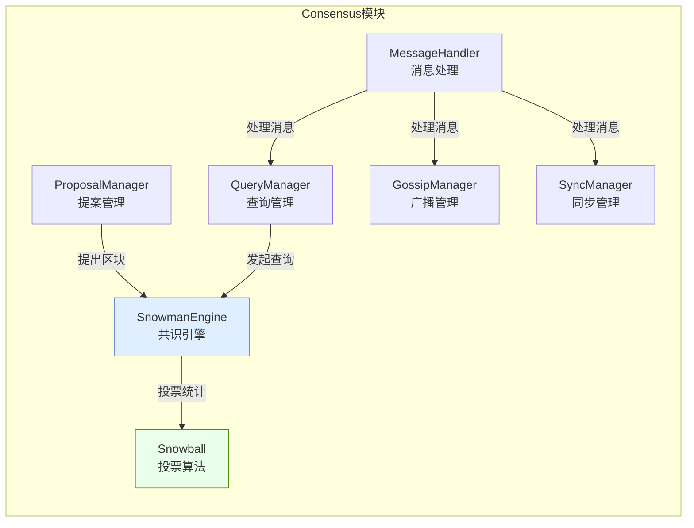

---

## 📌 2. 核心组件

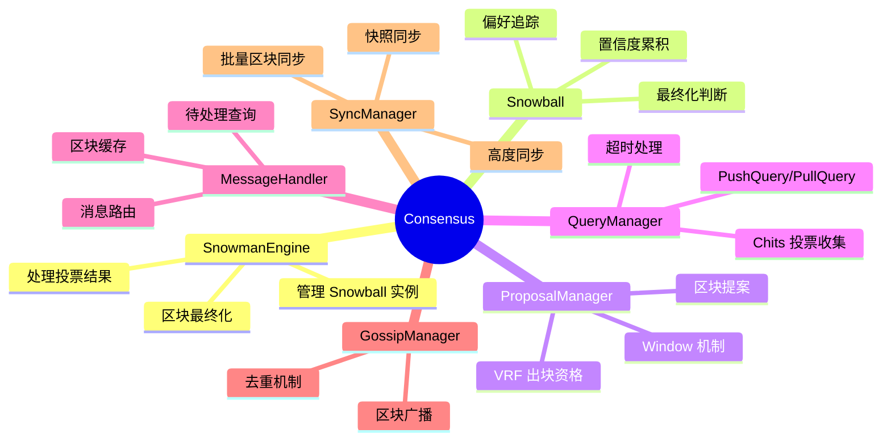

---

## 📌 3. Snowball 共识算法

### 3.1 核心参数

| 参数 | 含义 | 典型值 |
|------|------|--------|
| **K** | 每轮采样节点数 | 20 |
| **α (Alpha)** | 达成共识所需最小票数 | 15 |
| **β (Beta)** | 最终化所需连续成功轮数 | 20 |

### 3.2 算法流程

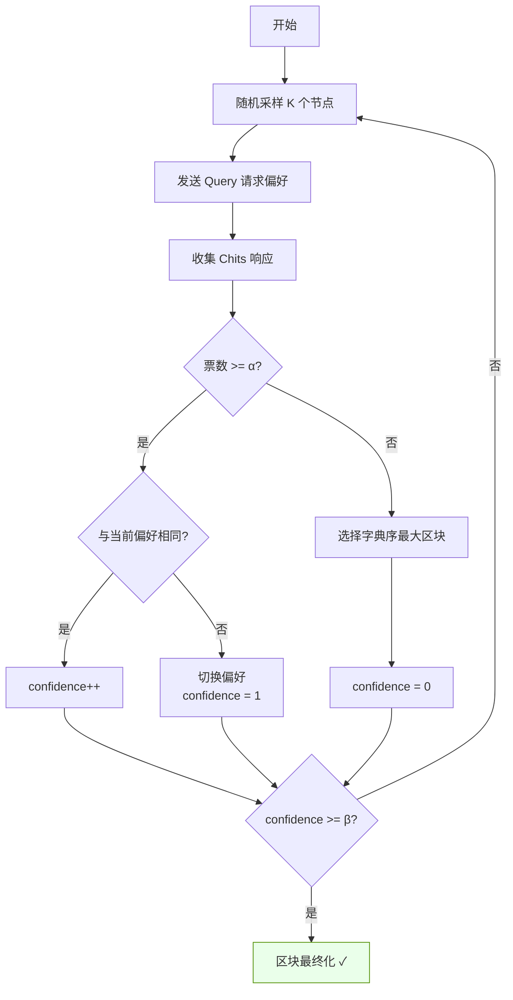

---

## 📌 4. 区块提案流程

### 4.1 Window 机制

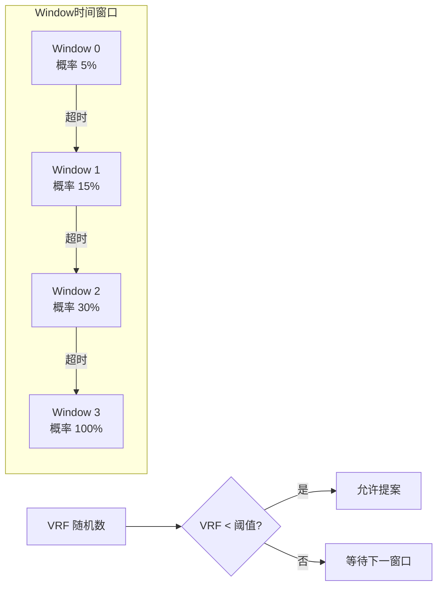

### 4.2 提案时序

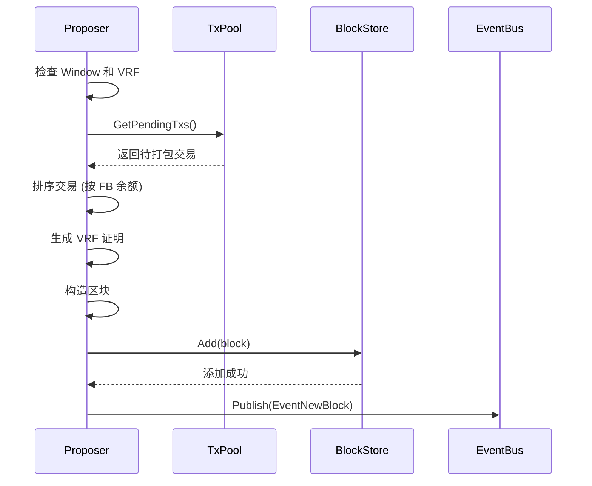

---

## 📌 5. 查询与投票流程

### 5.1 消息类型

| 消息类型 | 发送者 | 用途 |
|----------|--------|------|
| **PushQuery** | 区块提议者 | 携带完整区块，请求投票 |
| **PullQuery** | 非提议者 | 仅携带区块ID，请求投票 |
| **Chits** | 被查询节点 | 返回偏好投票 |
| **Get** | 缺失区块的节点 | 请求区块数据 |
| **Put** | 持有区块的节点 | 响应区块数据 |
| **Gossip** | 任意节点 | 主动广播新区块 |

### 5.2 查询时序图

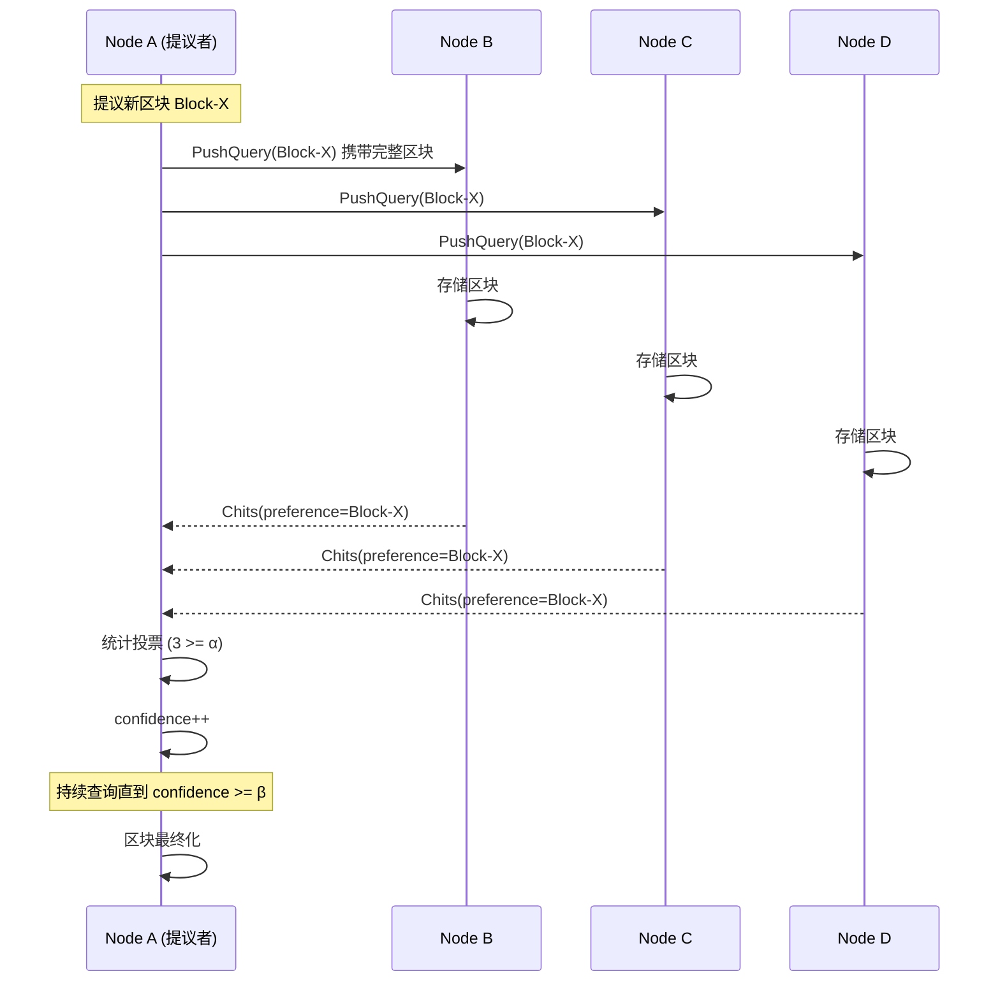

### 5.3 PullQuery 流程（非提议者）

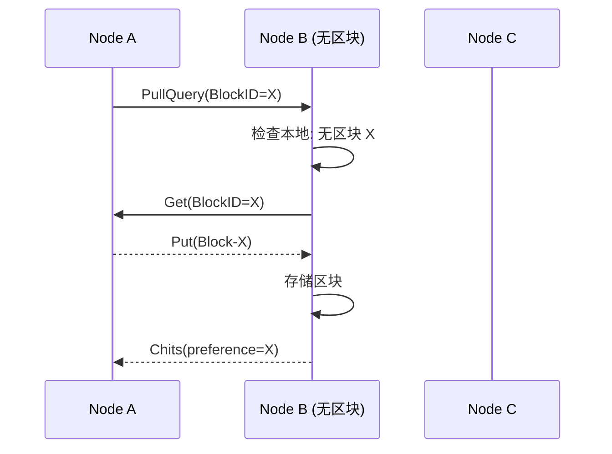

---

## 📌 6. 同步机制

### 6.1 同步策略

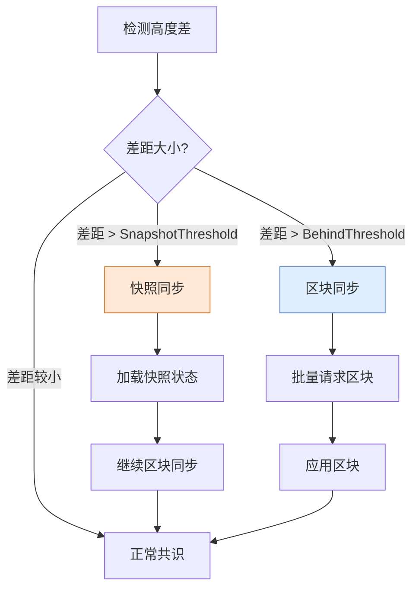

### 6.2 同步时序图

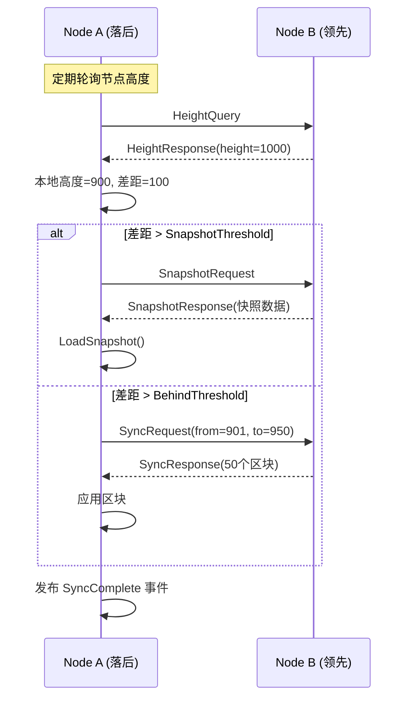

---

## 📌 7. Gossip 广播

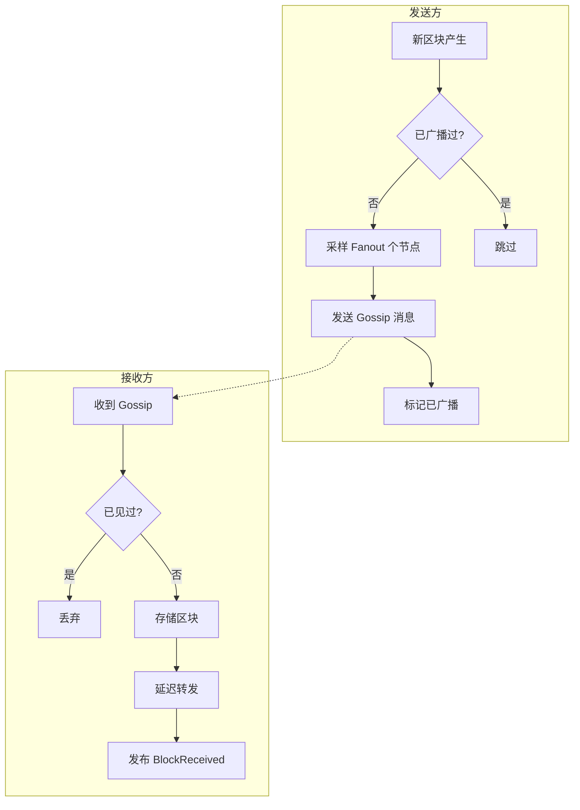

---

## 📌 8. 消息处理流程

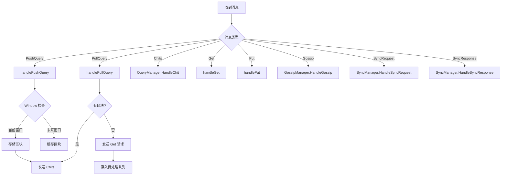

---

## 📌 9. 区块最终化

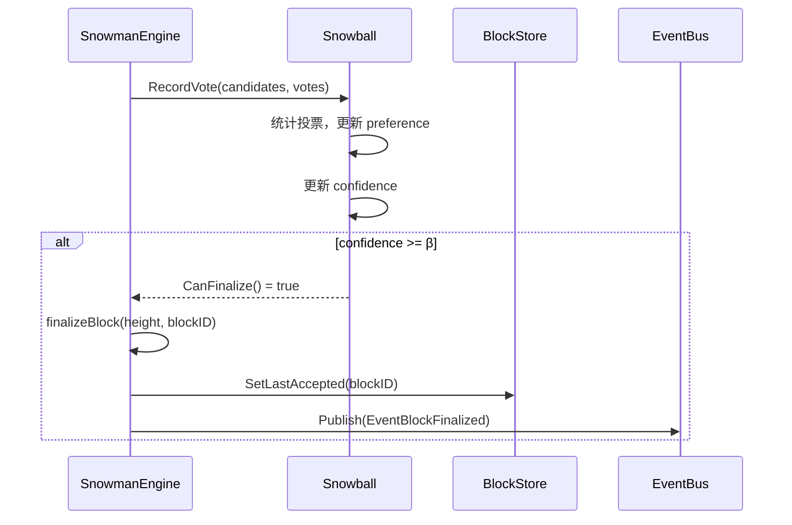

---

## 📌 10. 系统架构总览

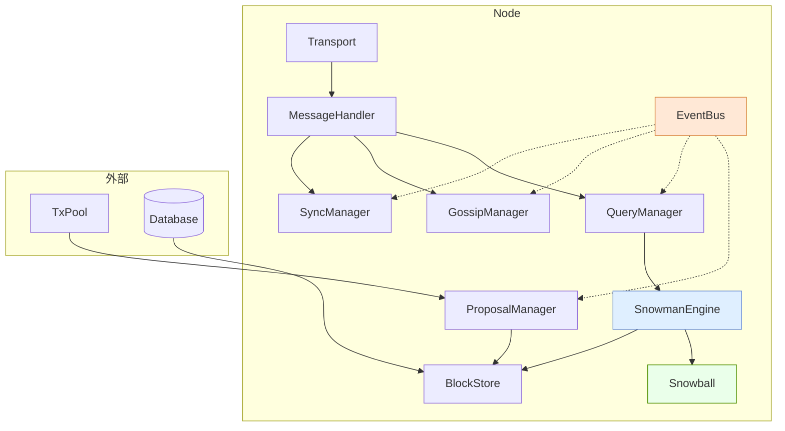

---

## 📌 11. 关键配置参数

| 参数 | 说明 | 默认值 |
|------|------|--------|
| `K` | 每轮采样节点数 | 20 |
| `Alpha` | 共识阈值 | 15 |
| `Beta` | 最终化阈值 | 20 |
| `MaxConcurrentQueries` | 最大并发查询数 | 4 |
| `ProposalInterval` | 提案检查间隔 | 100ms |
| `GossipInterval` | Gossip 间隔 | 500ms |
| `GossipFanout` | Gossip 扇出 | 8 |
| `SyncBehindThreshold` | 触发同步的落后高度 | 10 |
| `SnapshotThreshold` | 触发快照同步的落后高度 | 100 |
| `SyncBatchSize` | 同步批量大小 | 50 |

