# Consensus 模块设计文档

## 📌 1. 模块概述

本模块实现了基于 **Snowman** 协议的共识机制，是 Avalanche 共识家族的一员，支持链式区块结构的 BFT 共识。

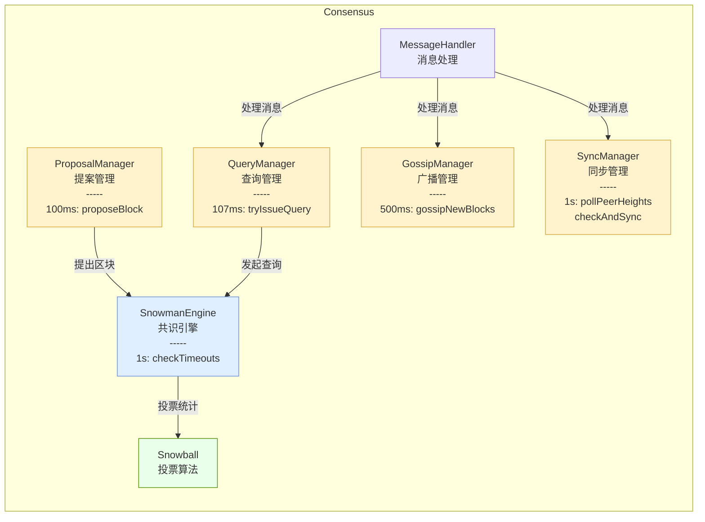

---

## 📌 2. 核心组件

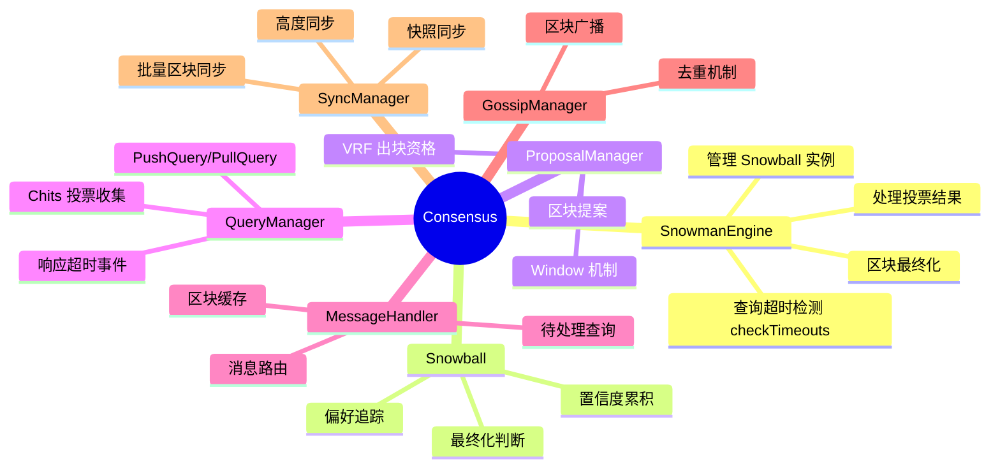

---

## 📌 3. Snowball 共识算法

### 3.1 核心参数

| 参数 | 含义 | 典型值 |
|------|------|--------|
| **K** | 每轮采样节点数 | 20 |
| **α (Alpha)** | 达成共识所需最小票数 | 15 |
| **β (Beta)** | 最终化所需连续成功轮数 | 20 |

### 3.2 算法流程

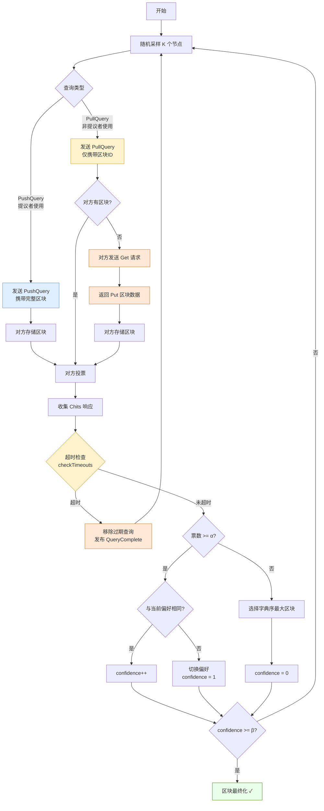

#### PushQuery vs PullQuery 对比

| 特性 | PushQuery | PullQuery |
|------|-----------|-----------|
| **使用者** | 区块提议者 | 非提议者（收到 Gossip 后） |
| **携带数据** | 完整区块 | 仅区块ID |
| **网络开销** | 较大（每次传输区块） | 较小（仅ID） |
| **延迟** | 低（对方直接投票） | 可能高（需额外 Get/Put） |
| **适用场景** | 首次广播新区块 | 后续查询或同步后查询 |

---

## 📌 4. 区块提案流程

### 4.1 Window 机制

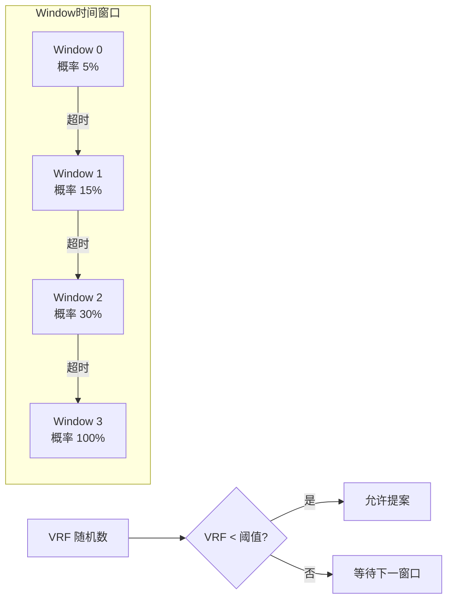

### 4.2 提案时序

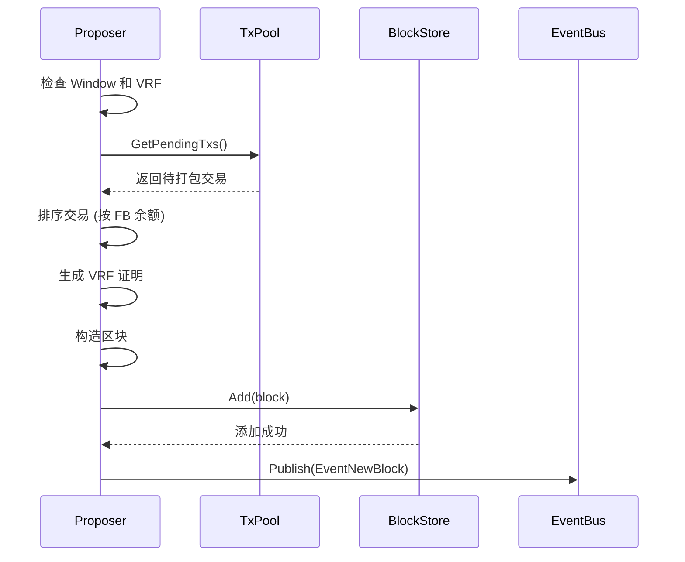

---

## 📌 5. 查询与投票流程

### 5.1 消息类型

| 消息类型 | 发送者 | 用途 |
|----------|--------|------|
| **PushQuery** | 区块提议者 | 携带完整区块，请求投票 |
| **PullQuery** | 非提议者 | 仅携带区块ID，请求投票 |
| **Chits** | 被查询节点 | 返回偏好投票 |
| **Get** | 缺失区块的节点 | 请求区块数据 |
| **Put** | 持有区块的节点 | 响应区块数据 |
| **Gossip** | 任意节点 | 主动广播新区块 |

### 5.2 查询时序图

**PushQuery 只发给 K 个随机采样节点，不是所有矿工。** 未收到 PushQuery 的节点通过 Gossip 或 PullQuery 获取区块。

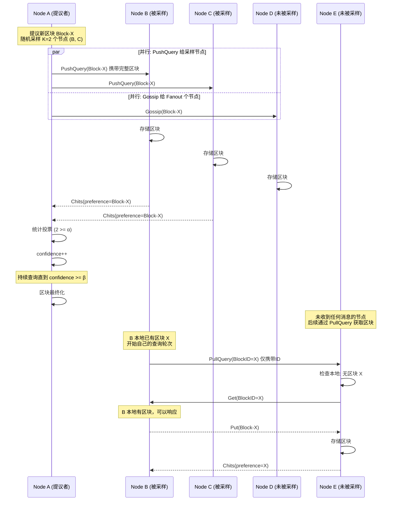

> **注意**：发送 PullQuery 的节点**必须本地已有区块**。因为接收方可能发送 Get 请求，发送方需要能够响应并返回完整区块。

#### 区块传播路径总结

| 传播方式 | 发起者 | 接收者 | 携带数据 | 说明 |
|---------|--------|--------|---------|------|
| **PushQuery** | 提议者 | K 个采样节点 | 完整区块 | 首次查询，请求投票 |
| **Gossip** | 提议者 | Fanout 个节点 | 完整区块 | 主动广播，加速传播 |
| **PullQuery + Get/Put** | 任意节点 | 任意节点 | 仅ID → 按需获取 | 后续轮次或补漏 |

### 5.3 PullQuery 流程（非提议者）

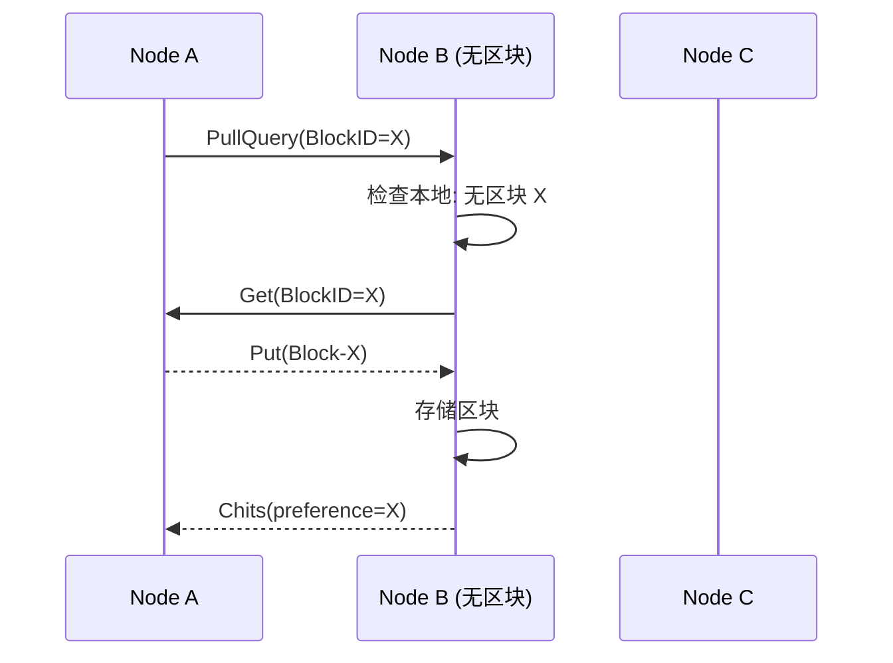

### 5.4 查询超时处理 (checkTimeouts)

`SnowmanEngine.checkTimeouts()` 是共识引擎的**超时监控机制**，确保查询不会无限等待。

#### 工作原理

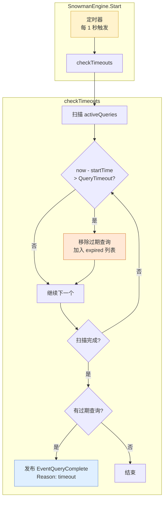

#### 超时时序图

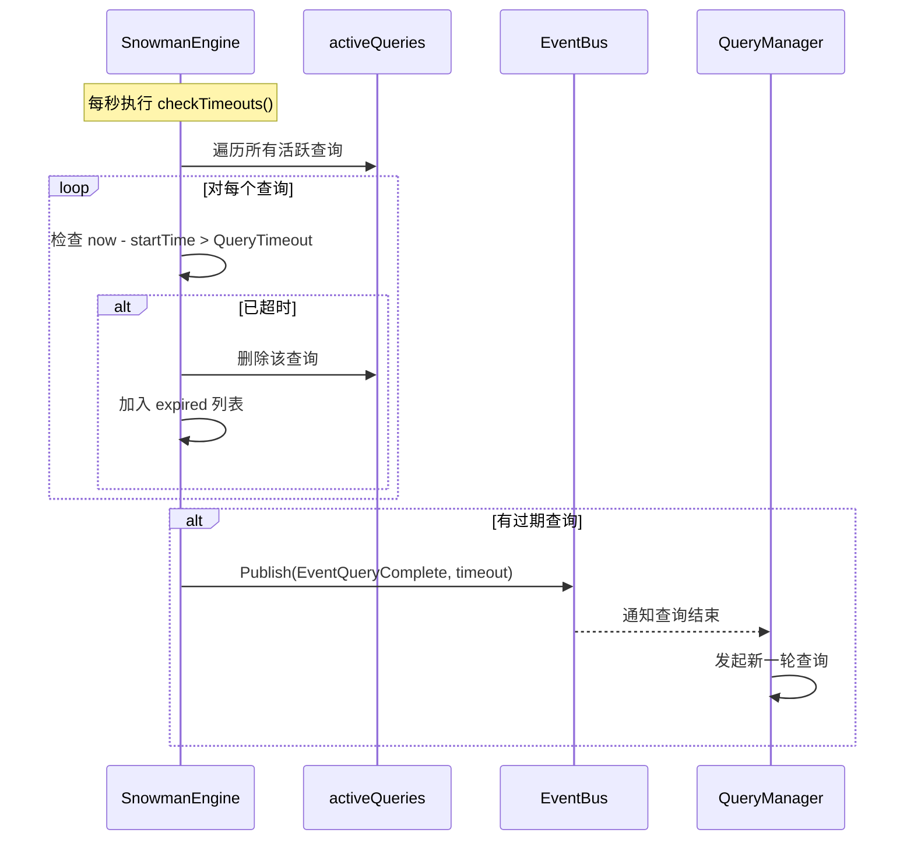

#### 为什么需要超时处理

| 场景 | 问题 | 超时处理的作用 |
|------|------|----------------|
| 网络分区 | 部分节点无法响应 Chits | 释放查询资源，允许重试 |
| 节点宕机 | 被查询节点不再响应 | 避免无限等待，继续共识 |
| 高负载 | 响应延迟超过阈值 | 防止查询堆积 |
| 恶意节点 | 故意不响应 | 限制 DoS 攻击影响 |

---

## 📌 6. 同步机制

### 6.1 同步策略

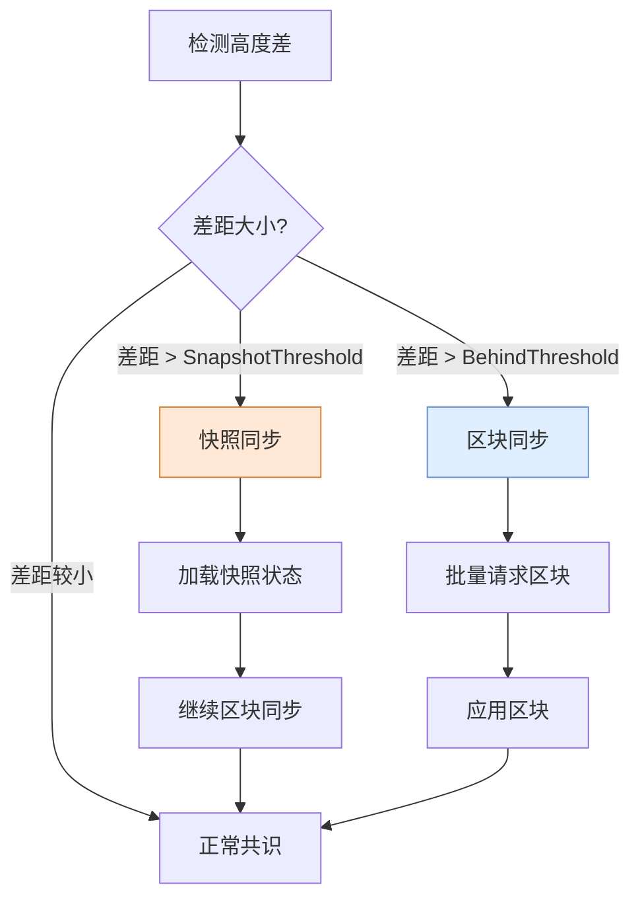

### 6.2 同步时序图

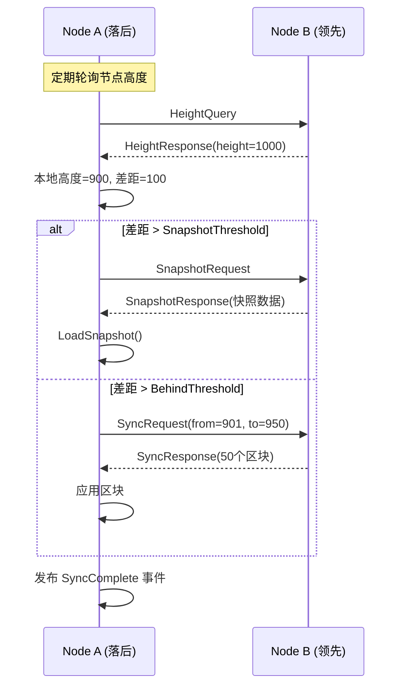

---

## 📌 7. Gossip 广播

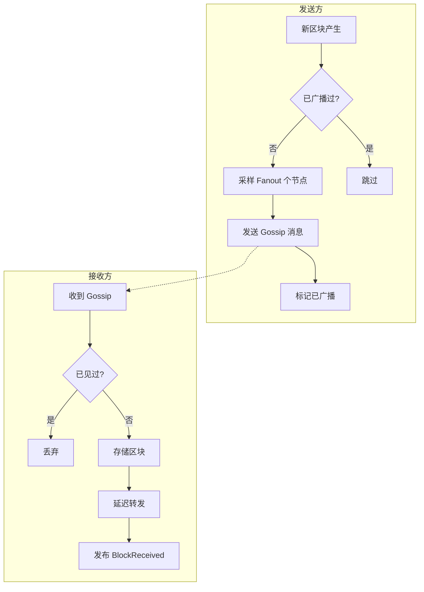

---

## 📌 8. 消息处理流程

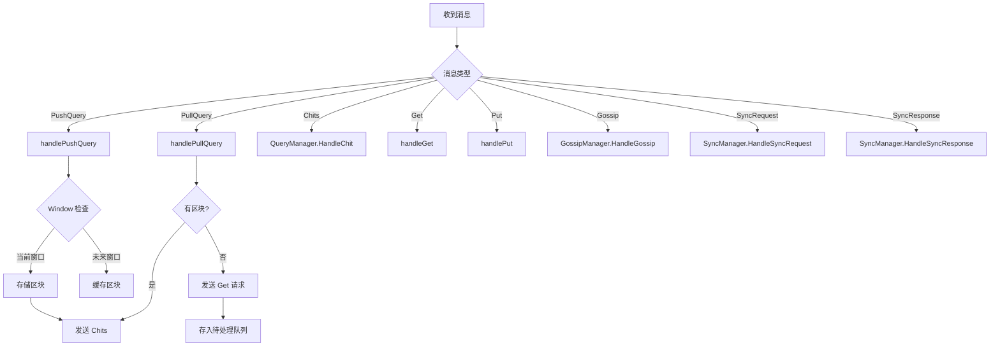

---

## 📌 9. 区块最终化

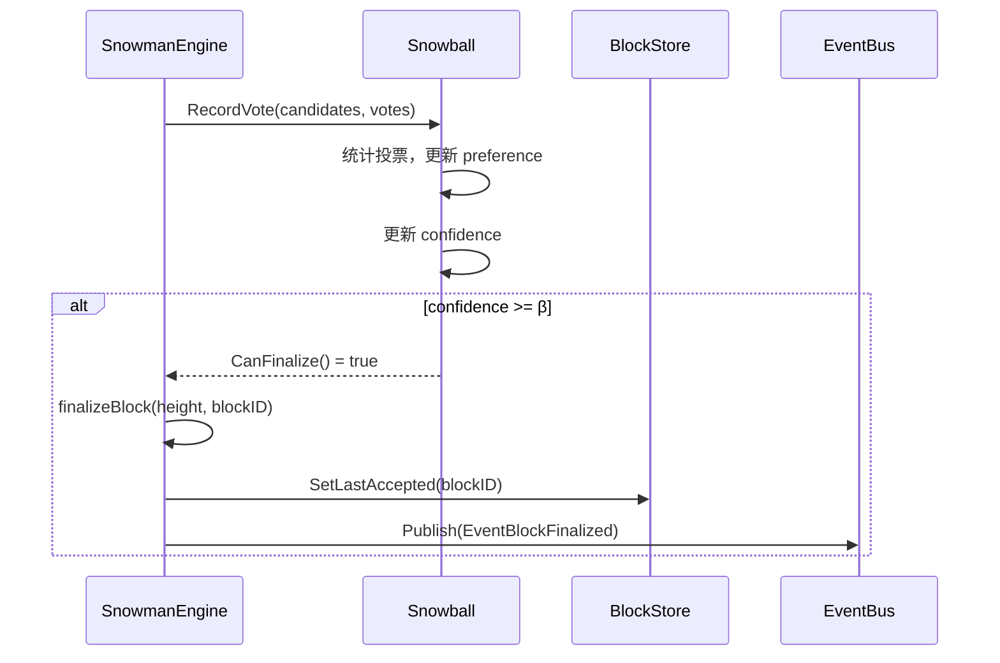

---

## 📌 10. 系统架构总览

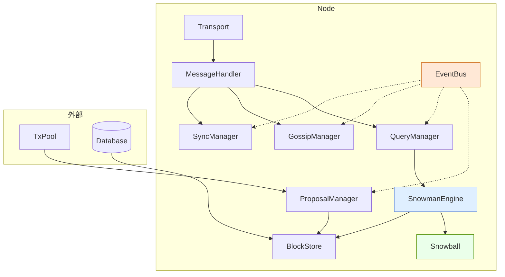

---

## 📌 11. 关键配置参数

| 参数 | 说明 | 默认值 |
|------|------|--------|
| `K` | 每轮采样节点数 | 20 |
| `Alpha` | 共识阈值 | 15 |
| `Beta` | 最终化阈值 | 20 |
| `QueryTimeout` | 查询超时时间 (checkTimeouts 检查间隔 1s) | 2s |
| `MaxConcurrentQueries` | 最大并发查询数 | 4 |
| `ProposalInterval` | 提案检查间隔 | 100ms |
| `GossipInterval` | Gossip 间隔 | 500ms |
| `GossipFanout` | Gossip 扇出 | 8 |
| `SyncBehindThreshold` | 触发同步的落后高度 | 10 |
| `SnapshotThreshold` | 触发快照同步的落后高度 | 100 |
| `SyncBatchSize` | 同步批量大小 | 50 |

