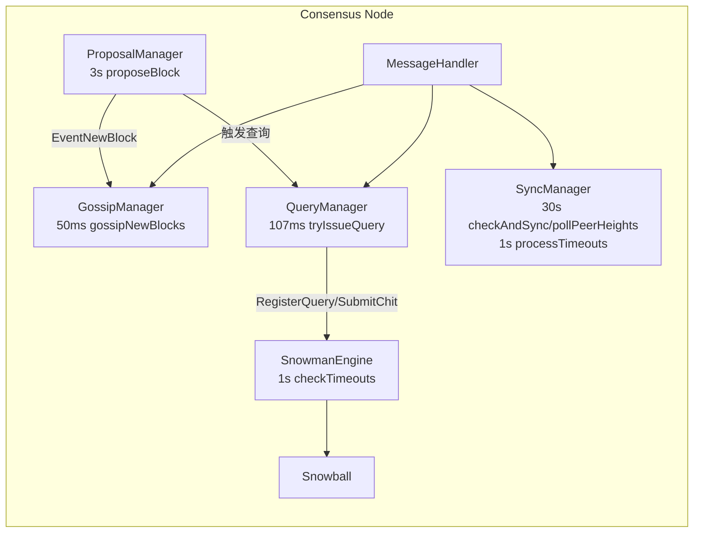
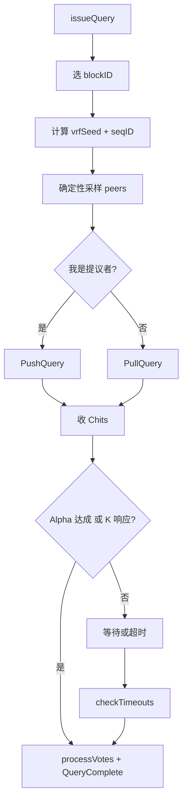
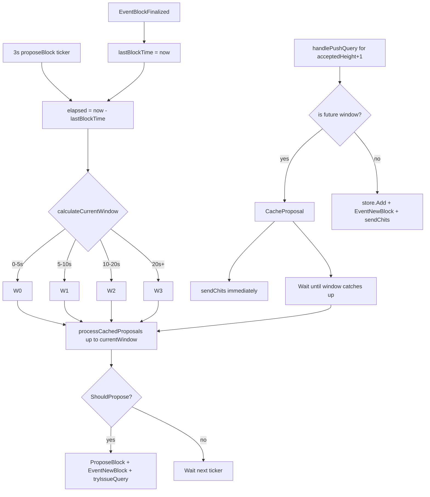

# Consensus 模块设计文档（与当前实现同步）

本文档按当前代码实现更新，主要参考：

- `consensus/consensusEngine.go`
- `consensus/snowball.go`
- `consensus/queryManager.go`
- `consensus/proposalManager.go`
- `consensus/messageHandler.go`
- `consensus/syncManager.go`
- `consensus/gossipManager.go`
- `consensus/config.go`

---

## 1. 模块概览

共识模块实现链式 Snowman 风格共识，核心特征是：

1. 只在“父块已最终化”的前提下推进下一高度。
2. 查询采样采用 VRF 种子 + `seqID` 的确定性采样。
3. 失败路径不“免费”切换偏好，优先保安全，再通过逃生阈值保活性。
4. 同步采用“定时采样 + Chit 事件驱动 + 并行分片 + 证据校验”。

---

## 2. 关键默认参数

### 2.1 共识参数（`consensus/config.go`）

| 参数 | 默认值 | 说明 |
|------|--------|------|
| `K` | 20 | 每轮采样上限 |
| `Alpha` | 14 | 单轮成功阈值 |
| `Beta` | 15 | 最终化阈值 |
| `QueryTimeout` | 4s | 查询超时 |
| `MaxConcurrentQueries` | 8 | 最大并发查询 |
| `ProposalInterval` | 3s | 提案周期 |
| `Gossip.Interval` | 50ms | gossip tick |
| `Gossip.Fanout` | 15 | gossip 扇出 |

### 2.2 同步参数（`consensus/config.go`）

| 参数 | 默认值 | 说明 |
|------|--------|------|
| `CheckInterval` | 30s | 定时同步检查周期 |
| `BehindThreshold` | 2 | 落后阈值 |
| `BatchSize` | 50 | 每轮拉取高度范围 |
| `Timeout` | 10s | 同步请求超时 |
| `ShortSyncThreshold` | 20 | 短模式阈值 |
| `ParallelPeers` | 3 | 并行分片目标 peer 数 |
| `SampleSize` | 15 | 高度采样节点数 |
| `QuorumRatio` | 0.67 | 采样仲裁比例 |
| `SampleTimeout` | 2s | 采样超时 |
| `Consensus Alpha/Beta` | 14 / 15 | 最终化与签名集验阈（单一来源） |
| `DeepLagStateSyncThreshold` | 100 | 深度落后阈值（stateDB-first 路径） |
| `StateSyncPeers` | 4 | stateDB 分片同步 peer 上限 |
| `StateSyncShardConcurrency` | 8 | stateDB 分片并发数 |
| `StateSyncPageSize` | 1000 | stateDB 分页大小 |
| `ChitSoftGap/HardGap` | 1 / 3 | Chit 软/硬触发差距 |
| `ChitGracePeriod` | 1s | 软触发等待 |
| `ChitCooldown` | 1.5s | 触发冷却 |
| `ChitMinConfirmPeers` | 2 | 最小确认 peer 数 |

---

## 3. Snowball 决策逻辑（已更新）

### 3.1 候选过滤

`SnowmanEngine.processVotes` 只允许当前高度里 **父块等于已最终化父块** 的候选参与投票统计，其他票会被丢弃。

### 3.2 成功路径

当某候选票数 `>= Alpha`：

1. 赢家可切换偏好（唯一主路径）。
2. 偏好不变则 `confidence++`，偏好切换则 `confidence=1`。
3. 记录成功轮次投票明细（用于最终化证据）。

### 3.3 失败路径

当本轮无候选达到 `Alpha`：

1. `confidence` 归零。
2. 已有偏好时默认保持不变，不按 window 直接切换。
3. 连续失败达到 `WindowEscalationThreshold=45` 后，才允许跨 window 切换（活性逃生阀）。

### 3.4 候选选择规则

`selectBestCandidate` 规则：

1. `window` 越小优先。
2. `window` 相同则区块 hash（`blockID` 最后段）字典序越小优先。

这套规则在 `Snowball`、`QueryManager`、`MessageHandler.sendChits` 中保持一致。

---

## 4. 查询与投票流程（已更新）

### 4.1 查询发起

`QueryManager.issueQuery`：

1. 仅针对 `lastAccepted+1` 高度发起查询。
2. 优先使用当前偏好；无偏好时按 `selectBestCandidate` 选块。
3. 生成 `vrfSeed = SHA256(parentID || height || window || nodeID)`。
4. 用 `samplePeersDeterministic(vrfSeed, seqID, fanout, peers)` 采样。
5. 仅提议者发 `PushQuery`（带 `Block`），其他节点发 `PullQuery`（仅 `BlockID`）。

### 4.2 查询节流与背压

- 冷却：`queryCooldown=250ms`。
- 并发：受 `MaxConcurrentQueries` 限制。
- sender 控制队列拥塞时，自动进入 backoff；fanout 固定为 `K`（默认 20）。

### 4.3 查询完成与超时

- `SubmitChit` 在两种条件下结束查询：  
  1) 已有候选达到 `Alpha`；2) 已收齐 `K` 个响应。
- `checkTimeouts` 每秒扫描超时查询；即使超时也会先处理已收到的票，再发布 `EventQueryComplete(reason=timeout)`。
- `QueryComplete` 后 `seqID++`，下一轮采样集合变化。

---

## 5. 区块提案流程（已更新）

### 5.1 Window 配置（来源 `config.Window`）

| Window | 时间段 | 概率 |
|--------|--------|------|
| `W0` | 0-5s | 5% |
| `W1` | 5-10s | 15% |
| `W2` | 10-20s | 30% |
| `W3` | 20s+ | 50% |

> 当前实现最后窗口不是 100%，而是 50%。

### 5.2 提案约束

`ProposalManager.proposeBlock` + `RealBlockProposer.ShouldPropose`：

1. 当前窗口由 `calculateCurrentWindow()` 按 `time.Since(lastBlockTime)` 计算（配置阶段：`W0->W1->W2->W3`）。
2. `lastBlockTime` 在 `EventBlockFinalized` 时更新，下一轮窗口从 `W0` 重新开始计时。
3. 每次 `proposeBlock` 会先执行 `processCachedProposals(currentWindow)`，把 `window <= currentWindow` 的缓存提案入库并发布 `EventNewBlock`。
4. 必须先拿到 `lastHeight` 对应的已最终化父块。
5. `currentBlocks` 只统计“父链匹配”的候选。
6. 早窗严格限流，晚窗放宽候选数上限（活性逃生）。
7. 空块仅允许在最后窗口（`window == lastWindow`）提出。
8. 本地提案成功后发布 `EventNewBlock`，并立即触发一次查询。

### 5.3 Window 切换与缓存回放（Mermaid）

---

## 6. 消息处理关键路径（已更新）

### 6.1 PullQuery

`handlePullQuery`：

1. 本地有块：直接 `sendChits`。
2. 本地无块：回 `Get`，并把请求存入 `pendingQueries`，待 `Put` 到达后再补发 `Chits`。

### 6.2 PushQuery

`handlePushQuery`：

1. 若高度已不新（`<= acceptedHeight`），直接回 `Chits`，不重入 store。
2. 仅对“当前待决高度（`acceptedHeight+1`）”执行 window 约束；未来窗口块会缓存到 `ProposalManager`。
3. 即使进入缓存路径，也会立即回 `Chits`，避免对端查询超时导致停滞。
4. 若 `store.Add` 返回数据不完整，交给 `PendingBlockBuffer` 异步补课，补齐后再回 `Chits`。
5. 若缺父块，主动请求父块。

### 6.3 Chits 发送规则

`sendChits`：

1. 若父高度未最终化则弃权（`preferred=""`）。
2. 偏好块必须父链匹配，否则重选。
3. 回包附带 `AcceptedID/AcceptedHeight`。
4. 当 `preferred != ""` 且有 `vrfSeed` 时，附带 ECDSA `ChitSignature`。

---

## 7. 同步机制（已更新）

### 7.1 触发路径

1. 定时路径：`checkAndSync + pollPeerHeights`。
2. 事件路径：`QueryManager.HandleChit -> TriggerSyncFromChit`。

### 7.2 定时路径

1. 发现落后超过 `BehindThreshold` 后先做高度采样。
2. 采样达到 `QuorumRatio` 才进入同步。
3. 同步区间为 `[local+1, min(local+BatchSize, quorumHeight)]`。

### 7.3 事件路径（Chit 防抖）

1. `heightDiff >= ChitHardGap`：快速触发（仍受冷却/残留状态保护）。
真正执行触发时按 `DeepLagStateSyncThreshold`（默认 100）分流：`<=100` 走普通追块，`>100` 走 stateDB-first 追赶路径。
2. `ChitSoftGap <= heightDiff < ChitHardGap`：进入 grace + confirm peers 的延迟评估。

### 7.4 执行与收包

`performTriggeredSync` 默认走 `requestSyncParallel`：

1. 对高度区间分片并行拉取。
2. 小范围或 peer 太少时退化成 `requestSync`。
3. 短差距启用 `SyncShortMode`，可附带 `BlocksShortTxs`。

`performStateDBFirstSyncThenCatchUp`（深度落后）：

1. 优先执行分片 stateDB 同步（不同 shard 分配给不同 peer 拉取，失败 shard 自动切换 peer）。
2. 通过 `/statedb/snapshot/shards` + `/statedb/snapshot/page` 分页下载并重建本地快照。
3. stateDB 同步成功后继续常规追块；若失败则回退到仅区块追赶。

`HandleSyncResponse`：

1. 先尝试入库（含不完整块补课）。
2. 再按父链做 fast-finalize 推进 `lastAccepted`。
3. `SignatureSets` 是同步通过验证的必要条件：每个同步高度都必须先通过 `Consensus Alpha/Beta` 校验与采样合法性重放，必要时做 ECDSA 验签。
4. 仍落后则 50ms 后流水线续传下一批。

> 当前代码未定义 `SnapshotRequest/SnapshotResponse` 消息；stateDB 快照同步通过独立 shard/page 接口完成。

---

## 8. Gossip 广播（已更新）

1. `EventNewBlock` 触发即时 gossip。
2. 周期任务补发 `accepted+1`、`accepted+2` 高度候选。
3. `seenBlocks` 去重，缓存过大时清理（>1000）。
4. 收到新 gossip 后，随机延迟 50-150ms 再转发，降低风暴。

---

## 9. 最终化与证据

最终化路径：

1. `Snowball.CanFinalize(Beta)` 达成后调用 `store.SetFinalized(height, blockID)`。
2. 同步保存：
   - `FinalizationChits`（有效轮次投票明细）
   - `ConsensusSignatureSet`（VRF 采样签名集）
3. 发布 `EventBlockFinalized`，事件数据为 `BlockFinalizedData{Block, Chits}`。

---

## 10. 主要消息与事件

### 10.1 消息类型

- 查询/投票：`MsgPushQuery` `MsgPullQuery` `MsgChits` `MsgGet` `MsgPut`
- 广播：`MsgGossip`
- 同步：`MsgHeightQuery` `MsgHeightResponse` `MsgSyncRequest` `MsgSyncResponse`

### 10.2 事件类型

- `EventNewBlock`
- `EventBlockReceived`
- `EventQueryComplete`
- `EventSyncComplete`
- `EventBlockFinalized`
- `EventPreferenceChanged`

