# 共识同步流程详解

> 源码文件：`consensus/syncManager.go`、`consensus/queryManager.go`、`consensus/messageHandler.go`、`consensus/realBlockStore.go`

---

## 📌 目录

1. [整体架构](#1-整体架构)
2. [触发路径：两条入口](#2-触发路径两条入口)
3. [采样验证（Quorum）](#3-采样验证quorum)
4. [三种同步模式](#4-三种同步模式)
5. [同步响应处理：HandleSyncResponse](#5-同步响应处理handlesyncresponse)
6. [VRF 签名集合验证](#6-vrf-签名集合验证)
7. [超时与容错机制](#7-超时与容错机制)
8. [PendingBlockBuffer 补课机制](#8-pendingblockbuffer-补课机制)
9. [关键配置参数](#9-关键配置参数)
10. [完整流程总览图](#10-完整流程总览图)

---

## 1. 整体架构

同步管理器 `SyncManager` 负责让落后节点追赶网络最新状态。它有**两条触发路径**和**三种同步模式**：

```
触发路径:
  ├── 路径A: 定时轮询 (checkAndSync, 每 CheckInterval 触发)
  └── 路径B: Chit 事件驱动 (TriggerSyncFromChit, 实时触发)

同步模式:
  ├── 普通同步 (requestSync)          —— 单节点批量拉取
  ├── 分片并行同步 (requestSyncParallel) —— 多节点并发拉取
  └── 快照同步 (requestSnapshotSync)   —— 大幅度落后时使用
```

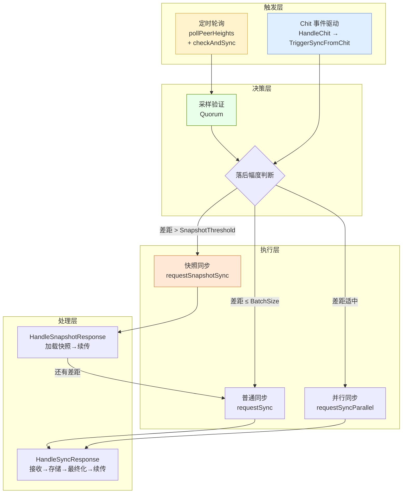

---

## 2. 触发路径：两条入口

### 2.1 路径 A：定时轮询（兜底机制）

`SyncManager.Start()` 启动 **3 个后台循环**：

| 循环 | 间隔 | 职责 |
|------|------|------|
| `checkAndSync` | `CheckInterval` (30s) | 检查是否落后，启动采样/同步 |
| `pollPeerHeights` | `CheckInterval` (30s)，落后时 500ms | 向随机节点询问高度 |
| `processTimeouts` | 1s | 清理超时请求、采样、处理中范围 |

**高度探测流程：**

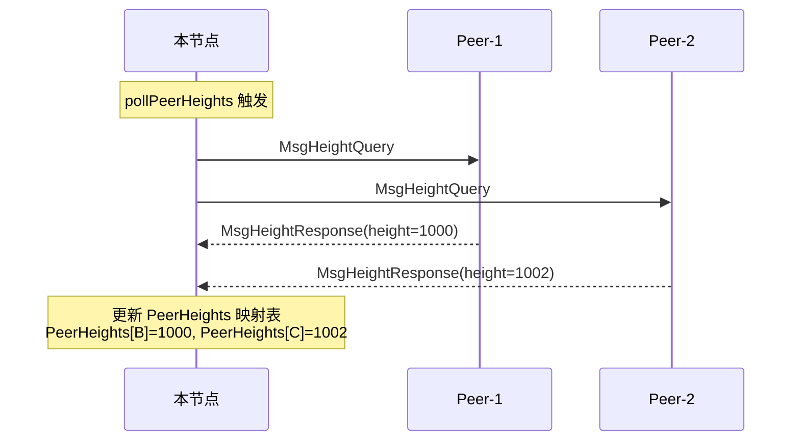

**checkAndSync 决策流程：**

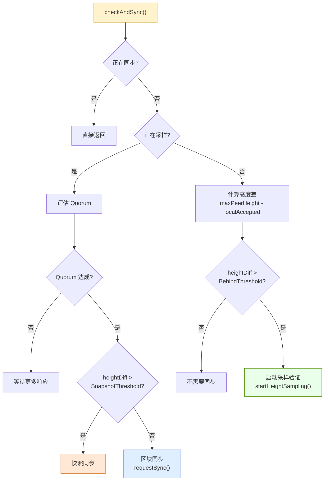

### 2.2 路径 B：Chit 事件驱动（快速响应）

当 `QueryManager.HandleChit()` 收到投票响应时，如果对方的 `AcceptedHeight > localAccepted`，会立即调用 `TriggerSyncFromChit()`。

这条路径不依赖定时器，**实时感知**落后。

**Chit 触发的完整流程：**

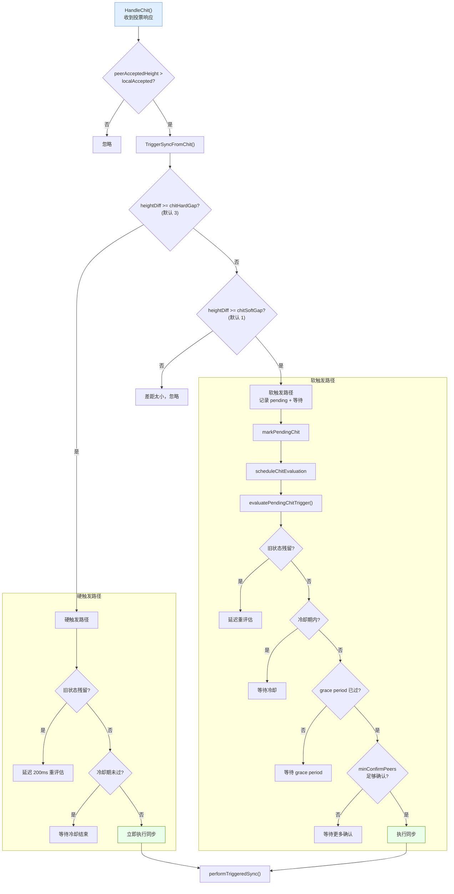

**Chit 触发的防抖参数：**

| 参数 | 含义 | 默认值 |
|------|------|--------|
| `ChitSoftGap` | 最小触发差距 | 1 |
| `ChitHardGap` | 立即触发差距 | 3 |
| `ChitGracePeriod` | 软触发等待期 | 1s |
| `ChitCooldown` | 两次触发间冷却 | 1.5s |
| `ChitMinConfirmPeers` | 最少确认节点数 | 2 |

---

## 3. 采样验证（Quorum）

在**路径 A**中，当检测到落后超过 `BehindThreshold` 后，不会直接同步，而是先**采样验证**——确认多数节点确实在该高度，避免被单个恶意节点误导。

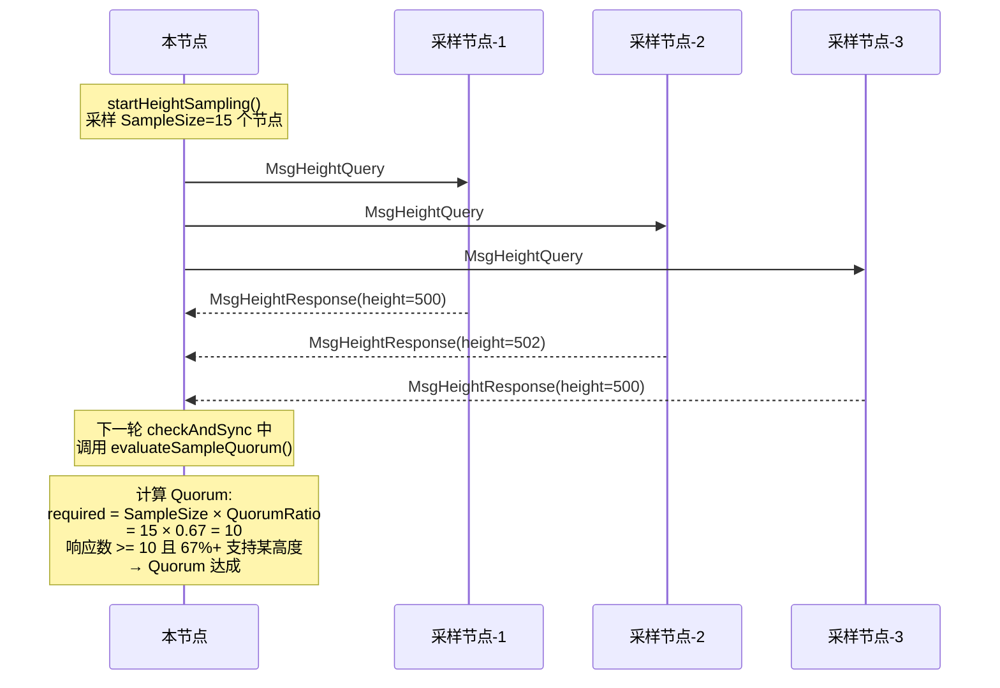

**Quorum 评估算法：**

```
对每个候选高度 H：
  统计 sampleResponses 中 height >= H 的节点数 → supportCount
  如果 supportCount >= required 且 H > maxQuorumHeight：
    maxQuorumHeight = H

返回 maxQuorumHeight（满足 Quorum 的最高高度）
```

---

## 4. 三种同步模式

### 4.1 普通同步 `requestSync(from, to)`

适用于小范围同步（≤5 个块或只有 1 个可用 Peer）。

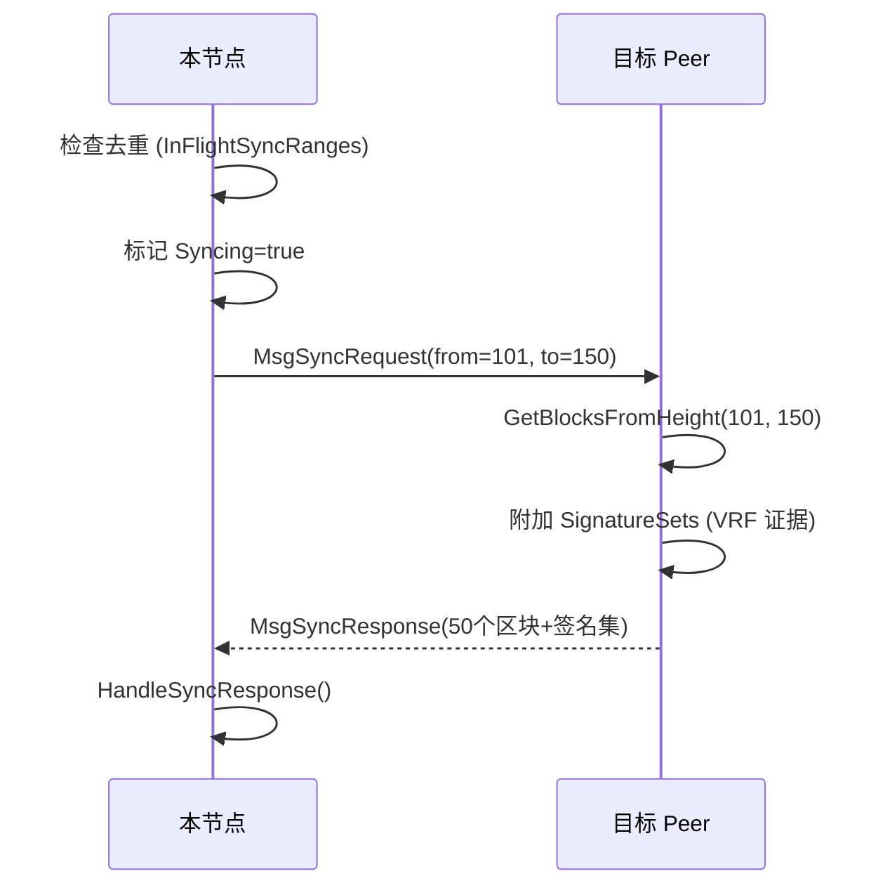

### 4.2 分片并行同步 `requestSyncParallel(from, to)`

适用于中等范围同步，将高度范围分配给多个 Peer 并发拉取。

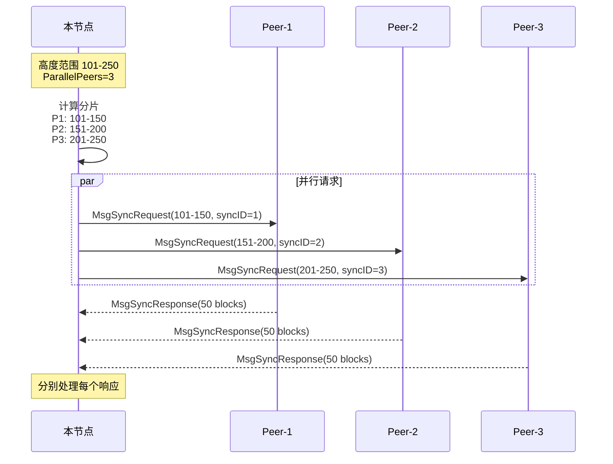

**ShortTxs 模式判断：**  
当 `totalBlocks <= ShortSyncThreshold`（默认 20）时，启用 ShortTxs 模式：
- 发送方附带 `ShortTxs`（交易短哈希）
- 接收方从本地 TxPool 还原完整交易
- 减少网络传输量

### 4.3 快照同步 `requestSnapshotSync(targetHeight)`

适用于大幅度落后（`heightDiff > SnapshotThreshold`，默认 100）。

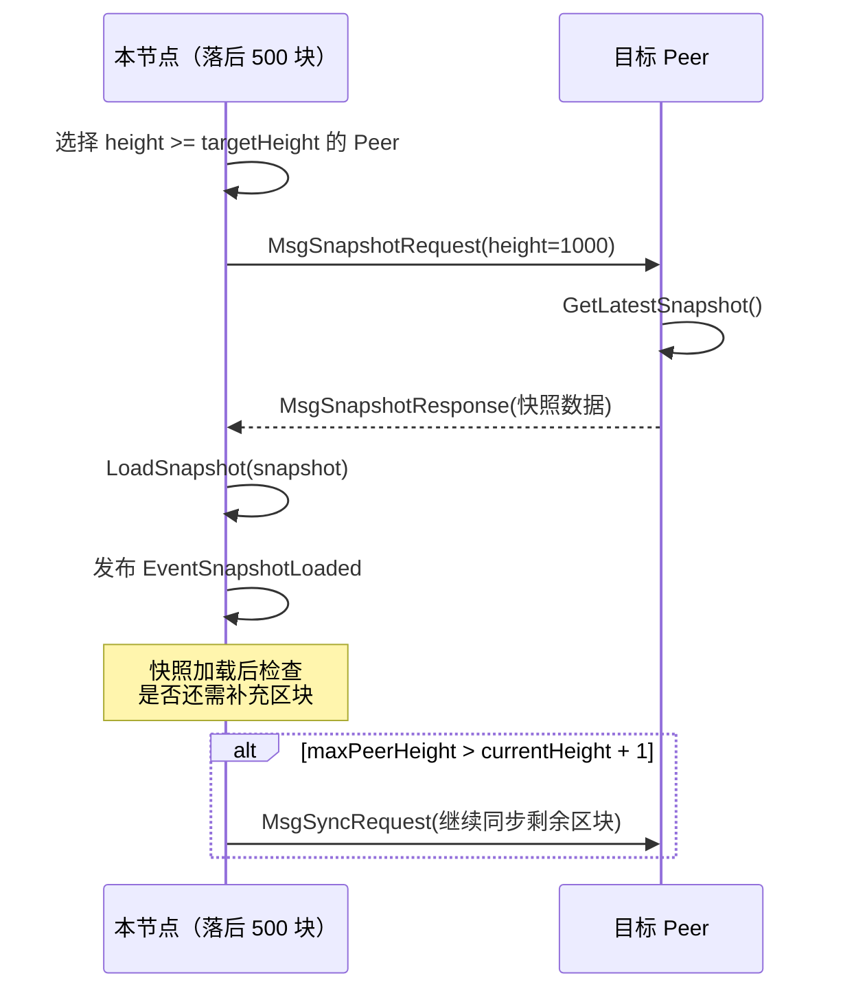

---

## 5. 同步响应处理：HandleSyncResponse

这是同步流程中**最核心**的函数，处理从 Peer 返回的区块数据。

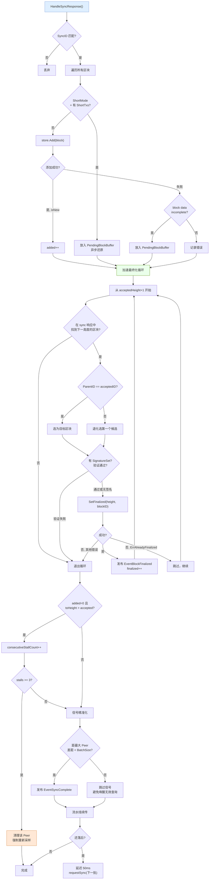

### 关键设计点

1. **加速最终化**：不依赖共识轮次，直接按父链关系推进 `lastAccepted`，解决"本地已有区块但共识迟迟无法收敛"的问题。

2. **只用 sync 响应中的区块**：不混入本地 store 的候选，因为本地可能有未被选中分支的区块（不同 Window/不同 parent），混入会导致父链不兼容。

3. **流水线续传**：每轮同步完成后，如果仍落后，延迟 50ms 后立即发起下一轮，实现高效追块。

4. **停滞保护**：连续 3 轮 added=0 后，清理当前 Peer 信息，强制重新采样，避免"死盯一个坏 Peer"。

---

## 6. VRF 签名集合验证

同步响应中附带 `SignatureSets`，在加速最终化前进行 **四步验证**：

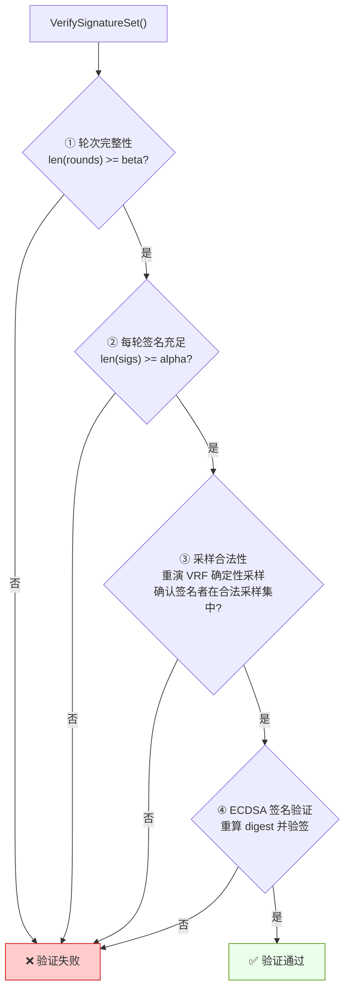

| 步骤 | 验证内容 | 防御目标 |
|------|---------|---------|
| ① 轮次完整性 | 至少 β 轮成功 | 防止伪造快速最终化 |
| ② 签名充足 | 每轮至少 α 个签名 | 防止少数节点串谋 |
| ③ 采样合法性 | 签名者在 VRF 确定性采样集中 | 防止选择性签名者 |
| ④ 密码学验签 | ECDSA 签名正确 | 防止签名伪造 |

---

## 7. 超时与容错机制

### 7.1 processTimeouts（每 1 秒执行）

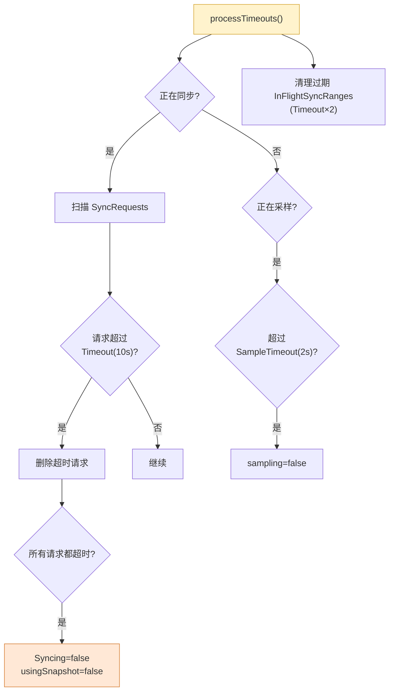

### 7.2 状态保护机制

| 机制 | 作用 |
|------|------|
| `InFlightSyncRanges` 去重 | 防止同一高度范围重复请求 |
| `consecutiveStallCount` | 检测停滞，3次后切换 Peer |
| `chitCooldown` | 两次 Chit 触发间最少 1.5s 间隔 |
| `chitGracePeriod` | 软触发需等待 1s，收集更多证据 |
| `resetStaleSyncState` | 清理残留的 Syncing/sampling 状态 |

---

## 8. PendingBlockBuffer 补课机制

当同步收到的区块**缺失交易数据**时，会进入 `PendingBlockBuffer` 进行异步补课：

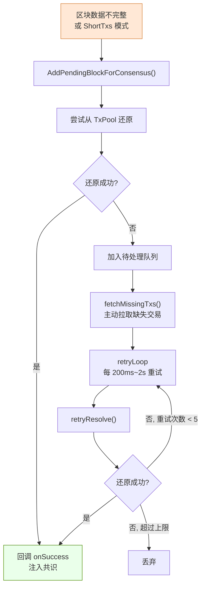

---

## 9. 关键配置参数

| 参数 | 所属配置 | 含义 | 默认值 |
|------|---------|------|--------|
| `CheckInterval` | SyncConfig | 定时检查间隔 | 30s |
| `BehindThreshold` | SyncConfig | 触发采样的最小落后块数 | 2 |
| `BatchSize` | SyncConfig | 单次同步最大区块数 | 50 |
| `Timeout` | SyncConfig | 同步请求超时 | 10s |
| `SnapshotThreshold` | SyncConfig | 触发快照同步的落后块数 | 100 |
| `ShortSyncThreshold` | SyncConfig | 启用 ShortTxs 模式的阈值 | 20 |
| `ParallelPeers` | SyncConfig | 并行同步节点数 | 3 |
| `SampleSize` | SyncConfig | 采样验证节点数 | 15 |
| `QuorumRatio` | SyncConfig | Quorum 比例 | 0.67 |
| `SampleTimeout` | SyncConfig | 采样超时 | 2s |
| `SyncAlpha` | SyncConfig | 签名验证 α | 14 |
| `SyncBeta` | SyncConfig | 签名验证 β | 15 |
| `ChitSoftGap` | SyncConfig | Chit 软触发差距 | 1 |
| `ChitHardGap` | SyncConfig | Chit 硬触发差距 | 3 |
| `ChitGracePeriod` | SyncConfig | Chit 软触发等待期 | 1s |
| `ChitCooldown` | SyncConfig | Chit 触发冷却期 | 1.5s |
| `ChitMinConfirmPeers` | SyncConfig | Chit 最少确认节点 | 2 |

---

## 10. 完整流程总览图

```mermaid
flowchart TB
    %% ===== 触发层 =====
    subgraph 触发层["🔔 触发层"]
        A1["⏰ 定时轮询<br>pollPeerHeights()"]
        A2["📨 Chit 事件驱动<br>HandleChit()"]
    end

    %% ===== 发现差距 =====
    A1 --> POLL["向 10 个随机节点<br>发送 HeightQuery"]
    POLL --> RESP["收集 HeightResponse<br>更新 PeerHeights"]
    RESP --> CHECK_SYNC["checkAndSync()"]

    A2 --> CHIT_CMP{"peerAccepted ><br>localAccepted?"}
    CHIT_CMP -->|否| NOOP["忽略"]
    CHIT_CMP -->|是| TRIGGER_SYNC["TriggerSyncFromChit()"]

    %% ===== 采样验证 =====
    CHECK_SYNC --> BEHIND{落后 ><br>BehindThreshold?}
    BEHIND -->|否| NOOP2[不需要同步]
    BEHIND -->|是| SAMPLE["startHeightSampling()<br>采样 15 个节点"]
    SAMPLE --> QUORUM["下一轮 evaluateSampleQuorum()"]
    QUORUM --> QUORUM_OK{67%+ 确认?}
    QUORUM_OK -->|否| WAIT["等待更多响应"]
    QUORUM_OK -->|是| DECIDE

    %% ===== 防抖 =====
    TRIGGER_SYNC --> DEBOUNCE["防抖机制<br>soft/hard gap<br>grace period<br>cooldown<br>min confirm peers"]
    DEBOUNCE --> DECIDE

    %% ===== 决策 =====
    DECIDE{"heightDiff 判断"}
    DECIDE -->|"> SnapshotThreshold<br>(100)"| SNAP_SYNC["requestSnapshotSync()"]
    DECIDE -->|"适中 + 多 Peer"| PARA_SYNC["requestSyncParallel()"]
    DECIDE -->|"≤5 或 1 Peer"| NORM_SYNC["requestSync()"]

    %% ===== 执行同步 =====
    SNAP_SYNC --> SNAP_REQ["发送 MsgSnapshotRequest"]
    SNAP_REQ --> SNAP_RESP["HandleSnapshotResponse()<br>LoadSnapshot()"]
    SNAP_RESP --> SNAP_CONTINUE{"还有差距?"}
    SNAP_CONTINUE -->|是| NORM_SYNC

    PARA_SYNC --> SHARD["分片: 高度范围 ÷ 节点数"]
    SHARD --> PARALLEL["并行发送 MsgSyncRequest"]
    PARALLEL --> HANDLE_RESP

    NORM_SYNC --> SINGLE["发送 MsgSyncRequest"]
    SINGLE --> HANDLE_RESP

    %% ===== 响应处理 =====
    HANDLE_RESP["HandleSyncResponse()"]
    HANDLE_RESP --> ADD_BLOCKS["遍历区块:<br>store.Add() 或 PendingBuffer"]
    ADD_BLOCKS --> FAST_FIN["加速最终化循环:<br>按父链推进 lastAccepted"]
    FAST_FIN --> VERIFY["验证 SignatureSet<br>(4 步验证)"]
    VERIFY --> SET_FIN["SetFinalized()"]
    SET_FIN --> PUBLISH["发布 EventBlockFinalized"]
    PUBLISH --> STALL{"停滞检测<br>stalls >= 3?"}
    STALL -->|是| SWITCH["切换 Peer"]
    STALL -->|否| PIPELINE{"还落后?"}
    PIPELINE -->|是| NORM_SYNC
    PIPELINE -->|否| DONE["✅ 同步完成<br>发布 EventSyncComplete"]

    style A1 fill:#fff3cd,stroke:#d6a735
    style A2 fill:#dfefff,stroke:#6b8fd6
    style SAMPLE fill:#eaffea,stroke:#4f8f00
    style SNAP_SYNC fill:#ffe8d6,stroke:#d67f35
    style DONE fill:#eaffea,stroke:#4f8f00
    style SWITCH fill:#ffcccc,stroke:#cc0000
```

---

## 附录：消息类型一览

| 消息类型 | 方向 | 说明 |
|---------|------|------|
| `MsgHeightQuery` | 请求 | 询问 Peer 当前已最终化高度 |
| `MsgHeightResponse` | 响应 | 返回自己的已最终化高度 |
| `MsgSyncRequest` | 请求 | 请求指定高度范围的区块 |
| `MsgSyncResponse` | 响应 | 返回区块 + ShortTxs + SignatureSets |
| `MsgSnapshotRequest` | 请求 | 请求最新快照 |
| `MsgSnapshotResponse` | 响应 | 返回快照数据 |
