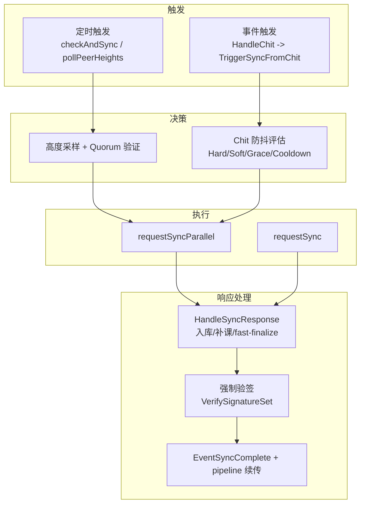
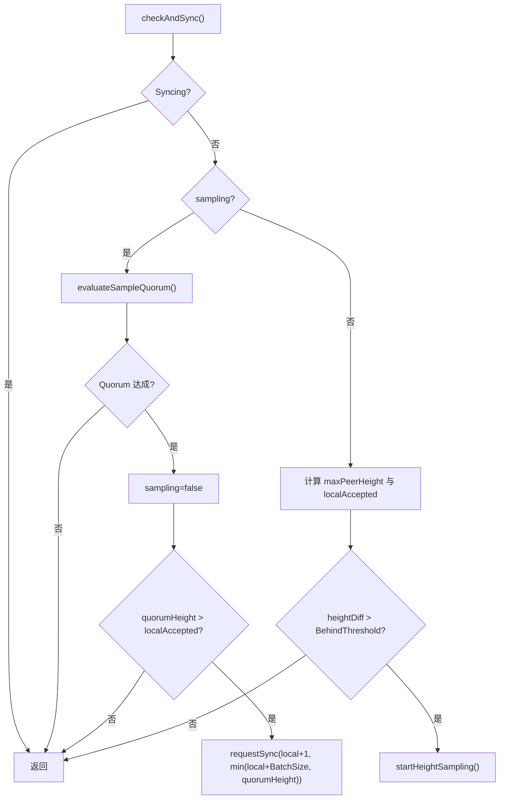
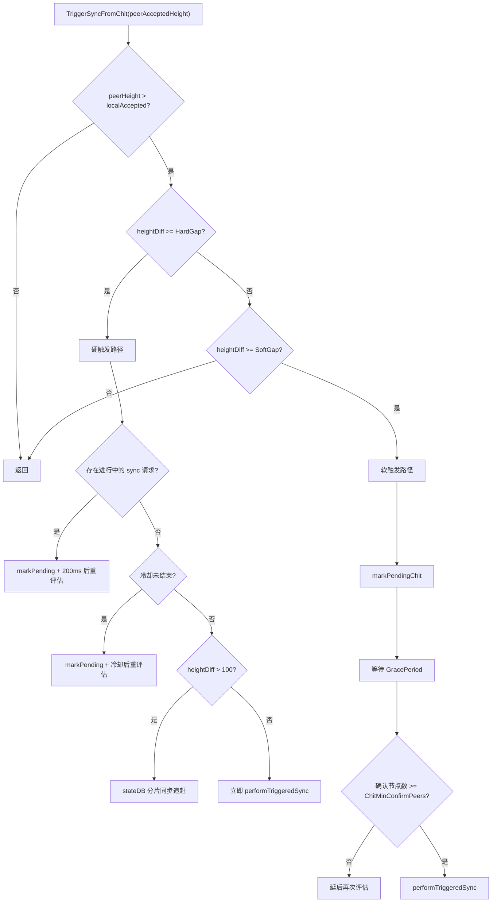
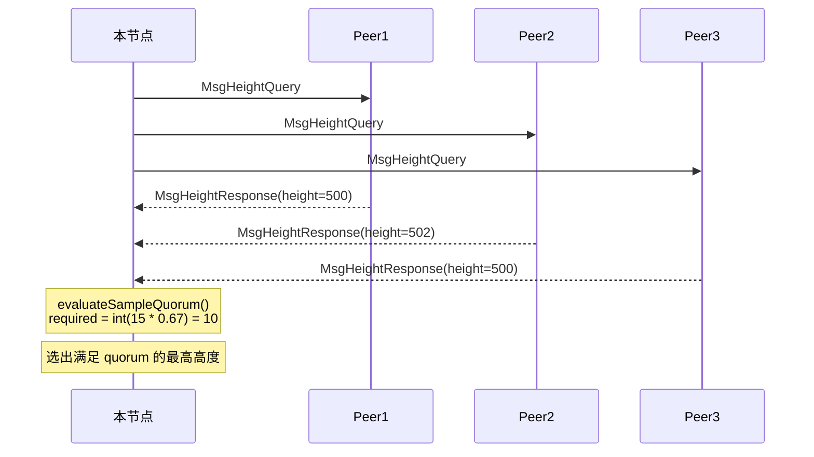
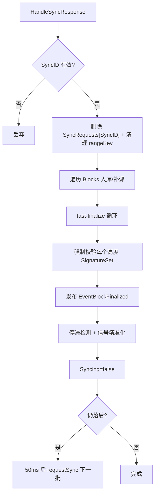
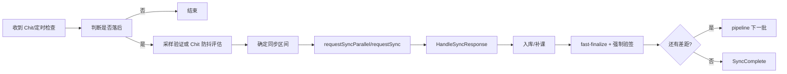

# 共识同步流程详解（与当前实现同步）

> 对齐源码：`consensus/syncManager.go`、`consensus/queryManager.go`、`consensus/messageHandler.go`、`consensus/pending_block_buffer.go`、`consensus/config.go`

---

## 1. 总览

`SyncManager` 的目标是让落后节点安全追平已最终化高度。当前实现有：

1. 两条触发路径
- 定时路径：`checkAndSync` + `pollPeerHeights`
- 事件路径：`QueryManager.HandleChit -> TriggerSyncFromChit`

2. 两种请求方式
- 单点拉取：`requestSync`
- 分片并行：`requestSyncParallel`

3. 一种传输变体
- `SyncShortMode`（短差距时附带 `BlocksShortTxs`，减少完整交易传输）

> 当前消息类型里没有 `SnapshotRequest/SnapshotResponse`；深度落后时的 stateDB 同步通过独立的 shard/page 接口完成。

---

## 2. 启动后后台循环

`SyncManager.Start()` 启动 3 个循环：

| 循环 | 周期 | 作用 |
|------|------|------|
| `checkAndSync` | `CheckInterval`（默认 30s） | 检查落后并驱动采样/同步 |
| `pollPeerHeights` | `CheckInterval`（默认 30s） | 主动探测 Peer 已接受高度 |
| `processTimeouts` | 1s | 超时回收、状态兜底、去重表清理 |

`pollPeerHeights` 的实现细节：

1. `Syncing=true` 时直接跳过，避免拥塞。
2. 默认冷却 2s；若发现 `maxPeer > accepted + 2`，冷却缩短到 500ms。
3. 每次向最多 10 个随机 peer 发 `MsgHeightQuery`。

---

## 3. 路径 A：定时触发

### 3.1 高度采集

`HandleHeightResponse` 只记录对端 `msg.Height`（已接受/已最终化高度），不以 `msg.CurrentHeight` 作为同步目标。

### 3.2 checkAndSync 决策

核心逻辑：

1. 若正在 `Syncing`，本轮退出。
2. 若正在 `sampling`，先评估 Quorum。
3. 若未采样，则计算 `heightDiff = maxPeerHeight - localAccepted`。
4. 仅当 `heightDiff > BehindThreshold` 才启动采样。

---

## 4. 路径 B：Chit 事件触发

`QueryManager.HandleChit` 在 `msg.AcceptedHeight > localAccepted` 时调用：

`syncManager.TriggerSyncFromChit(msg.AcceptedHeight, fromNode)`

触发分为硬触发和软触发：

1. 硬触发：`heightDiff >= ChitHardGap`（默认 3）。
先经过残留状态/冷却保护；真正执行时再按 `DeepLagStateSyncThreshold`（默认 100）分流。
2. 软触发：`ChitSoftGap <= heightDiff < ChitHardGap`（默认 soft=1），走延迟评估。

实现里的状态保护点：

1. `resetStaleSyncStateLocked`：若 `Syncing/sampling` 仅是残留状态且无请求，会自动清理。
2. `triggerCooldownRemainingLocked`：冷却期内只记录 pending，不直接触发。
3. `scheduleChitEvaluationLocked`：避免重复挂过多定时器。
4. `evaluatePendingChitTrigger` 在最终落地触发前会再次分流：`heightDiff >= HardGap && heightDiff > DeepLagStateSyncThreshold` 时走 stateDB-first，否则走普通追块。

---

## 5. 采样验证（Quorum）

当定时路径检测到落后超过 `BehindThreshold` 后：

1. `startHeightSampling` 向 `SampleSize` 个节点发送 `MsgHeightQuery`。
2. 收集到 `sampleResponses` 后，`evaluateSampleQuorum` 计算可确认的最高高度。

Quorum 门槛实现：

`required = int(float64(SampleSize) * QuorumRatio)`

默认值 `15 * 0.67 = 10.05`，代码取整后为 `10`。

最高 Quorum 高度选择规则：

1. 枚举响应中每个候选高度 `H`。
2. 统计 `supportCount = count(height >= H)`。
3. `supportCount >= required` 时，选择最大的 `H` 作为 `maxQuorumHeight`。

---

## 6. 同步请求执行

### 6.1 触发后的统一入口

普通追块入口：

`performTriggeredSync(peerAcceptedHeight, localAccepted, heightDiff)`

会调用：

`requestSyncParallel(localAccepted+1, min(localAccepted+BatchSize, peerAcceptedHeight))`

深度落后入口（`heightDiff > DeepLagStateSyncThreshold`）：

`performStateDBFirstSyncThenCatchUp(...)`

该路径会先尝试分片 stateDB 同步（不同 shard 分配给不同 peer 并行下载）：

1. 拉取 shard 列表（`/statedb/snapshot/shards`）。
2. 按 shard 把主下载 peer 做轮转分配，并对失败 shard 做 peer fallback。
3. 分页拉取 shard 数据（`/statedb/snapshot/page`），合并后重建本地 stateDB 快照。
4. 完成后继续常规区块追赶 pipeline；若 state 同步失败则回退到仅区块追赶。

### 6.2 requestSyncParallel

流程要点：

1. `InFlightSyncRanges` 去重，防止同范围重复请求。
2. 可用 peer 为 `SamplePeers(nodeID, ParallelPeers)`。
3. 若范围很小（`totalBlocks <= 5`）或只有一个 peer，退化到 `requestSync`。
4. 分片后每个 shard 使用独立 `syncID` 并发请求。
5. `SyncShortMode` 判定依据是总范围：`totalBlocks <= ShortSyncThreshold`。

### 6.3 requestSync

流程要点：

1. 同样走 `InFlightSyncRanges` 去重。
2. 优先选择已知 `PeerHeights` 中能覆盖 `toHeight` 的节点。
3. 若没有匹配 peer，随机采样 5 个节点挑一个。

---

## 7. HandleSyncRequest（响应方）

收到 `MsgSyncRequest` 后：

1. `store.GetBlocksFromHeight(from, to)` 取区块。
2. 组装 `MsgSyncResponse`：
- `Blocks`
- `FromHeight/ToHeight`
- `SyncShortMode`

3. 严格模式下，若 `store` 是 `RealBlockStore`，仅保留“有可序列化 `SignatureSets`”的区块；缺失或序列化失败的区块会被剔除，不发送。
4. 若 `store` 不是 `RealBlockStore`（无法读取签名集），返回空区块集（严格模式）。
5. 若 `SyncShortMode=true`，只对最终保留的区块附带 `BlocksShortTxs`（从缓存读取）。

---

## 8. HandleSyncResponse（核心处理）

具体行为：

1. 响应有效性  
- 若 `SyncID` 不在 `SyncRequests`，直接忽略。

2. 签名集合预校验（强制）  
- 对响应里的每个高度，必须存在对应 `SignatureSets[height]`。
- 必须能反序列化为 `ConsensusSignatureSet`，且通过 `VerifySignatureSet`。
- 不满足时该高度视为无效，不参与入库与最终化。

3. 区块入库  
- 无“已验证签名集”的区块会被直接跳过。
- 短模式且有 `BlocksShortTxs` 时，优先放入 `PendingBlockBuffer` 异步补课，并做 optimistic `added++`。
- 否则走 `store.Add`；若报 `block data incomplete`，也放入 `PendingBlockBuffer`。

4. fast-finalize  
- 只用本次 sync 响应里的区块构建 `blocksByHeight`。
- 从 `acceptedHeight+1` 开始找下一高度候选。
- 优先选 `ParentID == acceptedID` 的候选；没有则退化为第一个。
- 每个待最终化高度必须已有“已验证签名集”；缺失则停止 fast-finalize。
- 成功 `SetFinalized` 后发布 `EventBlockFinalized`。

5. 停滞保护  
- 若 `finalized==0` 且同步范围晚于当前高度，连续 3 轮停滞会清理该 peer 的高度记录并打断当前流水线。

6. 信号精准化  
- 仅当 `added>0 || finalized>0` 且 `maxPeer <= curAccepted + BatchSize` 时发布 `EventSyncComplete`。

7. pipeline 续传  
- 有进展且仍落后时，50ms 后继续 `requestSync(nextRange)`。

---

## 9. VRF 签名集合验证

`VerifySignatureSet(sigSet, alpha, beta, transport, localNodeID)` 的 4 步：

> 当前实现里，这是同步“通过验证”的必要条件；缺失或验签失败会导致对应高度被跳过，且不能用于 fast-finalize。

| 步骤 | 规则 | 目的 |
|------|------|------|
| 1 | `len(rounds) >= beta` | 防止伪造“快速最终化” |
| 2 | 每轮 `len(signatures) >= alpha` | 防止少量签名凑证据 |
| 3 | 重放 `samplePeersDeterministic(vrfSeed, seqID, k, peers)` 校验签名者在采样集 | 防止采样外签名 |
| 4 | 重算 chit digest 并做 ECDSA 验签（若公钥表非空） | 防止签名伪造 |

实现细节：

1. 第 3 步里 `k` 取 `len(allPeers)` 上限进行重放校验。
2. 若本地公钥注册表为空（新节点冷启动场景），第 4 步会被跳过。

---

## 10. 超时与容错

`processTimeouts` 每 1s 执行：

1. 若既不 `Syncing` 也不 `sampling`，直接返回。
2. 清理超过 `Timeout` 的 `SyncRequests`。
3. 若本轮发生超时且 `SyncRequests` 已空，设置 `Syncing=false`。
4. 采样超过 `SampleTimeout` 时，设置 `sampling=false`。
5. 清理超过 `Timeout*2` 的 `InFlightSyncRanges`。

容错与防抖机制汇总：

| 机制 | 作用 |
|------|------|
| `InFlightSyncRanges` | 同步范围去重，防重复请求 |
| `consecutiveStallCount` | 连续停滞自动切换 peer |
| `ChitCooldown` | 限制事件触发频率 |
| `ChitGracePeriod` | 软触发先观察再行动 |
| `ChitMinConfirmPeers` | 软触发最小确认数 |
| `resetStaleSyncStateLocked` | 清理残留同步状态 |

---

## 11. PendingBlockBuffer 补课关系

同步路径与 `PendingBlockBuffer` 的交互点：

1. 短模式收到 `BlocksShortTxs` 时，先把块放入 buffer 补齐交易。
2. `store.Add` 因 `block data incomplete` 失败时，也进入 buffer 补课。
3. buffer 会按来源节点/提议者主动拉缺失交易，指数退避重试。
4. 补齐后会缓存完整 `pb.Block` 供后续完整性检查通过。

> 在 `SyncManager` 路径里调用 `AddPendingBlockForConsensus` 时回调通常为 `nil`，因此这里主要是“补齐缓存并等待后续流程消费”。

---

## 12. 关键默认配置（当前实现）

| 配置 | 默认值 | 文件 |
|------|--------|------|
| `CheckInterval` | 30s | `consensus/config.go` |
| `BehindThreshold` | 2 | `consensus/config.go` |
| `BatchSize` | 50 | `consensus/config.go` |
| `Timeout` | 10s | `consensus/config.go` |
| `ShortSyncThreshold` | 20 | `consensus/config.go` |
| `ParallelPeers` | 3 | `consensus/config.go` |
| `SampleSize` | 15 | `consensus/config.go` |
| `QuorumRatio` | 0.67 | `consensus/config.go` |
| `SampleTimeout` | 2s | `consensus/config.go` |
| `Consensus.Alpha` | 14 | `consensus/config.go` |
| `Consensus.Beta` | 15 | `consensus/config.go` |
| `DeepLagStateSyncThreshold` | 100 | `consensus/config.go` |
| `StateSyncPeers` | 4 | `consensus/config.go` |
| `StateSyncShardConcurrency` | 8 | `consensus/config.go` |
| `StateSyncPageSize` | 1000 | `consensus/config.go` |
| `ChitSoftGap` | 1 | `consensus/config.go` |
| `ChitHardGap` | 3 | `consensus/config.go` |
| `ChitGracePeriod` | 1s | `consensus/config.go` |
| `ChitCooldown` | 1.5s | `consensus/config.go` |
| `ChitMinConfirmPeers` | 2 | `consensus/config.go` |

---

## 13. 端到端流程图

