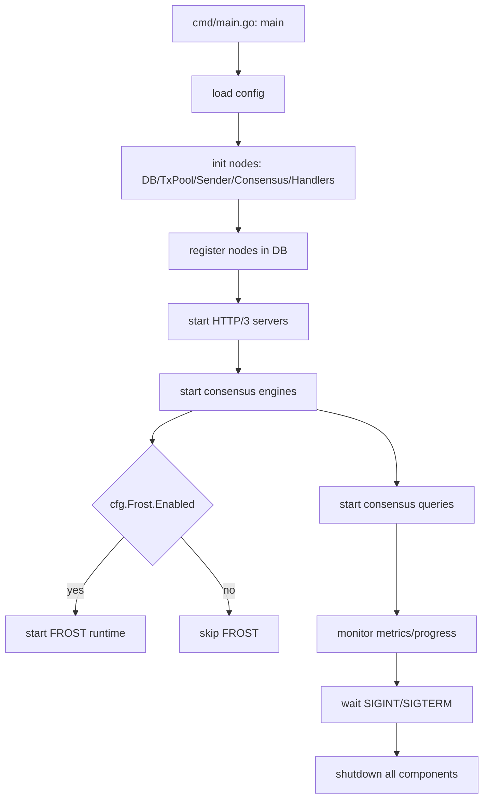
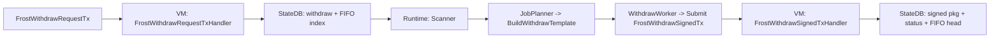
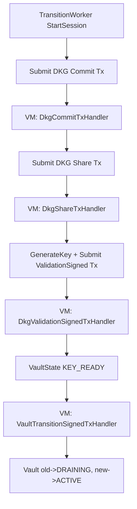
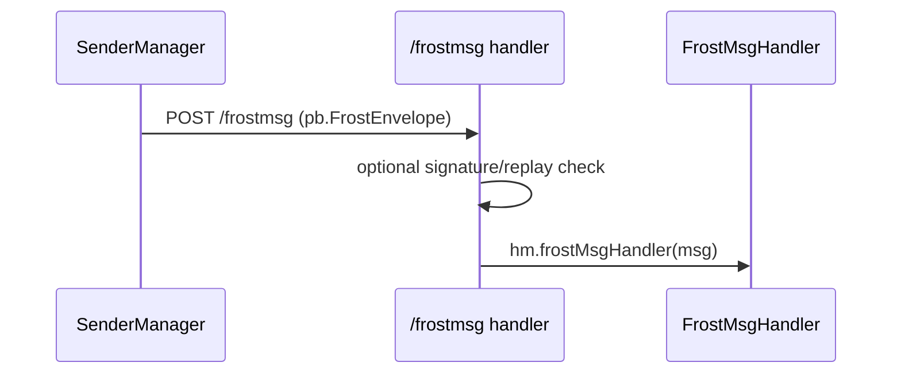

# FROST 代码阅读指南（基于当前实现）

这份指南基于现有代码行为总结，重点描述运行生命周期、调用路径和关键模块。内容不以设计稿为前提。

## 1. 入口与生命周期
- 实际入口：`cmd/main.go`
- 启动阶段（按代码顺序）：
  - Phase 1：创建节点、清理数据目录、初始化 DB / TxPool / Sender / Consensus / Handlers
  - Phase 2：将节点注册到各自 DB（使节点互相可发现）
  - Phase 3：启动 HTTP/3 服务（quic-go，自签证书）
  - Phase 3.5：启动共识引擎
  - Phase 3.6：若 `cfg.Frost.Enabled` 为 true，启动 FROST Runtime
  - Phase 4：启动共识查询、监控指标与进度
- 退出：SIGINT/SIGTERM 触发优雅关闭，依次停止 FROST Runtime、共识、Handler、Sender、TxPool、HTTP 服务、DB

调用图（启动生命周期）：

相关文件：
- `cmd/main.go`
- `config/config.go`
- `config/frost.go`

## 2. 模块地图（定位入口）
- Runtime 编排：`frost/runtime/*`
  - `manager.go`（Runtime 主循环）
  - `scanner.go`（FIFO 队列扫描）
  - `job_planner.go`（确定性模板规划）
  - `withdraw_worker.go`（提交签名提现交易）
  - `transition_worker.go`（DKG 与 Vault 轮换）
  - `coordinator.go` / `participant.go`（ROAST 会话）
  - `session/*`（nonce 绑定与内存存储）
- 链适配器：`frost/chain/*`
  - `adapter.go`（接口 + 工厂）
  - `btc/*`（已实现）
  - `evm/*`（部分实现）
  - `tron/*`、`solana/*`（空壳）
- VM 状态机：`vm/frost_*`、`vm/frost_dkg_handlers.go`
- HTTP & P2P：`handlers/frost_*`、`handlers/handleFrostMsg.go`
- P2P 发送：`sender/doSendFrost.go`
- 状态 Key：`keys/keys.go`（FROST 区块）

## 3. FROST Runtime 生命周期（当前实现行为）
在 `cmd/main.go` 中创建 `Manager` 时只传了 `ManagerConfig{NodeID: ...}`，因此：
- `SupportedChains` 为空 => 扫描循环不执行任何链
- `Notifier` 为空 => finalized 事件回调不触发
- `TxSubmitter` / `P2P` / `SignerProvider` / `VaultProvider` 均为空

Runtime 主循环（`frost/runtime/manager.go`）：
- `Start()` 启动 `runLoop()`
- 默认每 5 秒执行 `scanAndProcess()`
- `scanAndProcess()` 依赖 `SupportedChains` 列表逐链处理

相关文件：
- `frost/runtime/manager.go`
- `frost/runtime/scanner.go`
- `frost/runtime/job_planner.go`
- `frost/runtime/withdraw_worker.go`
- `frost/runtime/adapters/state_reader.go`

## 4. 提现流程（VM + Runtime）
VM 侧：
- `FrostWithdrawRequestTxHandler` 写入 FIFO + `pb.FrostWithdrawState`
  - FIFO Keys：`KeyFrostWithdrawFIFOSeq` / `KeyFrostWithdrawFIFOHead` / `KeyFrostWithdrawFIFOIndex`
  - State Key：`KeyFrostWithdraw(withdraw_id)`
- `FrostWithdrawSignedTxHandler`：
  - 首次提交强制 FIFO 顺序
  - BTC 验签与 UTXO lock
  - 更新 Withdraw 状态为 SIGNED
  - 写入签名产物并推进 FIFO head

Runtime 侧（期望行为）：
- `Scanner.ScanOnce()` 读取 FIFO head 与 queued withdraw
- `JobPlanner.PlanJob()` 调链适配器构建模板与 job_id
- `WithdrawWorker.ProcessOnce()` 提交 `pb.FrostWithdrawSignedTx`

调用图（提现路径）：

相关文件：
- `vm/frost_withdraw_request.go`
- `vm/frost_withdraw_signed.go`
- `frost/runtime/scanner.go`
- `frost/runtime/job_planner.go`
- `frost/runtime/withdraw_worker.go`
- `keys/keys.go`

## 5. DKG 与 Vault 轮换流程
VM 侧（状态写入与校验）：
- `FrostVaultDkgCommitTxHandler`
- `FrostVaultDkgShareTxHandler`
- `FrostVaultDkgComplaintTxHandler`
- `FrostVaultDkgRevealTxHandler`
- `FrostVaultDkgValidationSignedTxHandler`
- `FrostVaultTransitionSignedTxHandler`

Runtime 侧（期望行为）：
- `TransitionWorker` 驱动 DKG：commit -> share -> key -> validation
- `DefaultVaultCommitteeProvider` 从 StateDB 读 Top10000、VaultConfig、VaultState

调用图（DKG 与切换）：

相关文件：
- `frost/runtime/transition_worker.go`
- `frost/runtime/vault_committee_provider.go`
- `vm/frost_dkg_handlers.go`
- `db/manage_frost.go`

## 6. P2P 消息路径（HTTP 入口）
实际 HTTP 路径：
- `sender.SendFrost` -> POST `https://<peer>/frostmsg`
- `handlers.HandleFrostMsg` 进行可选签名/重放校验，然后调用 `hm.frostMsgHandler`

调用图（P2P 入口）：

注意点：
- Runtime 内部使用 `runtime.FrostEnvelope`，HTTP 侧使用 `pb.FrostEnvelope`，两者未打通。
- `HandlerManager.SetFrostMsgHandler` 在 `cmd/main.go` 中没有被调用。

相关文件：
- `sender/doSendFrost.go`
- `handlers/handleFrostMsg.go`
- `frost/runtime/coordinator.go`
- `frost/runtime/participant.go`
- `frost/runtime/net/msg.go`

## 7. 配置与状态键
- `config/frost.go` 定义 FrostConfig，但运行时没有显式加载与注入。
- Key 定义集中在 `keys/keys.go` 的 FROST 部分，VM 与 Runtime 共享。

相关文件：
- `config/frost.go`
- `keys/keys.go`

## 8. 现有集成缺口（阅读时要特别注意）
- `cmd/main.go` 未使用 `DefaultManagerConfig`，导致 `SupportedChains` 为空。
- `TxSubmitter` 为 nil，`WithdrawWorker` 无法提交交易。
- `TxPoolSubmitter` 需要 `AddTx` / `Broadcast` 接口，但 `txpool.TxPool` 未实现这些方法。
- 只注册了 BTC 适配器，EVM 未注册，TRON/SOL 是空实现。
- P2P 处理链路未打通（runtime handler 未接入）。

## 9. 建议阅读顺序
1) `cmd/main.go`（全局生命周期）
2) `handlers/manager.go`、`handlers/handleFrostMsg.go`（HTTP 入口）
3) `vm/default_handlers.go` + `vm/frost_*`（链上状态变化）
4) `frost/runtime/manager.go` -> `scanner.go` -> `job_planner.go` -> `withdraw_worker.go`
5) `frost/chain/*`（模板构建）
6) `frost/runtime/coordinator.go`、`participant.go`（ROAST 会话）
7) `frost/runtime/transition_worker.go` + `vault_committee_provider.go`
8) `keys/keys.go` + `db/manage_frost.go`
