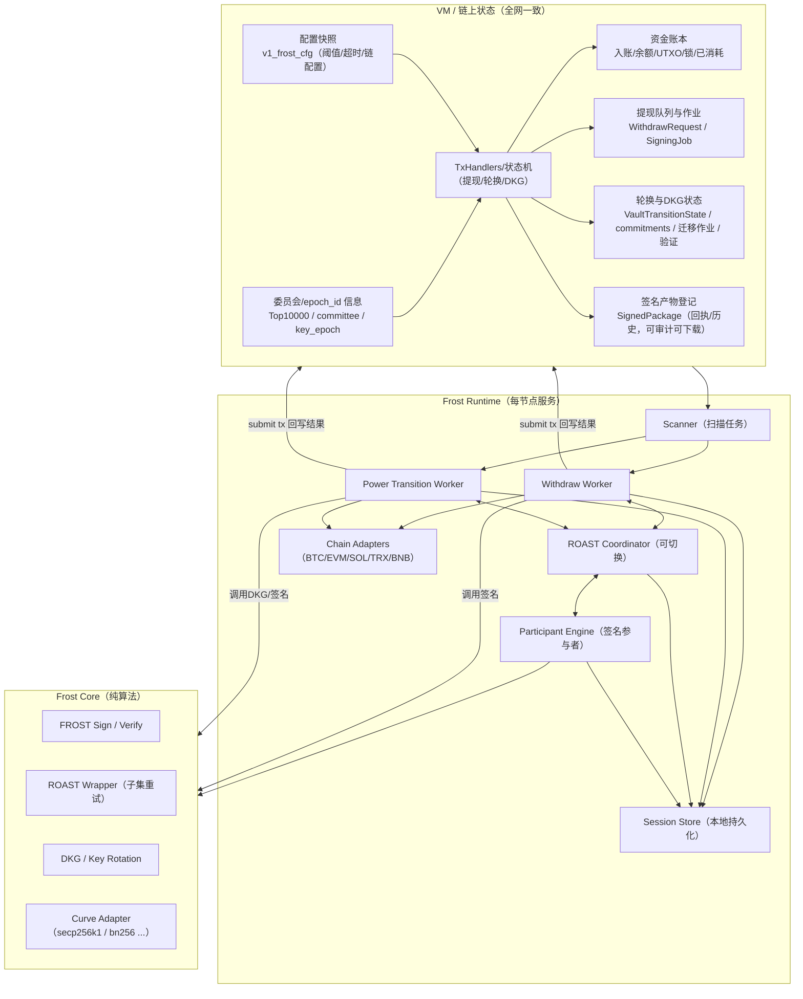
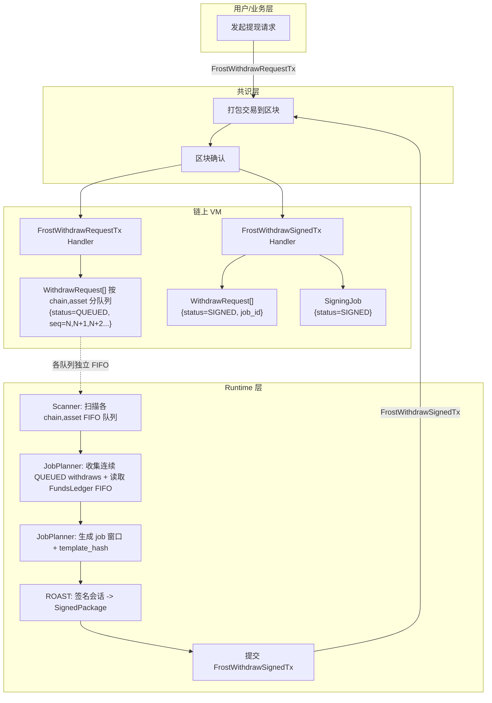
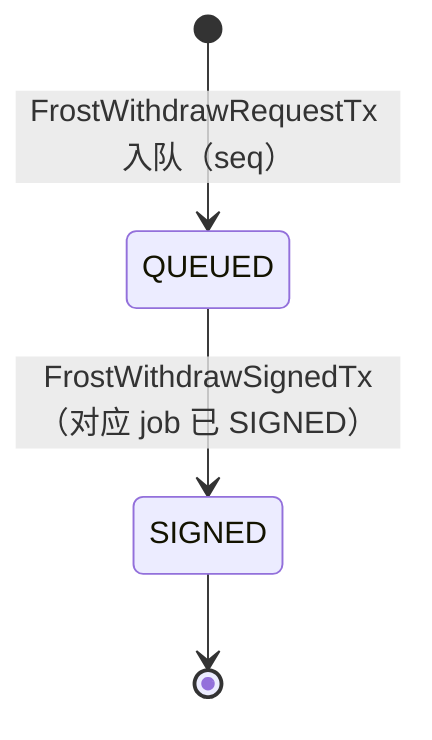
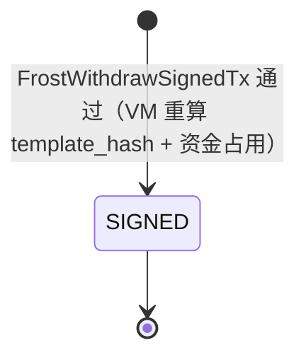
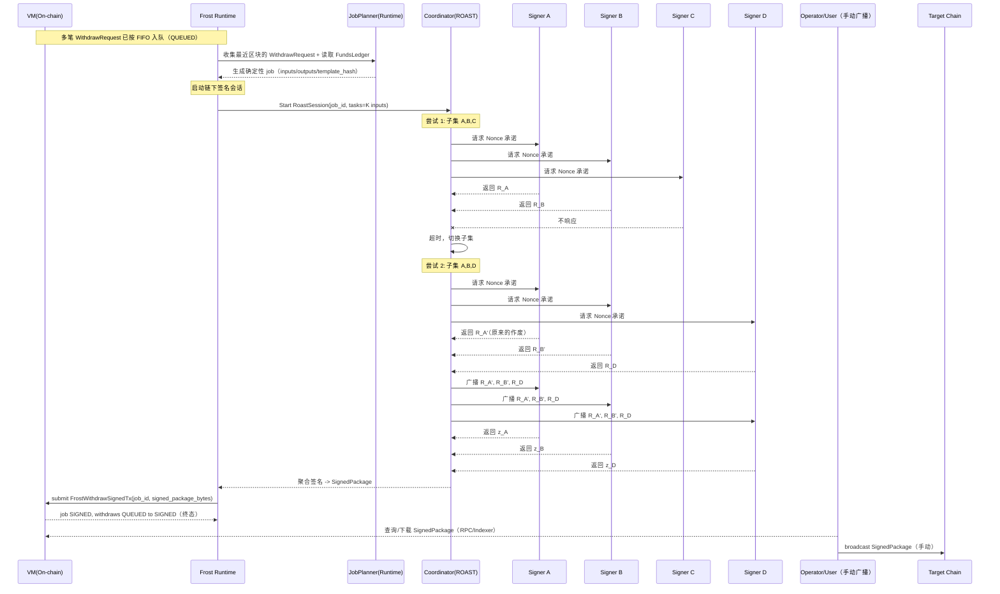
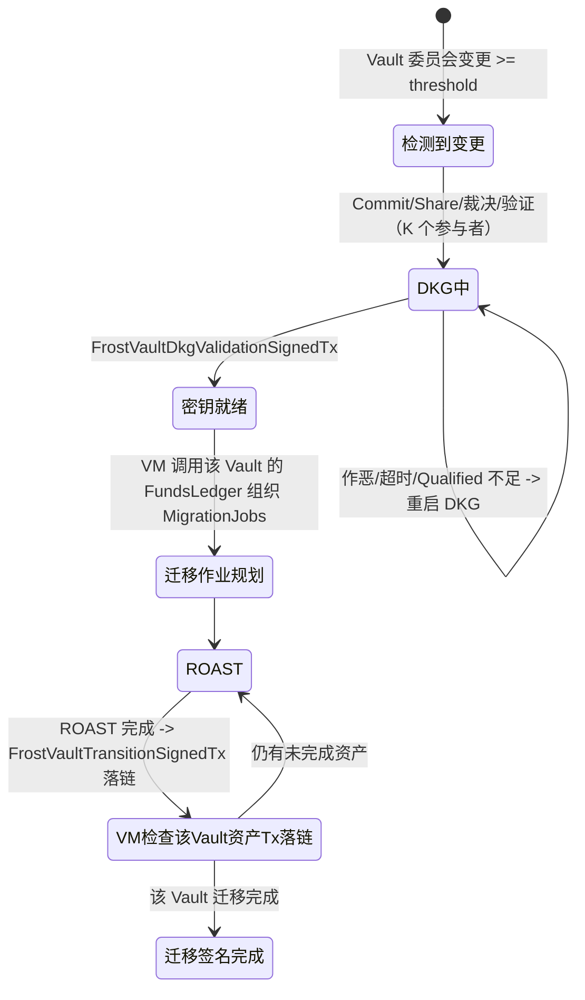
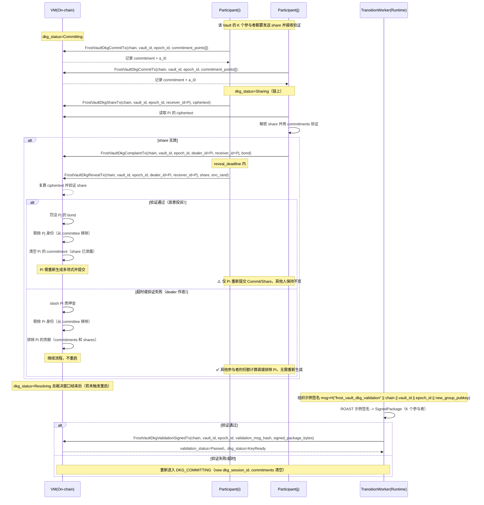
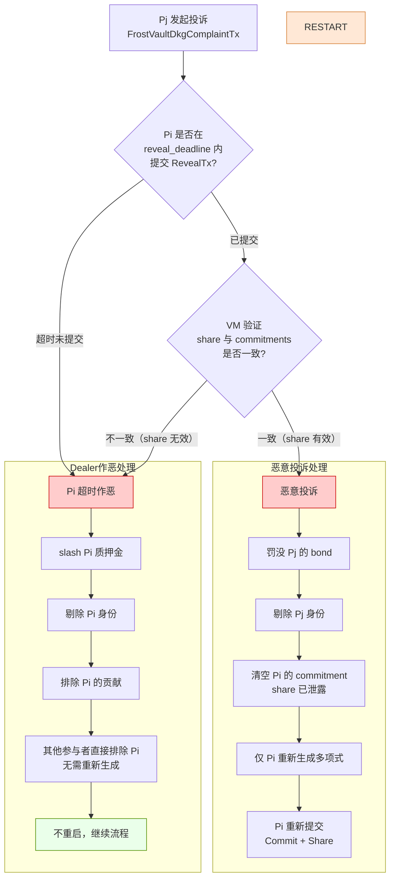
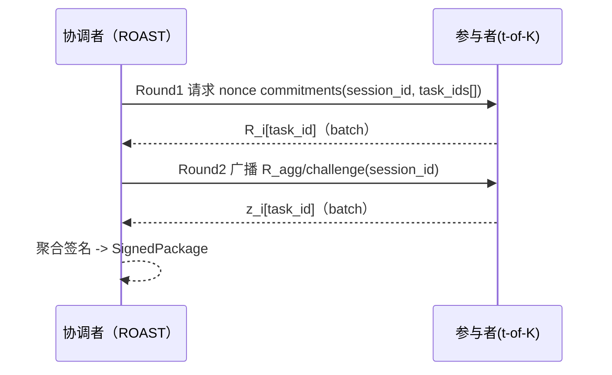


# FROST 模块设计文档（v1）

> 目标：把 FROST 做成**独立于共识**的"跨链资产执行引擎"，严格按**已达成共识的队列**执行两类流程：
> 1) 提现（Withdraw Queue）
> 2) 权力交接/密钥轮换（Power Transition / Key Rotation Queue）
>
> 关键约束来自 `frost/requirements.md`：
> - 前 10000 个共识 miner 参与签名流程（可从状态机/数据库获取其公钥/地址）
> - Withdraw 支持 FROST/ROAST；ROAST 要支持**超时切换聚合者**
> - Nonce/UTXO 设计要确保异步冗余下仍不多签发
> - v1 支持：BTC / ETH / SOL / TRX / BNB
> - Gas/手续费配置文件（按年均 300% 写死，后续版本治理/升级更新）
> - 提现调度 FIFO（先入账的资金先被提现）
> - 提现/迁移相关的三方链交易：**FROST/整个工程不负责广播与确认**；Runtime 只负责构建模板、完成门限签名，并把"签名产物/交易包"落链（可查询/可审计）；广播由用户/运营方手动完成。
> - 允许 ROAST 对同一 `template_hash` 产生**多份合法签名产物**；系统通过 tx 接受并追加记录这些产物（receipt/history），同时保证不会导致双花（同一 withdraw_id 绑定同一模板/同一输入集合）。

---

## 0. 术语

- **On-chain State**：由 VM 执行、随区块最终化提交的状态（全网一致、可验证）。
- **Runtime**：每个节点本地运行的 frost 服务（非共识、可重启、可容错）。
- **Signer Set (Top10000)**：由 `committee_ref` 指向的 Top10000 miner 快照（来自状态机/数据库可查询）。
- **Committee（Top10000 bitmap）**：链上 Top10000 的 bitset 表示，按 bit index 形成确定性排序列表。
- **Threshold (t)**：门限签名阈值（默认 `t = ceil(N * 0.8)`，可配置）。
- **Coordinator / Aggregator（聚合者）**：会话中负责收集承诺值/部分签名并输出聚合签名的角色；需要可切换。
- **Session**：一次签名或一次 DKG/轮换的会话，包含 session_id、参与者集合、消息摘要等。
- **DKG Commitments（承诺点）**：参与者在 DKG 中登记到链上的承诺点集合（用于份额验证与链上裁决）。
- **Chain Adapter**：链适配器（BTC UTXO vs 合约链/账户模型链）。

**Vault 相关术语（资金分片）**：

- **Vault（金库）**：每条链上的一个独立资金分片，拥有自己的门限公钥、签名委员会和资金池。同一条链可有 M 个 Vault，资金与签名权限按 Vault 隔离。
- **vault_id**：Vault 的唯一标识（`0..M-1`），用于区分同链的不同金库。
- **VaultRef（金库地址）**：Vault 在目标链上的具体地址/合约：
  - BTC：Taproot 地址（由该 Vault 的 `group_pubkey` 派生）
  - EVM（ETH/BNB）：托管合约地址
  - SOL：程序派生账户（PDA）
  - TRX：托管合约地址
- **VaultCommittee（金库委员会）**：负责该 Vault 签名的 K 个矿工子集（从 Top10000 确定性分配）。
- **vault_key_epoch**：Vault 当前生效的密钥版本（每次该 Vault 的 DKG 完成后递增）。
- **VaultConfig**：链级 Vault 配置（vault_count、committee_size、threshold_ratio 等）。
- **VaultState**：单个 Vault 的运行时状态（vault_ref、group_pubkey、committee_members、lifecycle 等）。

**签名算法与曲线（按链区分）**：

> 不同链使用不同的签名曲线/算法（来自 `pb.SignAlgo`），因此每个 Vault 的 `group_pubkey` 是**曲线相关**的。DKG 产出的密钥份额和公钥只能用于该曲线的签名。

| 链 | SignAlgo | 曲线 | FROST 变体 | group_pubkey 格式 |
|----|----------|------|-----------|------------------|
| BTC | `SCHNORR_SECP256K1_BIP340` | secp256k1 | FROST-secp256k1 | 32 bytes x-only（BIP-340） |
| ETH/BNB | `SCHNORR_ALT_BN128` | alt_bn128 | FROST-bn128 | 64 bytes (x \|\| y) |
| SOL | `ED25519` | ed25519 | FROST-Ed25519 | 32 bytes |
| TRX | `ECDSA_SECP256K1` | secp256k1 | **GG20/CGGMP**（非 FROST） | 33 bytes 压缩格式 |

- **Vault 与链绑定**：每个 Vault 只服务于一条链（一种曲线），`sign_algo` 字段决定 DKG 使用哪种曲线。
- **TRX 特殊处理**：TRX 需要 ECDSA 签名（ecrecover），无法使用 FROST Schnorr；需使用 GG20/CGGMP 等 ECDSA 门限方案。v1 可暂不支持 TRX 门限签名，或采用独立的 ECDSA 门限模块。

---

## 1. 设计目标与非目标

### 1.1 目标

1) **确定性输入，异步执行**
FROST 的输入来自 On-chain State（已最终化的 tx/队列），Runtime 只“读状态 + 执行动作 + 以 tx 回写结果”。

2) **模块解耦**
尽量复用现有工程抽象：EventBus / Transport / VM HandlerRegistry / DBManager。
不引入独立的“ConsensusObserver / FrostVMHandler / FrostNetworkAdapter”平行体系。

3) **安全的 Anti-Double-Spend / Anti-Double-Sign**
- BTC：UTXO 选择与锁定、模板固定
- 合约链：合约层使用 withdraw_id 去重；账户链 nonce/序列由“链上/合约”保证唯一

4) **ROAST 鲁棒性**
- 节点掉线/恶意不配合：自动换子集/换聚合者
- 聚合者作恶：超时切换聚合者（所有节点可独立计算切换序列）

5) **两条主流程独立**
- Withdraw pipeline
- Power transition pipeline：在达到触发阈值时进入，保证最终一致

6) **资金分片与权限分散（Vault 模式）**
- **安全域隔离**："每个 Vault 只控制一部分资金"。任何单个 Vault 被攻破只影响该分片，不波及全局。
- **去中心化覆盖**： "Top10000 被分摊到 M 个 Vault 的委员会里"。每个矿工最多参与一个 Vault 的签名（当 M×K ≈ 10000），权限天然分散。
- **DKG/ROAST 可落地**：每个 Vault 的委员会规模为 K（如 200~500），而非 10000，使得 DKG 与 ROAST 在工程上可行。
- **独立生命周期**：每个 Vault 可独立轮换、迁移、暂停（DRAINING/RETIRED），不需要一次性全网切换。

7) **多曲线/多签名算法支持（按链区分）**
- 每条链绑定唯一的签名算法（`pb.SignAlgo`），决定 DKG 和 ROAST 使用哪种曲线
- BTC: FROST-secp256k1（Schnorr BIP-340）
- ETH/BNB: FROST-bn128（Schnorr alt_bn128）
- SOL: FROST-Ed25519
- TRX: **不使用 FROST**，需 GG20/CGGMP（ECDSA），v1 暂不支持或独立模块


---

## 2. 总体架构

FROST 分三层：**共识状态层（VM） / 运行时层（Runtime） / 密码学内核（Core）**。



---

## 4. On-chain 状态机与数据模型（VM 层）

### 4.1 为什么要“链上状态机”

为了满足：

* “每个 miner 都能根据状态机和数据库得到签名者集合”
* “异步冗余也不多签发”
* “共识暂停时 Runtime 仍执行（但最终以链上队列作为唯一输入源）”

关键做法：
**所有“可能影响资产安全/唯一性”的决策都必须落在链上状态中**（例如：withdraw_id、交易模板 hash、UTXO 锁、合约 withdraw_id 去重标记等）。

### 4.2 Key 前缀

> 具体由keys\keys.go管理。这里用 `v1_frost_` 举例。

**全局配置与委员会**：

| 数据                  | Key 示例                              | 说明                                         |
| ------------------- | ----------------------------------- | ------------------------------------------ |
| 配置快照                | `v1_frost_cfg`                      | topN、thresholdRatio、timeouts、链配置 hash 等 |
| Top10000 集合         | `v1_frost_top10000_<height>`        | bitmap（bitset，按 Top10000 index 排序） |

**Vault 配置与状态（每条链 M 个 Vault）**：

| 数据                  | Key 示例                              | 说明                                         |
| ------------------- | ----------------------------------- | ------------------------------------------ |
| Vault 配置            | `v1_frost_vault_cfg_<chain>`        | VaultConfig：vault_count(M)、committee_size(K)、threshold_ratio、selection_seed_rule |
| Vault 状态            | `v1_frost_vault_<chain>_<vault_id>` | VaultState：vault_ref、sign_algo、committee_members、key_epoch、group_pubkey、lifecycle |
| Vault 轮换状态        | `v1_frost_vault_transition_<chain>_<vault_id>_<epoch_id>` | 单个 Vault 的 DKG/迁移状态（独立于其他 Vault） |
| Vault DKG 承诺        | `v1_frost_vault_dkg_commit_<chain>_<vault_id>_<epoch_id>_<miner>` | 该 Vault DKG 的参与者承诺点 |

**资金账本（按 Vault 分片）**：

| 数据                  | Key 示例                              | 说明                                         |
| ------------------- | ----------------------------------- | ------------------------------------------ |
| Funds Ledger        | `v1_frost_funds_<chain>_<asset>_<vault_id>` | 该 Vault 的余额、lot 队列、UTXO set（BTC）等 |
| Funds Lot Index     | `v1_frost_funds_lot_<chain>_<asset>_<vault_id>_<height>_<seq>` | 入账 lot 索引（按 Vault 分片，height 需零填充） |
| Funds Lot Head      | `v1_frost_funds_lot_head_<chain>_<asset>_<vault_id>` | 该 Vault 的 FIFO 头指针 |
| Funds Lot Seq       | `v1_frost_funds_lot_seq_<chain>_<asset>_<vault_id>_<height>` | 每个高度的 lot 序号计数器 |
| Funds Pending Lot   | `v1_frost_funds_pending_lot_<chain>_<asset>_<vault_id>_<height>_<seq>` | 已确认但未上账（待入账队列，按 Vault 分片） |
| Funds Pending Lot Seq | `v1_frost_funds_pending_lot_seq_<chain>_<asset>_<vault_id>_<height>` | 待入账队列序号 |
| Funds Pending Ref   | `v1_frost_funds_pending_ref_<request_id>` | request_id -> (vault_id, pending lot key) |
| BTC UTXO            | `v1_frost_btc_utxo_<vault_id>_<txid>_<vout>` | 该 Vault 的 UTXO（避免跨 Vault 误签） |
| BTC Locked UTXO     | `v1_frost_btc_locked_utxo_<vault_id>_<txid>_<vout>` | 该 Vault 已锁定的 UTXO -> job_id |

**提现队列（全局 FIFO，签名时选择 Vault）**：

| 数据                  | Key 示例                              | 说明                                         |
| ------------------- | ----------------------------------- | ------------------------------------------ |
| Withdraw Queue      | `v1_frost_withdraw_<withdraw_id>`   | 提现请求与状态（含 vault_id 字段，SIGNED 后回填） |
| Withdraw FIFO Index | `v1_frost_withdraw_q_<chain>_<asset>_<seq>` | 按 (chain, asset) 分队列的 FIFO 索引 |
| Withdraw FIFO Seq   | `v1_frost_withdraw_seq_<chain>_<asset>` | 每个 (chain, asset) 队列的 seq 计数器 |
| Withdraw FIFO Head  | `v1_frost_withdraw_head_<chain>_<asset>` | 每个队列的 FIFO 头指针 |

**签名产物**：

| 数据                  | Key 示例                              | 说明                                         |
| ------------------- | ----------------------------------- | ------------------------------------------ |
| SignedPackage 收据    | `v1_frost_signed_pkg_<job_id>_<idx>`   | SignedPackage 列表（receipt/history，append-only） |

### 4.3 核心结构（ Proto ）

#### 4.3.0 VaultConfig 与 VaultState（链上，Vault 分片核心）

**VaultConfig（链级配置）**：

每条链一个配置，决定该链的 Vault 分片策略：

* `chain`：链标识（btc/eth/bnb/trx/sol）
* `sign_algo`：该链使用的签名算法（对应 `pb.SignAlgo`）：
  - BTC: `SCHNORR_SECP256K1_BIP340`
  - ETH/BNB: `SCHNORR_ALT_BN128`
  - SOL: `ED25519`
  - TRX: `ECDSA_SECP256K1`（需 GG20/CGGMP，v1 暂不支持或独立模块）
* `vault_count`（M）：该链的 Vault 数量（如 20~50）
* `committee_size`（K）：每个 Vault 的委员会规模（如 200~500）
* `threshold_ratio`：门限比例（如 0.67~0.8）
* `selection_seed_rule`：委员会选取种子规则（如 `H(epoch_id || chain)`）
* `vault_refs[]`：各 Vault 的地址/合约（BTC=Taproot 地址；EVM=合约地址；可由 group_pubkey 派生或预部署）
* `deposit_allocation_rule`：入账分配策略（如 `H(request_id) % M` 或轮询）

**VaultState（单个 Vault 运行时状态）**：

每条链的每个 Vault 一个状态：

* `chain / vault_id`：链标识与 Vault 编号（`0..M-1`）
* `vault_ref`：该 Vault 在目标链的地址/合约地址
* `sign_algo`：签名算法（从 VaultConfig 继承，对应 `pb.SignAlgo`）
* `committee_ref`：委员会快照高度（指向 Top10000）
* `committee_members[]`：该 Vault 的 K 个签名者（可从 Top10000 + selection_seed 确定性计算，也可显式存储）
* `key_epoch`：该 Vault 当前生效的密钥版本（每次 DKG 完成后递增）
* `group_pubkey`：该 Vault 当前的聚合公钥（格式由 `sign_algo` 决定）
  - `SCHNORR_SECP256K1_BIP340`: 32 bytes x-only
  - `SCHNORR_ALT_BN128`: 64 bytes (x || y)
  - `ED25519`: 32 bytes
  - `ECDSA_SECP256K1`: 33 bytes 压缩格式
* `lifecycle`：生命周期状态
  - `ACTIVE`：正常运行（可入账、可提现）
  - `DRAINING`：排空中（停止新入账，现有资金继续提现/迁移）
  - `RETIRED`：已退役（资金已全部迁移，不再使用）

**Vault 委员会分组规则**：

从 Top10000 确定性分配到 M 个 Vault 的委员会：

1. 取 Top10000 的确定性列表（按 bit index 排序）
2. 计算种子：`seed = H(epoch_id || chain)`
3. 对列表做确定性洗牌：`permuted_list = Permute(top10000_list, seed)`
4. 按顺序切分：`vault[j].committee = permuted_list[j*K : (j+1)*K]`（j = 0..M-1）

当 `M × K ≈ 10000` 时，每个矿工最多只在一个 Vault 里，权限天然分散。
若 `M × K < 10000`，可允许部分矿工不参与任何 Vault（或用于备选）。

#### 4.3.1 WithdrawRequest（链上）

* withdraw_id：全网唯一（`H(chain || asset || seq || request_height)`）
* seq：队列内 FIFO 序号（每个 `(chain, asset)` 独立递增）
* chain/asset：目标链与资产类型
* to / amount：提现目标地址与数量
* request_height：`FrostWithdrawRequestTx` 最终化高度（用于会话开始高度）
* status：`QUEUED | SIGNED`
* job_id：归属的 SigningJob（当 status=SIGNED 时存在）
* **vault_id**：由哪个 Vault 支付（QUEUED 时为空，SIGNED 时由 JobPlanner 确定性选择并回填）

> 说明：提现队列按 `(chain, asset)` 分开管理，不同资产的提现互不阻塞。`seq` 在每个队列内严格递增。
> **Vault 选择**：提现请求不预先绑定 Vault；JobPlanner 在规划时按确定性顺序尝试各 Vault，选出能覆盖该笔提现的第一个 Vault。

#### 4.3.2 FundsLedger（链上，按 Vault 分片）

> **关键变化**：所有资金按 `(chain, asset, vault_id)` 三元组分片存储。每个 Vault 独立管理自己的 lot/UTXO 集合。

* Account/Contract chains（ETH/BNB/TRX/SOL）：

  * `available_balance`（可选缓存，按 Vault 分片）
  * `reserved_balance`（可选缓存，按 Vault 分片）
  * `pending_lots`（以独立 KV 记录，按 Vault 分片）
    - key：`v1_frost_funds_pending_lot_<chain>_<asset>_<vault_id>_<height>_<seq>`
    - value：`request_id`
  * `deposit_lots`（以独立 KV 记录，按 Vault 分片，FIFO）
    - key：`v1_frost_funds_lot_<chain>_<asset>_<vault_id>_<height>_<seq>`
    - value：`request_id`（金额与 finalize_height 可从 RechargeRequest 读取）

* BTC（按 Vault 分片）：

  * `utxos[]`（每个 Vault 独立的 UTXO 集合：txid:vout:value:pkScript:confirmed_height）
    - key：`v1_frost_btc_utxo_<vault_id>_<txid>_<vout>`
  * `locked_utxos`（映射 utxo->job_id，按 Vault 分片，防止跨 Vault 误签）
    - key：`v1_frost_btc_locked_utxo_<vault_id>_<txid>_<vout>`

> 说明：BTC 的 UTXO 必须按 Vault 隔离，因为不同 Vault 的 Taproot 地址不同，UTXO 归属于特定 Vault。

**入账与 Vault 分配**：

充值时需要明确钱进了哪个 Vault：

1. **充值地址生成**：用户充值前，系统按 `deposit_allocation_rule`（如 `H(request_id) % M`）为其分配一个 `vault_id`，并返回该 Vault 的 `vault_ref`（BTC 地址/合约地址）
2. **Witness 记录**：`WitnessRequestTx` 必须包含 `deposit_address`（或 `vault_id`），用于验证充值确实进入了该 Vault
3. **Pending Lot 写入**：`WitnessRequestTx` 确认后，VM 以 `(chain, asset, vault_id, height, seq)` 写入 Pending Lot Index
4. **Finalized Lot 写入**：见证最终化后，VM 将 lot 移入 `Funds Lot Index`，同样按 Vault 分片

**确定性 Vault 分配算法**（已实现于 `vm/witness_handler.go`）：

```go
// allocateVaultID 确定性分配 vault_id
// 使用 H(request_id) % vault_count 确保相同 request_id 总是分配到相同 vault
func allocateVaultID(requestID string, vaultCount uint32) uint32 {
    hash := sha256.Sum256([]byte(requestID))
    n := binary.BigEndian.Uint32(hash[:4])
    return n % vaultCount
}
```

> **关键安全约束**：资金 lot 的 key 必须包含 `vault_id`，否则会导致不同 Vault 的资金混入同一 FIFO，破坏确定性规划和防多签发机制。
> 参见 `keys/keys.go` 中的 `KeyFrostFundsLotIndex`、`KeyFrostFundsPendingLotIndex` 等函数。

> 设计思路：两层账本（Pending 层 + Finalized 层）。Pending 层仅用于迁移，提现只能提现 Finalized 层资产。

FundsLedger 实现思路（按 Vault 分片）：
- 账户链：用 append-only 的 lot 索引形成天然 FIFO（每个 Vault 独立 FIFO）
  - `v1_frost_funds_pending_lot_<chain>_<asset>_<vault_id>_<height>_<seq> -> request_id`
  - `v1_frost_funds_lot_<chain>_<asset>_<vault_id>_<height>_<seq> -> request_id`
  - 维护 `v1_frost_funds_lot_head_<chain>_<asset>_<vault_id>` 作为该 Vault 的 FIFO 头指针
- BTC：每个 Vault 独立的 UTXO 集合，按 `confirmed_height` 升序选择

#### 4.3.3 VaultTransitionState（链上，按 Vault 独立轮换）

> **关键变化**：轮换从"全网一把 key"改为"按 Vault 独立轮换"。每个 Vault 拥有独立的 DKG/迁移状态，委员会规模为 K（而非 10000），使 DKG 可落地。

每条链的每个 Vault 独立维护一个轮换状态（key = `v1_frost_vault_transition_<chain>_<vault_id>_<epoch_id>`）：

* `chain / vault_id / epoch_id`：该 Vault 的本次轮换标识
* `sign_algo`：该 Vault 使用的签名算法（从 VaultConfig 继承，决定 DKG 使用哪种曲线）
* `trigger_height`：触发轮换的链上高度
* `old_committee_members[] / new_committee_members[]`：旧/新委员会成员（K 个，从 Top10000 确定性分配）
* `dkg_status`：NotStarted / Committing / Sharing / Resolving / KeyReady / Failed
* `dkg_session_id`：`H(chain || vault_id || epoch_id || sign_algo || "dkg")`
* `dkg_threshold_t / dkg_n`：本次 DKG 的参数（t = ceil(K * threshold_ratio)）
* `dkg_commit_deadline / dkg_dispute_deadline`（height）：commit / 裁决窗口
* `dkg_commitments`：该 Vault 委员会成员的承诺点（独立 KV：`v1_frost_vault_dkg_commit_<chain>_<vault_id>_<epoch_id>_<miner>`）
* `old_group_pubkey / new_group_pubkey`：格式由 `sign_algo` 决定（KeyReady 后落链）
* `validation_status`：NotStarted / Signing / Passed / Failed
* `validation_msg_hash`：`H("frost_vault_dkg_validation" || chain || vault_id || epoch_id || sign_algo || new_group_pubkey)`
* `lifecycle`：该 Vault 的生命周期（ACTIVE / DRAINING / RETIRED）

**Vault 生命周期管理**：

* `ACTIVE`：正常运行，可接收充值、可提现
* `DRAINING`：排空中，停止新充值（witness 不再分配该 Vault 的地址），现有资金继续提现或迁移
* `RETIRED`：已退役，资金全部迁移完成，该 Vault 不再使用

**迁移策略（按 Vault 分片）**：

* 每个 Vault 独立迁移：DKG 完成后，只需迁移该 Vault 的资金
* EVM/BNB：每个 Vault 合约各自 `updatePubkey(...)`
* BTC：每个 Vault 地址各自 sweep 到新地址（分片后每次 sweep 更小）
* 引入 `lifecycle=DRAINING`：先停止该 Vault 新入账，再迁移或等余额自然用完

> 迁移产物（raw tx / call data / signatures）可能多笔，可通过重复提交 `FrostVaultTransitionSignedTx`（同 vault_id + epoch_id 多份 SignedPackage）落 receipt/history。
> 新 key 生效由 VM 结合 FundsLedger 判断：当该 Vault 旧 key 对应资产已全部被迁移签名覆盖/消耗，即视为迁移完成。

---

### 4.4 On-chain Tx（共识输入 / 结构定义）

#### 4.4.1 提现类

* `FrostWithdrawRequestTx`（用户发起）
  * `chain / asset / to / amount`

说明：VM 直接基于已最终化的 WithdrawRequest 队列与链上 FundsLedger，确定性计算“队首 job 窗口”（最多 `maxInFlightPerChainAsset` 个），该窗口对应 FIFO 队首连续前缀并按资金先入先出消耗。

* `FrostWithdrawSignedTx`（Runtime 回写）
  * `job_id`
  * `signed_package_bytes`
  * 约束：
    * VM 必须基于链上状态 + 配置，确定性重算“队首 job 窗口”（最多 `maxInFlightPerChainAsset` 个），逐个迭代消耗 FIFO withdraws 与资金
    * 若该 `job_id` 尚不存在：仅当 tx 的 `job_id` 等于窗口中**当前最靠前的未签名 job**才接受；并写入 SigningJob 记录（status=SIGNED）、标记 withdraw 为 `SIGNED`、资金/UTXO 置为 **consumed/spent**
    * 若 job 已存在：签名产物必须绑定已存的 `template_hash`，只追加 receipt/history（`v1_frost_signed_pkg_<job_id>_<idx>`），不再改变状态

#### 4.4.2 轮换/DKG 类（按 Vault 分片）

> **关键变化**：所有 DKG 相关 Tx 增加 `chain` 和 `vault_id` 字段，每个 Vault 独立进行 DKG。

* `FrostVaultDkgCommitTx`（每个参与者必须提交）
  * `chain / vault_id / epoch_id`
  * `commitment_points[]`：承诺点集合（例如 Feldman VSS 的 `A_{ik}=a_{ik}·G, k=0..t-1`）
  * `a_i0`：常数项承诺点（可冗余携带，便于 VM 增量计算 `new_group_pubkey`）
  * 约束：
    * tx sender 必须属于该 Vault 的 `new_committee_members[]`
    * `dkg_status == Committing`
    * 同一 `(chain, vault_id, epoch_id)` 每个 sender 只能登记一次

* `FrostVaultDkgShareTx`（加密 share 上链）
  * `chain / vault_id / epoch_id`
  * `dealer_id`：share 提供者（通常等于 tx sender）
  * `receiver_id`：share 接收者
  * `ciphertext`：`Enc(pk_receiver, share; enc_rand)`（share 用 receiver 公钥加密）
  * 约束：
    * `dkg_status == Sharing`
    * `dealer_id` / `receiver_id` 必须属于该 Vault 的 `new_committee_members[]`
    * 同一 `(chain, vault_id, epoch_id, dealer_id, receiver_id)` 只能登记一次

* `FrostVaultDkgComplaintTx`（链上裁决 / 举证）
  * `chain / vault_id / epoch_id`
  * `dealer_id`：被投诉的 dealer
  * `receiver_id`：接收该碎片的参与者（通常等于 tx sender）
  * `bond`：保证金（防止滥用）
  * 约束：
    * `dkg_status ∈ {Sharing, Resolving}` 且未超过 `dkg_dispute_deadline`
    * 必须存在对应的 `FrostVaultDkgShareTx`（密文已上链）
  * 结果：
    * VM 进入待裁决并设置 `reveal_deadline`（<= `dkg_dispute_deadline`）

* `FrostVaultDkgRevealTx`（dealer 公开 share + 随机数）
  * `chain / vault_id / epoch_id`
  * `dealer_id`
  * `receiver_id`
  * `share`：`f_dealer(x_receiver)`（标量）
  * `enc_rand`：加密随机数
  * 约束：
    * 必须存在未结案的 `FrostVaultDkgComplaintTx`
    * 需在 `reveal_deadline` 前提交
    * VM 复算 `Enc(pk_receiver, share; enc_rand)` 与链上 `ciphertext` 一致
    * VM 用链上已登记的 `commitment_points[]` 验证 `share`
  * 结果：
    * 验证通过：dealer 保留资格；可选惩罚恶意投诉者并退还/扣除 `bond`
    * 超时或验证失败：`dealer_id -> DISQUALIFIED`（可选：罚没/剔除）

* `FrostVaultDkgValidationSignedTx`（示例签名产物回写/确认 DKG 结果）
  * `chain / vault_id / epoch_id`
  * `validation_msg_hash`
  * `signed_package_bytes`
  * 约束：
    * `dkg_status == Resolving` 且已过 `dkg_dispute_deadline`
    * `validation_status ∈ {NotStarted, Signing}`
    * `dkg_qualified_count >= dkg_threshold_t`
    * VM 重算 `new_group_pubkey == Σ a_i0(qualified_dealers)`，并校验 `validation_msg_hash == H("frost_vault_dkg_validation" || chain || vault_id || epoch_id || new_group_pubkey)`
  * 作用：VM 强制验签；通过后写入 `new_group_pubkey`，并将 `validation_status=Passed`、`dkg_status=KeyReady`
  * 发起者与冲突处理：
    * **permissionless**：任何节点/参与者均可提交
    * **幂等**：仅第一笔有效 tx 将状态推进到 `KeyReady`，之后同 `(chain, vault_id, epoch_id)` 的 validation tx 因 `dkg_status` 不匹配而无效

* `FrostVaultTransitionSignedTx`（迁移签名产物回写）
  * `chain / vault_id / epoch_id / job_id`
  * `signed_package_bytes`
  * 约束：
    * 签名产物必须绑定该 `MigrationJob.template_hash`
    * VM 需基于该 Vault 的 FundsLedger 确定当前待迁移资产与模板，仅接受与之匹配的 job_id/template_hash
    * 允许重复提交，多份产物追加 receipt/history（`v1_frost_signed_pkg_<vault_id>_<job_id>_<idx>`）
  * 作用：
    * 记录 SignedPackage，并据模板消耗/锁定该 Vault 的 FundsLedger 中对应资产（迁移进度）
    * 迁移完成以 VM 的 FundsLedger 检查为准：该 Vault 旧 key 资产全部覆盖/消耗后，新 key 生效

## 5. Withdraw Pipeline（提现流程，Job 模式）

本版本把“签名的基本单位”从 **withdraw_id** 提升为 **SigningJob**：

- **WithdrawRequest（提现请求）**：用户想要“转给谁/转多少”的业务请求，必须严格 FIFO 入队。
- **SigningJob（签名任务/模板任务）**：把 FIFO 队首的一段 `QUEUED` withdraw **打包成尽可能少的模板**，对该模板完成一次 ROAST（BTC 可能是 *一次会话产出多份 input 签名*），最终产出一个 `SignedPackage`。
- Frost 的交付点是：`SignedPackage` 已落链（receipt/history 或 state 引用），用户可下载后自行广播；**本链不负责广播/确认**。

### 5.1 链上对象与关键字段

#### 5.1.1 WithdrawRequest（链上）

- `withdraw_id`：全网唯一（`H(chain || asset || seq || request_height)`）
- `seq`：队列内 FIFO 序号（每个 `(chain, asset)` 独立严格递增）
- `chain / asset / to / amount`
- `request_height`：`FrostWithdrawRequestTx` 最终化高度（用于会话开始高度）
- `status`：`QUEUED | SIGNED`
- `job_id`：归属的 SigningJob（当 status=SIGNED 时存在）

> 说明：提现队列按 `(chain, asset)` 分开管理，不同资产的提现互不阻塞。

#### 5.1.2 SigningJob（链上，按 Vault 分片）

一个 job 必须能被任何节点**纯验证**（不依赖外链 RPC）。链上只记录已完成签名的 job（SIGNING 状态在链下 SessionStore）。

通用字段：

- `job_id`：全网唯一（ `H(chain || asset || vault_id || first_seq || template_hash || key_epoch)`）
- `chain`：btc/eth/trx/sol/bnb...
- `asset`：资产类型（native/token address）
- `vault_id`：该 job 使用哪个 Vault 的资金和密钥
- `sign_algo`：该 Vault 使用的签名算法（从 VaultConfig 继承，对应 `pb.SignAlgo`）
- `key_epoch`：使用该 Vault 哪个 epoch_id 的 `group_pubkey` 进行签名
- `withdraw_ids[]`：被该 job 覆盖的 withdraw 列表（按 seq 升序，必须是该 `(chain, asset)` 队列 FIFO 队首连续的 `QUEUED` 前缀）
- `template_hash`：模板摘要（签名绑定的唯一输入）
- `status`：`SIGNED`

**Vault 选择逻辑**：

提现请求不预先绑定 Vault。JobPlanner 在规划时按确定性顺序尝试各 Vault：
1. 按 `vault_id` 升序遍历所有 `lifecycle=ACTIVE` 的 Vault
2. 检查该 Vault 的 `available_balance`（或 UTXO 集合）是否能覆盖该笔提现
3. 选出第一个能覆盖的 Vault，生成 job

BTC 专用字段（确定性规划生成，可选落 receipt/history）：

- `inputs[]`：该 Vault 的 UTXO 列表（可能多笔）
- `outputs[]`：withdraw 输出列表（可多地址、多输出；支持“一个 input 覆盖多笔小额提现”）
- `change_output`：可选（返回该 Vault 的 treasury 地址；不计入本链可用余额，直到被外部入账模块再次确认入账）

> **重要**：BTC “一个大 UTXO 支付多笔提现” 就是一个 job：`1 input -> N withdraw outputs (+ change)`。
> 这会显著减少签名压力（少 inputs ⇒ 少签名任务），正是“尽可能少签名满足尽可能多提现”的核心抓手。

**跨 Vault 组合支付（解决队首大额阻塞）**：

> **问题**：严格 FIFO + 单 Vault 支付时，若队首有一笔大额提现超过任何单个 Vault 的可用余额，会阻塞整个队列（包括后面的小额提现）。

**解决方案：CompositeJob（跨 Vault 组合支付，仅限合约链/账户链）**

当队首提现无法由单个 Vault 覆盖时，启用跨 Vault 组合模式：

1. **触发条件**：所有 ACTIVE Vault 的单独余额都无法覆盖队首提现

2. **CompositeJob 结构**：
   ```
   CompositeJob {
       composite_job_id: H(chain || asset || first_seq || vault_ids[] || "composite")
       withdraw_ids[]: 被覆盖的提现列表
       sub_jobs[]: 子 job 列表，每个对应一个 Vault 的部分支付
           - vault_id / key_epoch / partial_amount / template_hash
   }
   ```

3. **组合规划算法**（确定性）：按 vault_id 升序累加可用余额直至覆盖总额

4. **执行流程**：
   - 每个 SubJob 独立进行 ROAST 签名（由对应 Vault 委员会执行）
   - 所有 SubJob 完成后，CompositeJob 完成，head_withdraw 变为 SIGNED
   - 合约链：多笔转账 batch 或多笔独立 tx

5. **BTC 不支持跨 Vault 组合**：
   - 每个 Vault 是独立 Taproot 地址，无法原子组合
   - 大额 BTC 提现必须等待单个 Vault 余额足够，或用户拆分请求


---

### 5.2 状态机：Withdraw 与 Job 分离

#### 5.2.1 综合流程图



#### 5.2.2 流程说明

| 步骤 | 组件 | 动作 | 状态变化 |
|------|------|------|----------|
| 1 | 用户 | 发起 `FrostWithdrawRequestTx` | - |
| 2 | 共识层 | 打包交易到区块并确认 | - |
| 3 | VM | Handler 创建 WithdrawRequest | `[*] → QUEUED`，分配队列内 FIFO seq + request_height |
| 4 | Runtime Scanner | 扫描各 `(chain, asset)` FIFO 队列 | - |
| 5 | Runtime JobPlanner | 生成 job 窗口 + template_hash（基于 FundsLedger FIFO） | 每个队列独立规划 |
| 6 | Runtime ROAST | 签名会话 → SignedPackage | - |
| 7 | Runtime | 提交 `FrostWithdrawSignedTx` | - |
| 8 | 共识层 | 打包交易到区块并确认 | - |
| 9 | VM | Handler 校验并写入 job + signed_package_bytes | Job: `[*] → SIGNED`<br>Withdraws: `QUEUED → SIGNED` |

#### 5.2.3 WithdrawRequest 状态机



#### 5.2.4 SigningJob 状态机



> 注：本链**不需要**链上记录 "SIGNING 中/会话进度"；会话信息放在 Runtime 的 `SessionStore`（可重启恢复）。
> 注：同链任意时刻有一个“队首 job 窗口”（最多 `maxInFlightPerChainAsset` 个）。Runtime 可并发签名窗口内 job，但 VM 上链仍按队首顺序接受，跳过前序 job 的提交会被拒绝。
---
---

#### 5.2.5. 时序图（Withdraw，Job 模式）



> 注：Frost 只保证"模板绑定 + 签名产物可审计可取用"，不追踪外链确认。

---
### 5.3 模板规划（Template Planning）：如何把 FIFO 队列打成最少的 Job

模板规划是最复杂部分，目标函数建议明确为：

1) **严格 FIFO**：job 窗口只能覆盖“队首连续的一段 `QUEUED` withdraw”，且资金消耗按 lot/UTXO 先入先出（不能跳过队首去装后面的）。
2) **尽可能少的签名工作量**：优先减少 `job 数`；在 BTC 中进一步减少 `inputs 数`（因为 inputs 数≈签名任务数）。
3) **跨链可扩展**：把“能否 batch、batch 上限”下沉到链策略/配置。

本版本要求规划**确定性**：给定链上状态与配置，所有节点计算出的 `template_hash` 与资金占用结果必须一致。
VM 在处理 `FrostWithdrawSignedTx` 时重算并校验，不一致直接拒绝。

#### 5.3.1 确定性规划规则（VM 可复验）

Runtime 的 `job_planner` **对每个 `(chain, asset)` 队列独立**按确定性算法生成 job 窗口（最多 `maxInFlightPerChainAsset` 个）及其 `template_hash` 并完成签名，提交 `FrostWithdrawSignedTx`；VM 用同算法复算并写入 `SigningJob`：

当允许并发时，`job_planner` 对每个 `(chain, asset)` 队列独立规划，按确定性规则连续生成最多 `maxInFlightPerChainAsset` 个 job；每生成一个 job，就在内存中消耗对应 withdraw/资金，再生成下一个。VM 以相同方式重算，保证窗口唯一。

单个 job 的规划规则如下（生成窗口时重复执行）：

- 扫描该 `(chain, asset)` 的 FIFO 队列，从 `plan_head_seq`（该队列最小的 `status=QUEUED` seq）开始收集连续 withdraw
- `withdraw_ids[]` 必须是从 `plan_head_seq` 开始的 **连续 QUEUED 前缀**（同一 `(chain, asset)` 内）
- 资金占用按对应 `(chain, asset)` 的 `deposit_lots` 的 `finalize_height + seq` 递增顺序扣减（先入先出）
- `job.template_hash` 由 `ChainAdapter.BuildTemplate(...)->TemplateHash(...)` 生成（编码必须规范化）
- 资金占用必须合法：
  - BTC：选中的 UTXO 当前未锁定，且总额覆盖 `sum(outputs)+fee+min_change`（或允许 “no-change eat fee”）
  - 账户/合约链：从 `available_balance/lot` 预留，不能超额
- VM 验证通过后：资金/UTXO 直接置为 **consumed/spent**；job 记录写入 `SIGNED`；对应 withdraw 置为 `SIGNED` 并写入 `job_id`

可选把模板明细追加到 receipt/history 便于审计，但不作为共识验证所必需数据。

> 规划必须“唯一确定”，否则 VM 无法校验；允许保守但不允许多解。
> `maxInFlightPerChainAsset` 决定“队首 job 窗口”大小；Runtime 可并发签名窗口内 job，但 VM 仍按队首顺序接受。

#### 5.3.2 BTC 规划算法（支持 多 inputs 与 多 outputs）

BTC job 的模板本质是一笔交易：

- 多笔小额提现：**允许 1 个 input 支付 N 个 withdraw outputs**（这是减少签名的关键）
- 大额提现：允许 N 个 inputs 共同覆盖（需要 N 份 input 签名）

一个可落地的“FIFO 贪心装箱”：

1) 从 `plan_head_seq`（第一个 `QUEUED`）开始，按序追加 withdraw 到 `outputs[]`，直到触达任一上限：
   - `max_outputs`（配置）
   - 估算 vbytes 超过 `max_vbytes`
2) 计算目标额：`need = sum(outputs) + fee_estimate + min_change`
3) 选择 inputs（UTXO）：
  - 默认按 `confirm_height` 升序选择（与“资金先到先出”直觉一致）
  - 同高度的 UTXO 按 `txid:vout` 字典序做确定性 tie-break
   - 逐个累加直到 `sum(inputs) >= need`
   - 若 inputs 超过 `max_inputs`，停止装箱（该 job 覆盖的 withdraw 可能更少，但 FIFO 仍成立）
4) change 处理：
   - 若 `change < dust`：不建 change（把 change 吃进 fee），模板仍合法
   - 否则创建 change 输出到 treasury 地址（注意：本链不把 change 计回可用余额，直到外部入账模块确认该 UTXO 确实出现并入账）
   - change 输出固定放在 outputs 末尾（确定性）
5) 输出 `SigningJob`：固定 `inputs/outputs/locktime/sequence/sighash`，得到 `template_hash`
   - `outputs[]` 顺序按 `withdraw.seq` 递增
   - `locktime/sequence/sighash_type/feerate` 来自链上配置，避免自由度

> 这样自然覆盖你关心的两种场景：
> - “金额太大”：多个 inputs（多签名任务）
> - “金额太小”：一个 input 输出给多个地址（少签名任务）

#### 5.3.3 合约链/账户链规划（ETH/BNB/TRX/SOL）

核心建议：链上合约/程序提供 **batchWithdraw**（或允许多 instruction），使一个 job 覆盖多笔 withdraw，只需一次门限签名。

- `outputs[]` 等价于 `batch params[]`
- `params[]/withdraw_ids[]` 按 `withdraw.seq` 递增顺序排列，编码必须规范化（ABI/IDL）
- `template_hash` 等价于 `H(chain_id || contract || method || params || withdraw_ids[] || key_epoch)`

---

### 5.4 ROAST（Job 模式）：一次会话产出 1..K 份签名

对一个 `SigningJob`，Runtime 创建一个 `RoastSession(job_id)`：
- 每个job_id一次Roast循环分配一个全网唯一的协调者负责Roast过程。Roast协调者切换算法全网统一，若在 `cfg.timeouts.aggregatorRotateBlocks` 超时窗口内未提交有效的 `FrostWithdrawSignedTx`，自动切换到下一个协调者。
- session 输入：`job_id`（已绑定 `template_hash + vault_id + key_epoch`）+ `committee`（该 Vault 的 K 个委员会成员）
- session 输出：`SignedPackage`（BTC 是 “模板 + 每个 input 的 schnorr sig”）

#### 5.4.1 Task 向量化：BTC 的 “K 个 input = K 个签名任务”

对 BTC 来说，一个 job 里有 `K = len(inputs)` 个需要签名的 message：

- `task[j].task_id = input_index`
- `task[j].msg = sighash(input_index, tx_template)`

因此 ROAST 会话必须支持批量：

- Round1：参与者发送 `R_i[0..K-1]`（每个 task 一个 nonce commitment）
- Round2：参与者发送 `z_i[0..K-1]`（每个 task 一个 sig share）

协调者最终得到 `sig[0..K-1]`，按 input_index 填入 witness。

> 这不是“一个签名变成 K 份”，而是“同一套 ROAST 协调流程并行完成 K 次 FROST”。
> 安全要求：**每个 task 必须使用独立 nonce**，不得复用。

#### 5.4.2 子集重试与部分完成

允许 “某些 task 已完成签名、少数 task 因掉线未完成” 的情况：

- session 内对每个 task 维护 `need_shares / collected / done`
- 协调者可对未完成 task 继续向新子集收集 share
- 已完成 task 的签名保持不变（不需要推倒重来）

#### 5.4.3 聚合者切换（确定性 + 超时）

输入 `session_id`（= job_id）：

- 时间基准统一使用区块高度（逻辑时间）
- `seed = H(session_id || key_epoch || "frost_agg")`
- `committee_list = BitmapToList(committee)`（按 bit index 形成确定性顺序）
- `agg_candidates = Permute(committee_list, seed)`
- `agg_timeout_blocks = cfg.timeouts.aggregatorRotateBlocks`
- `session_start_height = withdraw_ids[0].request_height`（队首 withdraw 的请求高度）
- `agg_index = floor((now_height - session_start_height)/agg_timeout_blocks) % len(agg_candidates)`
- 参与者仅接受当前 `agg_index` 的协调者请求，超时自然切换

---

### 5.5 SignedPackage（交付物）与上链方式

Frost 的“完成”定义：

- Runtime 得到 `SignedPackage`（可广播）
- 通过 `FrostWithdrawSignedTx` 把 `signed_package_bytes` 写入链上（receipt/history）
- **VM 必须验证聚合签名有效性**（见下文），验证失败直接拒绝该 tx
- VM 校验签名产物绑定同一 `job_id/template_hash` 后，追加到 `v1_frost_signed_pkg_<job_id>_<idx>` 列表（append-only）
- VM 将该 job 覆盖的所有 withdraw 标记为 `SIGNED`，并把占用资金标记为 **consumed/spent（永久不再用于后续提现）**
- 同一 `job_id` 允许重复提交 `FrostWithdrawSignedTx`；首笔有效 tx 推进状态并写入 `signed_package_bytes`，后续仅追加到 receipt/history，不再改变状态

BTC 的 `SignedPackage` 至少包含：

- `tx_template`（为 inputs/outputs/sequence）
- `input_sigs[]`（按 input_index 对齐的 schnorr signatures）
- `raw_wtx`（直接可广播的完整交易）

#### 5.5.1 VM 签名验证规则（防止垃圾签名锁死资金）

> **安全必要性**：若 VM 不验签就记账，恶意或有 bug 的 Runtime 可上链无效签名，导致资金被标记为 consumed 但实际无法在外链花费，永久锁死。

VM 在接受 `FrostWithdrawSignedTx` / `FrostVaultTransitionSignedTx` / `FrostVaultDkgValidationSignedTx` 时**必须验证聚合签名**：

1. **提取验证参数**：
   - `group_pubkey`：从 `VaultState` 读取该 Vault 当前生效的 `(key_epoch, group_pubkey)`
   - `sign_algo`：从 `VaultConfig` 读取（决定验签算法）
   - `msg`：从 `template_hash` / `validation_msg_hash` 确定性派生

2. **签名验证**（按 `sign_algo` 分支）：
   - `SCHNORR_SECP256K1_BIP340`（BTC）：对每个 `input_sigs[i]`，验证 `schnorr_verify(group_pubkey, sighash(i), sig[i])`
   - `SCHNORR_ALT_BN128`（ETH/BNB）：验证 `bn128_schnorr_verify(group_pubkey, msg, sig)`
   - `ED25519`（SOL）：验证 `ed25519_verify(group_pubkey, msg, sig)`
   - `ECDSA_SECP256K1`（TRX）：验证 `ecdsa_verify(group_pubkey, msg, sig)`（需 GG20/CGGMP）

3. **验证失败处理**：
   - 直接拒绝该 tx（不写入任何状态）
   - 不惩罚提交者（可能是网络传输错误），但计入节点信誉

4. **验证通过后**：
   - 写入 `SigningJob`（status=SIGNED）
   - 标记 withdraw 为 `SIGNED`
   - 资金/UTXO 置为 consumed/spent

> **性能说明**：签名验证是轻量操作（单次 Schnorr/ECDSA 验签 < 1ms），不会成为 VM 瓶颈。BTC 多 input 需验证 K 个签名，但 K 通常 < 10。

---

### 5.6 失败、回滚与重试（不依赖外链）

- ROAST 超时/失败：Runtime 可重试（换子集/换聚合者）

- 任何情况下都**不需要**链上记录外链广播/确认；用户拿 `SignedPackage` 自行广播

---

## 6. Power Transition Pipeline（权力交接 / 密钥轮换，按 Vault 分片）

> **关键变化**：轮换从"全网一把 key"改为"按 Vault 独立轮换"。每个 Vault 拥有独立的 DKG/迁移状态，委员会规模为 K（而非 10000），使 DKG 可落地。

轮换同样采用 “Job 交付签名包、外链执行交给运营方” 的模式：
- 初衷：每隔 epochBlocks 区块检查一次是否达到阈值，达到了即可开始切换流程
- **按 Vault 独立轮换**：每个 Vault 独立进行 DKG，委员会规模为 K（如 100），使 DKG 可落地
- 每一次权力交接都要有 DKG：**该 Vault 的 K 个参与者必须提交 `FrostVaultDkgCommitTx` 登记承诺点**
- 本链负责：检测触发条件 → 按 Vault 独立 DKG → 示例签名验证 → 迁移该 Vault 资金
- 运营方负责：拿签名包去执行外链 `updatePubkey(...)` / BTC 迁移交易广播
- 本链 **Active** 在 VM 依据该 Vault 的 FundsLedger 判定迁移完成后自动生效

### 6.1 触发条件（按 Vault 独立）

每个 Vault 独立检测触发条件：

- `change_ratio >= transitionTriggerRatio`（例如 0.2 = 2000/10000）
- 或治理参数指定的其它触发规则

补充策略（固定边界 / 前置 DKG / 权重计算）：

- **固定边界**：轮换只在 `epochBlocks` 边界生效；中途不切 key。若 DKG 未完成则顺延到下一边界，期间继续使用旧 key。
- **DKG 前置**：达到触发条件后可提前进入 DKG；`new_group_pubkey` 先以 KeyReady 落链但不立即生效，边界到达后再进入迁移/激活流程，避免收款地址真空期。
- **权力加权平均**：`change_ratio` 采用滑动窗口/加权平均（如 EWMA）计算，过滤短期波动后再与阈值比较。
- **ACTIVE 才计权**：权重统计只包含 `ACTIVE` 成员；退出/被 slash 后权重立即置 0，并同步影响加权平均。
- **双地址并行**：边界前后允许旧/新地址并行入账；witness 侧可按 `key_epoch`/地址白名单同时接受，提现仍绑定 `key_epoch`，避免切换真空期。

### 6.2 链上对象：VaultTransitionState 与 MigrationJob

#### 6.2.1 VaultTransitionState（链上，按 Vault 独立）

每个 Vault 独立维护一个轮换状态（key = `v1_frost_vault_transition_<chain>_<vault_id>_<epoch_id>`）：

- `chain / vault_id / epoch_id / trigger_height`
- `old_committee_members[] / new_committee_members[]`：旧/新委员会成员（K 个）
- `dkg_status：NotStarted / Committing / Sharing / Resolving / KeyReady / Failed`
- `dkg_session_id`：`H(chain || vault_id || epoch_id || "dkg")`
- `dkg_threshold_t / dkg_n`：本次 DKG 的参数（t = ceil(K * threshold_ratio)）
- `dkg_commit_deadline / dkg_dispute_deadline（height）`
- `dkg_commit_count / dkg_qualified_count`
- `new_group_pubkey`（KeyReady 后落链）
- `validation_status：NotStarted / Signing / Passed / Failed`
- `validation_msg_hash`
- `validation_signed_ref`
- `lifecycle`：该 Vault 的生命周期（ACTIVE / DRAINING / RETIRED）

> 约定：`dkg_commit_deadline = trigger_height + cfg.transition.dkgCommitWindowBlocks`。
> MigrationJob 可按该 Vault 的 FundsLedger 逐步追加；新 key 生效由 VM 结合 FundsLedger 判定迁移完成。

#### 6.2.2 MigrationJob（链上，按 Vault 分片）

- `job_id / chain / vault_id / epoch_id`
- `key_epoch`：使用该 Vault 哪个 epoch_id 的 `group_pubkey` 进行签名
- `template_hash`
- `status：SIGNING | SIGNED`（SIGNED 代表已落链至少一份 SignedPackage，不代表迁移完成）
- `signed_package_bytes`：不落在 job 结构内，产物通过 `FrostVaultTransitionSignedTx` 追加到 receipt/history

> 迁移 job 的本质与提现 job 相同：都是“模板 + ROAST + SignedPackage”，只是业务含义不同。
> 每个 Vault 独立迁移，分片后每次迁移更小、更可控。

#### 6.2.3 VaultDkgCommitment（链上，按 Vault 分片）

按参与者拆分存储（key = `v1_frost_vault_dkg_commit_<chain>_<vault_id>_<epoch_id>_<dealer_id>`）：

- `chain / vault_id / epoch_id / dealer_id`
- `sign_algo`：该 DKG 使用的签名算法（决定曲线与点格式）
- `commitment_points[]`：承诺点集合（格式由 `sign_algo` 决定，用于份额验证）
- `a_i0`：常数项承诺点（用于聚合 `new_group_pubkey`）
- `status：COMMITTED | DISQUALIFIED`
- `commit_txid / height`

> **曲线一致性**：同一 `(chain, vault_id, epoch_id)` 的所有 DKG 参与者必须使用相同的 `sign_algo`（从 VaultConfig 继承）。VM 在接受 `FrostVaultDkgCommitTx` 时必须校验 `sign_algo` 一致。

### 6.3 状态机（按 Vault 独立）



#### 6.3.1 DKG 关键时序（按 Vault 独立，K 个参与者）




#### 6.3.2 投诉裁决流程图



**两种裁决结果对比**：

| 场景 | 被惩罚方 | 惩罚措施 | 对 DKG 的影响 |
|------|----------|----------|---------------|
| **恶意投诉**（share 实际有效） | 投诉者 Pj | 罚没 bond + 剔除身份 | ⚠️ **Pi 重做**：仅清空 Pi 的 commitment，Pi 重新生成多项式并提交，其他人保持不变 |
| **Dealer 作恶**（share 无效或超时） | Dealer Pi | slash 质押金 + 剔除身份 | ✅ **继续流程**：其他参与者计算份额时直接排除 Pi 的贡献，无需重新生成 |

#### 6.3.3 DKG 剔除后的确定性规则（n/t 更新与有效集合）

> **问题背景**：裁决可能剔除参与者，导致 `n` 减少。若无明确规则，各节点对 `(n, t, qualified_set)` 计算可能不一致，甚至导致"永远凑不齐门限"。

**链上状态维护**（VaultTransitionState 新增字段）：

- `initial_n`：DKG 开始时的参与者数量（= K = 初始委员会规模）
- `initial_t`：DKG 开始时的门限（= ceil(K * threshold_ratio)）
- `qualified_set[]`：当前有效参与者集合（初始 = `new_committee_members[]`，剔除时移除）
- `disqualified_set[]`：已剔除的参与者集合（含剔除原因与高度）

**确定性更新规则**：

1. **剔除操作**（VM 在处理 `FrostVaultDkgRevealTx` 时执行）：
   ```
   // 恶意投诉：剔除投诉者 Pj
   qualified_set.remove(Pj)
   disqualified_set.add(Pj, reason="FALSE_COMPLAINT", height)

   // Dealer 作恶：剔除 dealer Pi
   qualified_set.remove(Pi)
   disqualified_set.add(Pi, reason="INVALID_SHARE", height)
   ```

2. **n/t 动态更新**：
   ```
   current_n = len(qualified_set)
   // t 保持不变：t = initial_t
   // 理由：动态降低 t 会降低安全性，不推荐
   ```

3. **门限可行性检查**（每次剔除后 VM 自动执行）：
   ```
   if current_n < initial_t:
       // 无法凑齐门限，必须重启 DKG
       dkg_status = FAILED
       trigger_dkg_restart(reason="INSUFFICIENT_QUALIFIED_PARTICIPANTS")
   ```

4. **DKG 重启规则**：
   ```
   when dkg_status == FAILED:
       epoch_id += 1  // 新 epoch
       dkg_session_id = H(chain || vault_id || epoch_id || sign_algo || "dkg")
       qualified_set = new_committee_members[]  // 重新加载完整委员会
       disqualified_set = []  // 清空（惩罚已执行，不重复）
       initial_n = K
       initial_t = ceil(K * threshold_ratio)
       dkg_status = COMMITTING
       // 所有参与者重新提交 Commit/Share
   ```

5. **group_pubkey 计算一致性**：
   ```
   // 裁决窗口结束后，VM 确定性计算 new_group_pubkey
   new_group_pubkey = Σ a_i0 for i in qualified_set where status == COMMITTED
   // 只聚合 qualified_set 中的常数项承诺点
   ```

6. **Signer ID 集合确定**：
   ```
   // ROAST 使用的 signer 集合
   valid_signers = qualified_set.sorted_by(miner_id)
   signer_index[i] = position of miner_i in valid_signers  // 0-based
   // 所有节点按相同规则排序，保证 index 一致
   ```

**重启次数限制**：

- `max_dkg_restarts_per_epoch = 3`（配置）
- 超过后 Vault 进入 `lifecycle=DRAINING`，等待人工干预

说明：

- **Participant**：本轮 DKG 的参与者（该 Vault 的 `new_committee_members[]` 内成员，共 K 个）。每个参与者既提交承诺点，也将加密 share 上链；接收者解密并用链上承诺点验证，必要时发起投诉。
- **TransitionWorker**：Runtime 中推进轮换流程的执行者（可由确定性规则选出），负责在裁决窗口结束后组织验证签名，验证通过即确认新 key（KeyReady）；失败则触发重新 DKG。
- **恶意投诉处理**：若投诉被证明无效（share 与 commitments 一致），投诉者 Pj 被惩罚并剔除。由于 Pi 的 share 已被公开泄露，**仅 Pi 需要重新生成多项式** 并重新提交 `FrostVaultDkgCommitTx` 和 `FrostVaultDkgShareTx`，其他参与者的 commitments/shares 保持不变。
- **Dealer 作恶处理**：若 dealer 提供的 share 确实无效或超时未响应，仅剔除该 dealer。其他参与者在计算最终私钥份额时 **直接排除该 dealer 的贡献**（`s_j = Σ s_{i→j}` 中去掉该 dealer），无需重新生成任何多项式（前提是剩余参与者数量仍满足门限要求）。

涉及的 Tx 目的（按 Vault 分片）：

- `FrostVaultDkgCommitTx`：把 dealer 的承诺点上链，作为份额验证与链上裁决的公开依据。
- `FrostVaultDkgShareTx`：把加密 share 上链（`Enc(pk_receiver, share; enc_rand)`），解决“未收到 share”的争议来源。
- `FrostVaultDkgComplaintTx`：receiver 认为 share 无效时发起投诉并锁定 bond，开启 `reveal_deadline`。
- `FrostVaultDkgRevealTx`：dealer 公开 `(share, enc_rand)`，VM 复算密文并验证 commitments；通过则驳回投诉（恶意投诉 → 仅 dealer 重做），失败或超时则 dealer DISQUALIFIED（继续流程）。
- `FrostVaultDkgValidationSignedTx`：记录示例签名结果并确认新 key；VM 依据链上承诺点确定性计算/校验 `new_group_pubkey`，验证通过即 KeyReady。

验证签名要点：

- 验证时机：裁决窗口结束后；VM 依据 commitments 重算 `new_group_pubkey` 校验 `validation_msg_hash`
- 验证消息：`msg = H("frost_vault_dkg_validation" || chain || vault_id || epoch_id || new_group_pubkey)`（单 task、无外链副作用）
- 通过 ROAST 产出 `SignedPackage`（K 个参与者），提交 `FrostVaultDkgValidationSignedTx` 写链并置 `validation_status=Passed`、`dkg_status=KeyReady`
- 若会话超时/收集不足导致验证失败，触发重新 DKG（生成新的 `dkg_session_id`，清空上一轮 commitments），状态回到 `DKG_COMMITTING`

### 6.4 迁移 Job 规划与签名（按 Vault 分片）

#### 6.4.1 合约链（ETH/BNB/TRX/SOL）

Runtime 为该 Vault 生成一个或多个 `MigrationJob`：

- `template`：`updatePubkey(new_pubkey, vault_id, epoch_id, ...)`（建议合约支持 batch/nonce 防重放）
- `template_hash`：对 calldata/params 做 hash（包含 chain、vault_id、epoch_id、合约地址等域分隔）
- 通过 ROAST（该 Vault 的 K 个参与者，通常 1 个 task）产出聚合签名，封装成可广播 `SignedPackage`

#### 6.4.2 BTC

若你的 BTC 侧采用 “旧地址资金迁移到新地址”的方案：

- 每个 Vault 独立迁移：MigrationJob 模板是该 Vault 的一笔或多笔 BTC 交易
- 同样支持：
  - 多 inputs（迁移该 Vault 的多个 UTXO）
  - 多 outputs（分批迁移/多找零）
- 分片后每次迁移更小、更可控
- ROAST 仍按 “每个 input 一个 task” 批量完成签名（复用 5.4 的机制）

### 6.5 与提现并行的策略（围绕 Vault 和 key_epoch）

- 所有 Withdraw SigningJob 必须携带 `vault_id` 和 `key_epoch`
- 在该 Vault 迁移未完成之前（VM/FundsLedger 判定）：
  - 新创建的 withdraw job 使用该 Vault 的旧 `key_epoch`
- 当 VM 依据该 Vault 的 FundsLedger 判定迁移完成后：
  - 新创建的 withdraw job 使用该 Vault 的新 `key_epoch`
- 由于本链不追踪外链执行，建议运营流程上：**先确保迁移 SignedPackage 已产出并可执行**（MIGRATION_SIGNED），再由运营方执行外链更新。

说明：
- `key_epoch` 的作用是把签名绑定到该 Vault 某次轮换的 `group_pubkey + committee` 快照（来自 `VaultTransitionState`），避免轮换窗口内用错 key/委员会
- 若希望移除 `key_epoch`，需在 job 中显式写入 `group_pubkey_ref` 或 `committee_ref`（或其 hash），并将其纳入 `job_id/template_hash`，VM 仍需校验一致

---
## 7. ROAST（通用签名会话流程）

ROAST 是本设计里所有“需要门限签名”的统一会话层：**两轮 FROST + 子集重试 + 协调者切换**。

> **关键变化**：ROAST 会话现在按 Vault 分片。每个 Vault 的 K 个委员会成员独立进行 ROAST，而非全网 10000 个节点。

在 v1 中 ROAST 会被三处复用：

- 提现：`SigningJob -> FrostWithdrawSignedTx`（该 Vault 的 K 个参与者）
- 轮换迁移：`MigrationJob -> FrostVaultTransitionSignedTx`（该 Vault 的 K 个参与者）
- DKG 验证签名：`validation_msg_hash -> FrostVaultDkgValidationSignedTx`（该 Vault 的 K 个参与者）

### 7.1 会话输入（链上可验证）

ROAST 会话必须只对“链上已确认且可纯计算”的消息签名：

- `session_id`：建议直接使用 `job_id`（包含 vault_id）；DKG 验证签名使用 `chain + vault_id + epoch_id + validation_msg_hash`
- `vault_id`：该会话属于哪个 Vault
- `sign_algo`：该 Vault 使用的签名算法（决定 FROST 变体与曲线）
  - `SCHNORR_SECP256K1_BIP340`: FROST-secp256k1（BTC）
  - `SCHNORR_ALT_BN128`: FROST-bn128（ETH/BNB）
  - `ED25519`: FROST-Ed25519（SOL）
  - `ECDSA_SECP256K1`: **不使用 FROST**，需 GG20/CGGMP（TRX，v1 暂不支持）
- `committee / threshold(t)`：来自该 Vault 的 `VaultTransitionState.new_committee_members[]`（K 个成员）
- `key_epoch`：绑定使用该 Vault 哪个 epoch_id 的 `group_pubkey`
- `msg`：
  - 合约链/账户链：从 `template_hash` 确定性导出
  - BTC：从 `tx_template` 确定性导出 `N=len(inputs)` 个 `sighash(input_index)`（task 向量化）
  - DKG 验证：`msg = H("frost_vault_dkg_validation" || chain || vault_id || epoch_id || sign_algo || new_group_pubkey)`（单 task）

### 7.2 两轮消息（Commit -> Share）

- Round1：参与者为每个 task 生成 nonce（本地落盘）并发送 commitment `R_i`
- Round2：协调者广播 `R_agg`/challenge，参与者返回 sig share `z_i`
- 协调者聚合得到最终签名（BTC 为 `sig[0..K-1]`）并封装 `SignedPackage`

### 7.3 子集重试（ROAST 的核心价值）

当部分节点掉线/作恶导致收集不到 `t` 份 share 时：

- 协调者可以选择新的子集继续收集（同一 `session_id`、同一 `msg`）
- 对 BTC：允许 `K` 个 task 部分完成，未完成 task 继续重试（已完成的不回滚）

### 7.4 协调者选举与切换（确定性）

为避免“单点协调者卡死”，所有节点必须能独立算出当前协调者：

- `seed = H(session_id || key_epoch || "frost_agg")`
- `committee_list = BitmapToList(committee)`（按 bit index 形成确定性顺序）
- `agg_candidates = Permute(committee_list, seed)`
- `agg_timeout_blocks = cfg.timeouts.aggregatorRotateBlocks`
- `session_start_height`：确定性起点高度
  - withdraw：`withdraw_ids[0].request_height`
  - migration：`transition.trigger_height`
  - DKG 验证：`dkg_dispute_deadline`（窗口结束后才允许验证签名）
- `agg_index = floor((now_height - session_start_height) / agg_timeout_blocks) % len(agg_candidates)`
- 参与者仅接受当前 `agg_index` 对应协调者的请求，超时自然切换

### 7.5 上链回写（交付物）

ROAST 的交付物是 `SignedPackage`，由 Runtime 通过不同 tx 回写链上：

- 提现：`FrostWithdrawSignedTx(job_id, signed_package_bytes)`
- 迁移：`FrostVaultTransitionSignedTx(chain, vault_id, epoch_id, job_id, signed_package_bytes)`
- DKG 验证：`FrostVaultDkgValidationSignedTx(chain, vault_id, epoch_id, validation_msg_hash, signed_package_bytes)`

### 7.6 通用时序图（简化）



---
## 8. 内部接口（模块间）——重新设计（重点）

> 目标：不造“ConsensusObserver / FrostVMHandler / FrostNetworkAdapter”。
> Frost Runtime 只依赖你工程里已经稳定存在的抽象：
>
> * EventBus（订阅 block.finalized 作为唤醒信号）
> * Transport（p2p 消息）
> * VM HandlerRegistry（注册 frost tx handlers）
> * DBManager / StateDB（读链上状态；本地存会话）

### 8.1 Runtime 依赖注入接口（Go）

```go
// frost/runtime/deps.go

// 读链上最终化状态（来自 StateDB/DB overlay 的只读视图）
type ChainStateReader interface {
    Get(key string) ([]byte, bool, error)
    Scan(prefix string, fn func(k string, v []byte) bool) error
}

// 提交“回写交易”（进入 txpool/广播/共识）
type TxSubmitter interface {
    Submit(tx any) (txID string, err error)
}

// 订阅最终化事件（仅作为唤醒，不是唯一触发源）
type FinalityNotifier interface {
    SubscribeBlockFinalized(fn func(height uint64))
}

// P2P 网络（复用现有 Transport）
type P2P interface {
    Send(to NodeID, msg *FrostEnvelope) error
    Broadcast(peers []NodeID, msg *FrostEnvelope) error
    SamplePeers(n int, role string) []NodeID
}

// 当前高度下 signer set（Top10000 bitmap）提供者
type SignerSetProvider interface {
    Top10000(height uint64) ([]SignerInfo, error) // height = committee_ref snapshot height
    CurrentEpoch(height uint64) uint64
}

// Vault 委员会提供者（按 Vault 分片）
type VaultCommitteeProvider interface {
    // 获取指定 Vault 的委员会成员（K 个）
    VaultCommittee(chain string, vaultID uint32, epoch uint64) ([]SignerInfo, error)
    // 获取指定 Vault 的当前 epoch
    VaultCurrentEpoch(chain string, vaultID uint32) uint64
    // 获取指定 Vault 的 group_pubkey
    VaultGroupPubkey(chain string, vaultID uint32, epoch uint64) ([]byte, error)
}

// 链适配器工厂
type ChainAdapterFactory interface {
    Adapter(chain string) (ChainAdapter, error)
}
```

> 说明：
>
> * `FinalityNotifier` 可直接由你现有 EventBus 包一层实现（订阅 `block.finalized`）。
> * `P2P` 可直接使用你现有 `Transport`，新增 `MsgFrost` 消息类型即可。
> * `SignerSetProvider` 的实现可以：
>
>   * 从共识层已落盘的 Top10000 bitmap 读（按 bit index 展开为确定性顺序）

### 8.2 P2P 消息：统一 Envelope（避免散乱）

```go
// frost/runtime/net/msg.go

type FrostEnvelope struct {
    SessionID   string
    Kind        string   // "NonceCommit" | "SigShare" | "Abort" | "CoordinatorAnnounce" | ...
    From        NodeID
    Chain       string   // 目标链
    VaultID     uint32   // 目标 Vault
    SignAlgo    int32    // pb.SignAlgo 枚举值，决定 FROST 变体与曲线
    Epoch       uint64   // key_epoch
    Round       uint32
    Payload     []byte   // protobuf / json（承诺点/份额格式由 SignAlgo 决定）
    Sig         []byte   // 消息签名（防伪造/重放）
}
```

新增：`MsgType = MsgFrost`，payload 为 `FrostEnvelope`。

### 8.3 VM 集成：只用 TxHandlers（Job 化，不在 VM 内跑签名）

* `frost/vmhandler/register.go`：把以下 tx kind 注册到 VM 的 HandlerRegistry

  * `FrostWithdrawRequestTx`：创建 `WithdrawRequest{status=QUEUED}` + 按 `(chain, asset)` 分配 FIFO index + request_height
  * `FrostWithdrawSignedTx`：确定性重算该 `(chain, asset)` 队首 job 窗口并校验当前 job，写入 `signed_package_bytes` 并追加 receipt/history；job 置为 `SIGNED`，withdraw 由 `QUEUED → SIGNED`（终态，资金视为已支出）

  * `FrostVaultDkgCommitTx`：登记该 Vault 本轮 DKG 承诺点（commitments）
  * `FrostVaultDkgShareTx`：登记该 Vault 的加密 share
  * `FrostVaultDkgComplaintTx`：无效碎片举证与链上裁决（剔除/惩罚）
  * `FrostVaultDkgRevealTx`：dealer 公开 share + 随机数
  * `FrostVaultDkgValidationSignedTx`：记录示例签名结果并确认该 Vault 的新 key（KeyReady）

  * `FrostVaultTransitionSignedTx`：记录该 Vault 的迁移 SignedPackage 并追加 receipt/history；VM 基于该 Vault 的 FundsLedger 消耗/锁定迁移资产

> VM TxHandlers 的职责：**验证 + 写入状态机（共识态）**。
> Runtime 的职责：**离链 ROAST/FROST 签名协作 + 会话恢复**，只对链上 job 的 `template_hash` 签名；并通过 `FrostWithdrawSignedTx` / `FrostVaultTransitionSignedTx` / `FrostVaultDkgValidationSignedTx` 把签名产物公布到链上。
> Frost 不负责外链广播/确认；用户/运营方拿链上 `SignedPackage` 自行广播。

### 8.4 数据库存储：链上状态 vs 本地会话

* **链上状态（StateDB）**：Withdraw/VaultTransitionState/VaultFundsLedger/Top10000/VaultCommittee 等（按 Vault 分片）
* **本地会话（SessionStore）**：nonce、commit、已见消息、超时计时、重启恢复信息（包含 DKG 的 commitments/shares/已裁决结果缓存等，按 Vault 隔离）

  * 重要：nonce 必须持久化后才发送 commitment，避免重启后不小心复用


---

## 9. 外部 RPC/API（对外暴露）

> v1 只做“读 + 运维”；写操作通过链上 tx（与系统一致）。

### 9.1 查询类

* `GetFrostConfig()`：当前 frost 配置快照
* `GetVaultGroupPubKey(chain, vault_id, epoch_id)`：指定 Vault 的当前/历史聚合公钥
* `GetWithdrawStatus(withdraw_id)`：状态机、job_id、template_hash、raw_txid（可离线从模板计算）、signed_package_bytes / signed_package_bytes[]、失败原因
* `ListWithdraws(chain, asset, from_seq, limit)`：FIFO 扫描指定 `(chain, asset)` 队列
* `GetVaultTransitionStatus(chain, vault_id, epoch_id)`：指定 Vault 的轮换进度
* `GetVaultDkgCommitment(chain, vault_id, epoch_id, dealer_id)`：查询某参与者的 DKG 承诺点（commitments）与状态
* `ListVaultDkgComplaints(chain, vault_id, epoch_id, from, limit)`：（可选）查询链上裁决记录
* `GetTxSignInfo(withdraw_id)`：聚合签名结果
* `GetAllWithdrawSignInfo(height1, height2)`：按高度范围汇总
* `ListVaults(chain)`：列出指定链的所有 Vault

### 9.2 运维/调试类

* `GetHealth()`：DB/StateReader/ChainAdapters/P2P/Scanner 状态
* `GetSession(job_id)`：本地会话详情（当前聚合者 index、每个 task 收到多少份、谁超时，包含 vault_id）
* `ForceRescan()`：触发 scanner 立即跑一轮（仅本地）
* `Metrics()`：签名耗时分布、聚合者切换次数、子集重试次数、失败原因统计等（不做外链确认统计）

---

## 10. 配置文件（v1）

`frost/config/default.json`：

```json
{
  "committee": {
    "topN": 10000,
    "thresholdRatio": 0.8,
    "epochBlocks": 200000
  },
  "vault": {
    "defaultK": 100,
    "minK": 50,
    "maxK": 500,
    "thresholdRatio": 0.67
  },
  "timeouts": {
    "nonceCommitBlocks": 2,
    "sigShareBlocks": 3,
    "aggregatorRotateBlocks": 5,
    "sessionMaxBlocks": 60
  },
  "withdraw": {
    "maxInFlightPerChainAsset": 1,
    "retryPolicy": {
      "maxRetry": 5,
      "backoffBlocks": 5
    }
  },
  "transition": {
    "triggerChangeRatio": 0.2,
    "pauseWithdrawDuringSwitch": true,
    "dkgCommitWindowBlocks": 2000,
    "dkgDisputeWindowBlocks": 2000
  },
  "chains": {
    "btc": {
      "signAlgo": "SCHNORR_SECP256K1_BIP340",
      "frostVariant": "frost-secp256k1",
      "feeSatsPerVByte": 25,
      "vaultsPerChain": 100
    },
    "eth": {
      "signAlgo": "SCHNORR_ALT_BN128",
      "frostVariant": "frost-bn128",
      "gasPriceGwei": 30,
      "gasLimit": 180000,
      "vaultsPerChain": 100
    },
    "bnb": {
      "signAlgo": "SCHNORR_ALT_BN128",
      "frostVariant": "frost-bn128",
      "gasPriceGwei": 3,
      "gasLimit": 180000,
      "vaultsPerChain": 100
    },
    "trx": {
      "signAlgo": "ECDSA_SECP256K1",
      "frostVariant": null,
      "thresholdScheme": "gg20 or cggmp (v1 not supported)",
      "feeLimitSun": 30000000,
      "vaultsPerChain": 100
    },
    "sol": {
      "signAlgo": "ED25519",
      "frostVariant": "frost-ed25519",
      "priorityFeeMicroLamports": 2000,
      "vaultsPerChain": 100
    }
  }
}

// 说明：
// - signAlgo: 对应 pb.SignAlgo 枚举，决定 DKG/ROAST 使用的曲线
// - frostVariant: FROST 实现变体名称（null 表示不使用 FROST）
// - TRX 使用 ECDSA，需要 GG20/CGGMP 等 ECDSA 门限方案，v1 暂不支持
```

---

---

## 12. 安全考虑

1. **参与者验签与防重放**

* FrostEnvelope 消息签名（使用 miner 节点身份签名）
* 必须校验 session_id / vault_id / sign_algo / key_epoch / round，不接受过期消息

2. **Nonce 安全（防止二次签名攻击）**

* Nonce 生成后必须本地落盘再发送 commitment
* 会话失败后 nonce 不复用
* **同一 nonce commitment 只能产出一次 sig share**（核心安全约束）

> **攻击场景**：恶意协调者收到参与者的 `R_i` 后，可能尝试用两个不同的 `msg`（或不同的 `R_agg`）诱导参与者产出两份 share `z_i` 和 `z_i'`。若成功，攻击者可通过 `z_i - z_i' = x_i * (c - c')` 反算出参与者的私钥份额 `x_i`（密钥恢复攻击）。

**参与者必须执行的防护**：

```
// SessionStore 维护的 nonce 状态
type NonceState struct {
    R_i         Point    // 已发送的 commitment
    msg_bound   []byte   // 已绑定的 msg（首次产出 share 时绑定）
    share_sent  bool     // 是否已产出 share
    task_id     string   // 绑定的 task_id
}

// 产出 sig share 前的校验
func (p *Participant) ProduceSigShare(session_id, task_id string, R_agg Point, msg []byte) error {
    nonce := p.sessionStore.GetNonce(session_id, task_id)
    if nonce == nil {
        return ErrNonceNotFound
    }

    // 核心校验：同一 nonce 只能用于一个 msg
    if nonce.share_sent {
        if !bytes.Equal(nonce.msg_bound, msg) {
            // 检测到二次签名攻击
            p.logger.Warn("duplicate share request with different msg, rejecting",
                "session_id", session_id, "task_id", task_id)
            return ErrDuplicateShareDifferentMsg
        }
        // 允许重发相同 msg 的 share（幂等）
        return nil
    }

    // 首次产出 share
    z_i := ComputeSigShare(nonce.secret, R_agg, msg)
    nonce.msg_bound = msg
    nonce.share_sent = true
    p.sessionStore.SaveNonce(session_id, task_id, nonce)  // 必须落盘

    return p.sendShare(session_id, task_id, z_i)
}
```

**关键规则**：

1. **一次性绑定**：`R_i` 只能与一个 `(R_agg, msg)` 组合产出 share
2. **落盘再发送**：`share_sent = true` 必须持久化后才发送 share
3. **重发幂等**：同一 `(R_i, msg)` 可重发相同 share（网络重试）
4. **不同 msg 拒绝**：同一 `R_i` 收到不同 msg 的请求，必须拒绝并告警
5. **会话隔离**：不同 `session_id` 使用不同 nonce（不可跨会话复用）

3. **模板绑定**

* 所有签名 share 必须绑定链上 `template_hash`，防止聚合者诱导签名不同交易
* 参与者在产生 `R_i` 或 `z_i` 前必须校验（否则拒签）：
  * `job_id` 要么等于链上确定性重算的队首 job（位于 job 窗口最前），要么已存在于 `SigningJob`（允许重复签名产物）
  * `template_hash` 与链上重算/已存的 `SigningJob.template_hash` 一致
  * `key_epoch` 与链上一致（避免轮换期间签错 key）
  * **`sign_algo` 与该 Vault 的配置一致**（避免跨曲线误用）
  * 对 BTC：每个 input/task 的 `msg = sighash(input_index, tx_template)` 必须能从链上模板纯计算
  * 对 DKG 验证签名：`validation_msg_hash` 必须与 `H("frost_vault_dkg_validation" || chain || vault_id || epoch_id || sign_algo || new_group_pubkey)` 一致

4. **聚合者作恶**

* 超时切换聚合者（确定性序列）

5. **DKG 加密 share 上链与裁决**

* dealer 上链 `commitment_points[]` 与加密 share（`Enc(pk_receiver, share; enc_rand)`），receiver 解密后本地验证
* 争议时 dealer 公开 `(share, enc_rand)`，VM 复算密文并校验 share 与 commitments 一致性
* 公开 share 会泄露该份 share：v1 接受该权衡；可对恶意投诉者惩罚并要求 bond

6. **签名算法一致性（跨曲线防护）**

* 每个 Vault 绑定唯一的 `sign_algo`（从 VaultConfig 继承）
* DKG 和 ROAST 必须校验所有参与者使用相同的 `sign_algo`
* 不同曲线的密钥/份额不可混用：secp256k1 ≠ alt_bn128 ≠ ed25519
* TRX 使用 ECDSA（`ECDSA_SECP256K1`），不能使用 FROST Schnorr，需独立的 GG20/CGGMP 模块

6. **合约链去重/防重放（ETH/BNB/TRX/SOL）**

* 建议把“唯一性/去重”交给合约/程序层（强约束），从而允许一个 job 覆盖多笔提现
* 被签名的消息建议包含（域分隔）：
  `job_id || chain_id || contract/program || method || withdraw_ids[] || to[] || amount[] || fee_cap || deadline_height || key_epoch`
* 合约/程序维护 `used_withdraw_id` 或 `used_job_id`（二选一即可），确保同一提现不会被重复执行

7. **BTC UTXO：模板固定与消耗标记（避免多签发）**

* `inputs/outputs/fee/locktime/sequence/sighash` 必须由确定性规划算法固定，VM 可重算校验
* 链上 FundsLedger 维护 UTXO 集与锁：`lock(utxo)->job_id`（在 `FrostWithdrawSignedTx` 接受时置锁并视为 consumed）
* Runtime `job_planner` 在生成 SigningJob 时固定：
  * 选取 `inputs[]`（可能多笔 UTXO）
  * 固定 `outputs[]`（可多地址、多输出）
  * 固定 fee/feerate、locktime/sequence、sighash_type
  * 生成 `tx_template` 并写入 `template_hash`
* 签名阶段（ROAST）：Nonce 必须按 task 独立生成并本地持久化，绝不跨 task 复用


