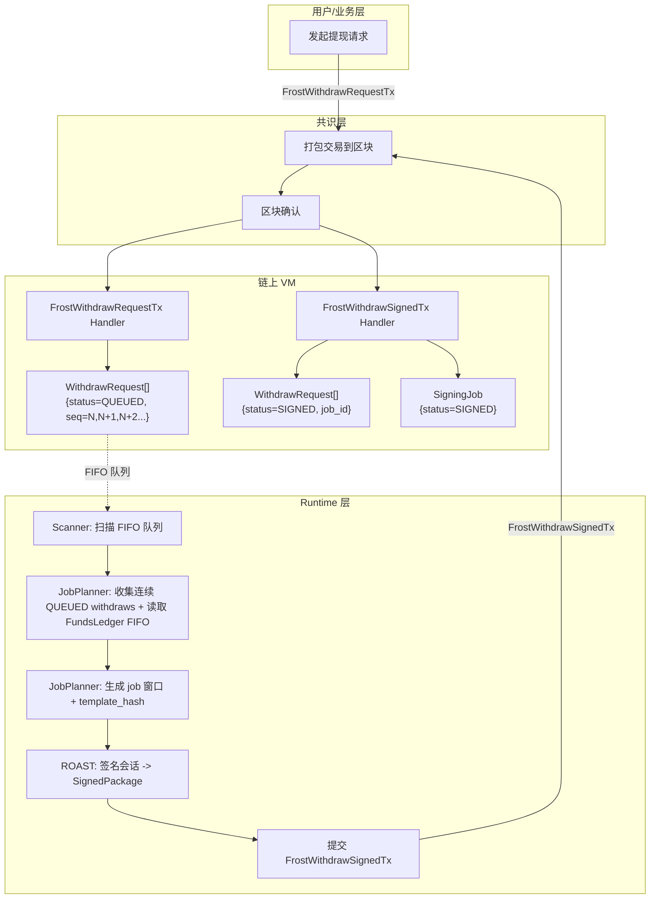
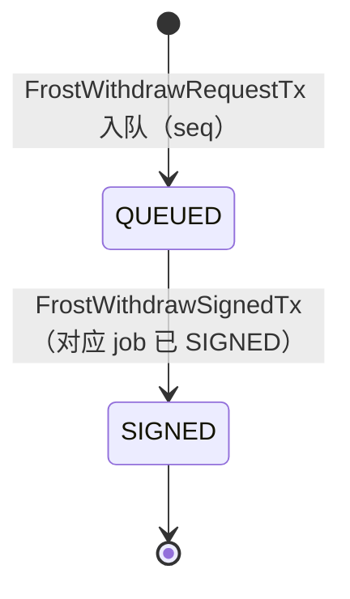
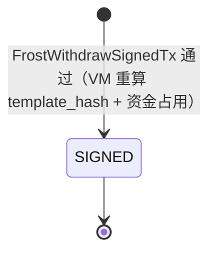
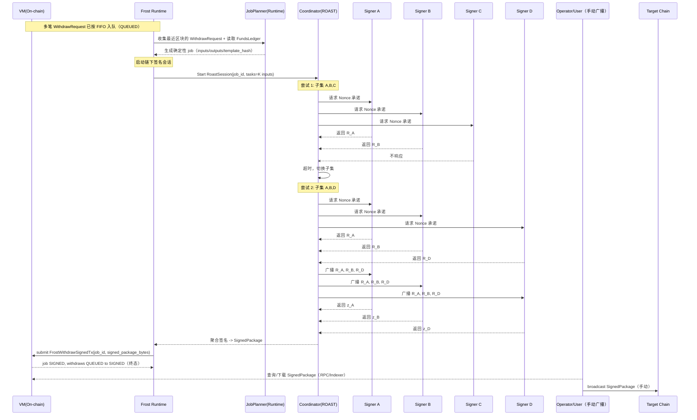
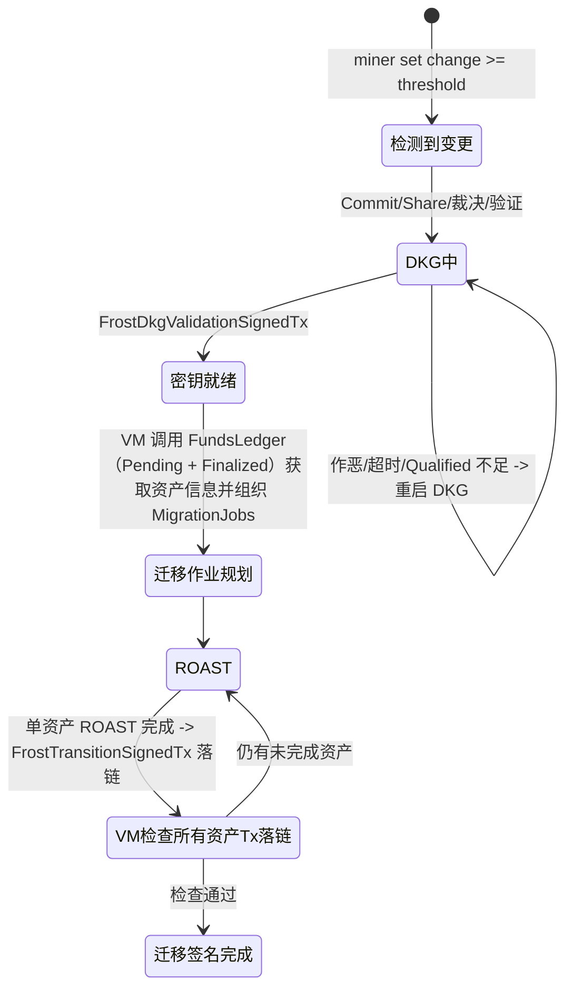
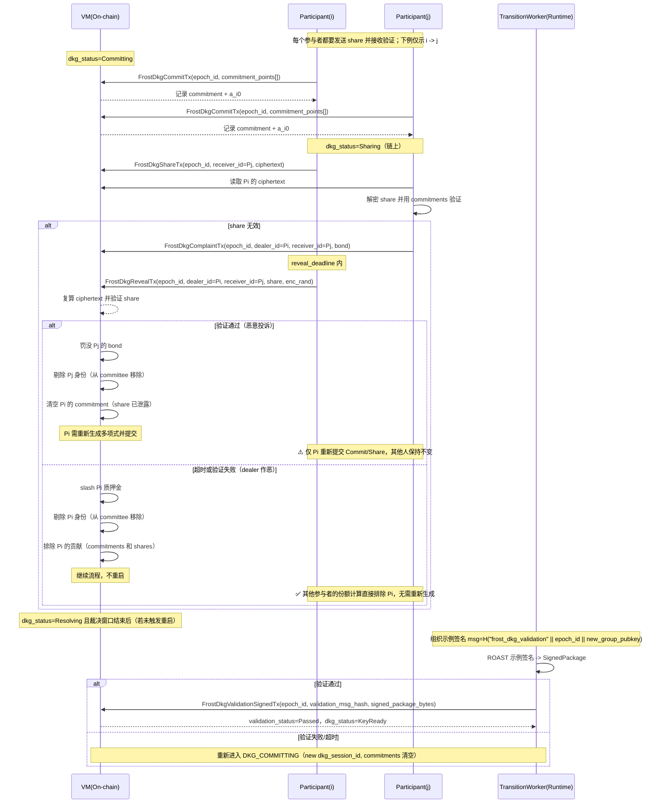
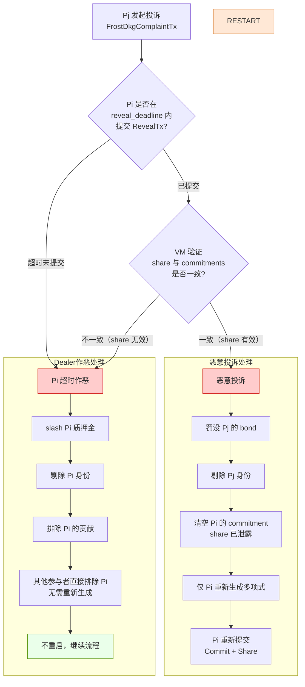


# FROST 模块设计文档（v1）

> 目标：把 FROST 做成**独立于共识**的"跨链资产执行引擎"，严格按**已达成共识的队列**执行两类流程：
> 1) 提现（Withdraw Queue）
> 2) 权力交接/密钥轮换（Power Transition / Key Rotation Queue）
>
> 关键约束来自 `frost/requirements.md`：
> - 前 10000 个共识 miner 参与签名流程（可从状态机/数据库获取其公钥/地址）
> - Withdraw 支持 FROST/ROAST；ROAST 要支持**超时切换聚合者**
> - Nonce/UTXO 设计要确保异步冗余下仍不多签发
> - v1 支持：BTC / ETH / SOL / TRX / BNB
> - Gas/手续费配置文件（按年均 300% 写死，后续版本治理/升级更新）
> - 提现调度 FIFO（先入账的资金先被提现）
> - 共识暂停时，FROST 仍持续执行**已确认**的提现/交接（状态回写可延后）
> - 提现/迁移相关的三方链交易：**FROST/整个工程不负责广播与确认**；Runtime 只负责构建模板、完成门限签名，并把"签名产物/交易包"落链（可查询/可审计）；广播由用户/运营方手动完成。
> - 允许 ROAST 对同一 `template_hash` 产生**多份合法签名产物**；系统通过 tx 接受并追加记录这些产物（receipt/history），同时保证不会导致双花（同一 withdraw_id 绑定同一模板/同一输入集合）。

---

## 0. 术语

- **On-chain State**：由 VM 执行、随区块最终化提交的状态（全网一致、可验证）。
- **Runtime**：每个节点本地运行的 frost 服务（非共识、可重启、可容错）。
- **Signer Set (Top10000)**：由 `committee_ref` 指向的 Top10000 miner 快照（来自状态机/数据库可查询）。
- **Committee（Top10000 bitmap）**：链上 Top10000 的 bitset 表示，按 bit index 形成确定性排序列表。
- **Threshold (t)**：门限签名阈值（默认 `t = ceil(N * 0.8)`，可配置）。
- **Coordinator / Aggregator（聚合者）**：会话中负责收集承诺值/部分签名并输出聚合签名的角色；需要可切换。
- **Session**：一次签名或一次 DKG/轮换的会话，包含 session_id、参与者集合、消息摘要等。
- **DKG Commitments（承诺点）**：参与者在 DKG 中登记到链上的承诺点集合（用于份额验证与链上裁决）。
- **Chain Adapter**：链适配器（BTC UTXO vs 合约链/账户模型链）。

---

## 1. 设计目标与非目标

### 1.1 目标

1) **确定性输入，异步执行**
FROST 的输入来自 On-chain State（已最终化的 tx/队列），Runtime 只“读状态 + 执行动作 + 以 tx 回写结果”。

2) **模块解耦**
尽量复用现有工程抽象：EventBus / Transport / VM HandlerRegistry / DBManager。
不引入独立的“ConsensusObserver / FrostVMHandler / FrostNetworkAdapter”平行体系。

3) **安全的 Anti-Double-Spend / Anti-Double-Sign**
- BTC：UTXO 选择与锁定、模板固定
- 合约链：合约层使用 withdraw_id 去重；账户链 nonce/序列由“链上/合约”保证唯一

4) **ROAST 鲁棒性**
- 节点掉线/恶意不配合：自动换子集/换聚合者
- 聚合者作恶：超时切换聚合者（所有节点可独立计算切换序列）

5) **两条主流程独立**
- Withdraw pipeline
- Power transition pipeline：在达到触发阈值时进入，保证最终一致


---

## 2. 总体架构

FROST 分三层：**共识状态层（VM） / 运行时层（Runtime） / 密码学内核（Core）**。


---

## 3. 模块边界与目录建议

> 你当前 `frost/` 里已有 DKG/曲线适配/签名实验代码（package 名叫 dkg）。需要迁移到 core 子目录，保持“纯算法不依赖网络/DB”。

建议目录：

```
frost/
  core/                     # 纯密码学，不依赖 VM/DB/Transport
    curve/                  # secp256k1、bn256 等适配
    frost/                  # 2-round FROST
    roast/                  # ROAST wrapper（重试/子集选择策略）
    dkg/                    # DKG/Key rotation
  runtime/                  # 每节点运行服务（可重启、可恢复）
    deps.go                 # 依赖注入接口（ChainStateReader/TxSubmitter/P2P 等，见 8.1）
    manager.go              # Runtime 主入口与生命周期管理
    scanner.go              # 扫描链上队列任务
    job_planner.go          # Job 规划器：确定性规划 withdraw/migration 模板并驱动签名
    withdraw_worker.go      # 提现流程执行器
    transition_worker.go    # 权力交接流程执行器
    coordinator.go          # ROAST Coordinator（聚合者角色）
    participant.go          # Participant Engine（签名参与者角色）
    session/
      store.go              # 本地会话持久化（nonce、commit、share…，见 8.4）
      types.go              # Session 相关类型定义
      recovery.go           # 会话恢复逻辑（重启后恢复进行中的会话）
    net/
      msg.go                # MsgFrost envelope 定义（见 8.2）
      handlers.go           # P2P 消息处理器（NonceCommit/SigShare/Abort 等）
  vmhandler/                # VM TxHandlers：写入/推进链上状态机（Job 化，见 5/6/8.3）
    register.go             # Handler 注册入口
    withdraw_request.go     # FrostWithdrawRequestTx：创建 QUEUED + FIFO index
    withdraw_signed.go      # FrostWithdrawSignedTx：写入 signed_package_bytes 并追加 receipt/history，job 与 withdraw 置为 SIGNED
    dkg_commit.go           # FrostDkgCommitTx：登记 DKG 承诺点（commitments）
    dkg_complaint.go        # FrostDkgComplaintTx：链上裁决（份额无效/作恶举证）
    dkg_validation_signed.go # FrostDkgValidationSignedTx：验证示例签名并确认新 group pubkey（KeyReady）
    transition_signed.go    # FrostTransitionSignedTx：记录迁移 SignedPackage 并追加 receipt/history，配合 FundsLedger 标记迁移进度
    funds_ledger.go         # 资金账本 helper（lot/utxo/lock），供 withdraw/transition handler 校验
  chain/                    # 链适配器（构建模板 / 封装 SignedPackage / 解析与校验）
    adapter.go              # ChainAdapter 接口定义 + ChainAdapterFactory
    btc/
      adapter.go            # BTC 适配器实现
      utxo.go               # UTXO 选择与管理
      template.go           # 交易模板构建
    evm/                    # ETH/BNB 共享
      adapter.go            # EVM 适配器实现
      contract.go           # 托管合约交互
    tron/
      adapter.go            # TRON 适配器实现
    solana/
      adapter.go            # Solana 适配器实现
  api/                      # 对外 RPC/HTTP（只读查询 + 运维，见 9）
    http.go                 # HTTP 服务入口
    routes.go               # 路由注册
    query_handlers.go       # 查询类接口实现（GetWithdrawStatus 等）
    admin_handlers.go       # 运维类接口实现（GetHealth/ForceRescan 等）
    types.go                # API 请求/响应类型定义
  config/
    default.json            # 默认配置文件（见 10）
    config.go               # 配置加载与解析
```

---

## 4. On-chain 状态机与数据模型（VM 层）

### 4.1 为什么要“链上状态机”

为了满足：

* “每个 miner 都能根据状态机和数据库得到签名者集合”
* “异步冗余也不多签发”
* “共识暂停时 Runtime 仍执行（但最终以链上队列作为唯一输入源）”

关键做法：
**所有“可能影响资产安全/唯一性”的决策都必须落在链上状态中**（例如：withdraw_id、交易模板 hash、UTXO 锁、合约 withdraw_id 去重标记等）。

### 4.2 Key 前缀

> 具体由keys\keys.go管理。这里用 `v1_frost_` 举例。

| 数据                  | Key 示例                              | 说明                                         |
| ------------------- | ----------------------------------- | ------------------------------------------ |
| 配置快照                | `v1_frost_cfg`                      | topN、thresholdRatio、timeouts、链配置 hash 等 |
| Top10000 集合         | `v1_frost_top10000_<height>`        | bitmap（bitset，按 Top10000 index 排序） |
| Funds Ledger        | `v1_frost_funds_<chain>_<asset>`    | 余额、lot 队列、UTXO set（BTC）等                   |
| Funds Lot Index     | `v1_frost_funds_lot_<chain>_<asset>_<height>_<seq>` | 入账 lot 索引（按高度 FIFO 扫描，height 需零填充） |
| Funds Lot Head      | `v1_frost_funds_lot_head_<chain>_<asset>` | FIFO 头指针（下一个未消费 lot）                  |
| Funds Lot Seq       | `v1_frost_funds_lot_seq_<chain>_<asset>_<height>` | 每个高度的 lot 序号计数器                        |
| Funds Pending Lot Index | `v1_frost_funds_pending_lot_<chain>_<asset>_<height>_<seq>` | 已确认但未上账的入账请求（待入账队列）              |
| Funds Pending Lot Seq   | `v1_frost_funds_pending_lot_seq_<chain>_<asset>_<height>` | 待入账队列序号                                   |
| Funds Pending Ref   | `v1_frost_funds_pending_ref_<request_id>` | request_id -> pending lot key                  |
| Withdraw Queue      | `v1_frost_withdraw_<withdraw_id>`   | 提现请求与状态                                    |
| Withdraw FIFO Index | `v1_frost_withdraw_q_<seq>`         | seq->withdraw_id，用于 FIFO 扫描                |
| Transition State    | `v1_frost_transition_<epoch_id>`       | 轮换/交接会话与状态                                 |
| DKG Commitment      | `v1_frost_dkg_commit_<epoch_id>_<miner>` | 参与者承诺点登记（用于份额验证/链上裁决）              |
| SignedPackage 收据    | `v1_frost_signed_pkg_<job_id>_<idx>`   | SignedPackage 列表（receipt/history，append-only） |

### 4.3 核心结构（ Proto ）

#### 4.3.1 WithdrawRequest（链上）

* withdraw_id：全网唯一
* seq：FIFO 序号（严格递增）
* chain/asset：目标链与资产类型
* to / amount：提现目标地址与数量
* request_height：`FrostWithdrawRequestTx` 最终化高度（用于会话开始高度）
* status：`QUEUED | SIGNED`
* job_id：归属的 SigningJob（当 status=SIGNED 时存在）

#### 4.3.2 FundsLedger（链上）

* Account/Contract chains（ETH/BNB/TRX/SOL）：

  * `available_balance`（可选缓存）
  * `reserved_balance`（可选缓存，用于并发预留）
  * `next_withdraw_seq`（用于生成 withdraw_id 或 FIFO index）
  * `pending_lots`（以独立 KV 记录，WitnessRequestTx 已确认但未上账；仅用于迁移）
    - key：`v1_frost_funds_pending_lot_<chain>_<asset>_<height>_<seq>`
    - value：`request_id`
  * `pending_lot_seq`（以独立 KV 记录，每个 request_height 对应一个序号）
    - key：`v1_frost_funds_pending_lot_seq_<chain>_<asset>_<height>`
  * `deposit_lots`（以独立 KV 记录，FIFO：每次入账形成一个 lot，提现从 lot 头部扣减）
    - key：`v1_frost_funds_lot_<chain>_<asset>_<height>_<seq>`
    - value：`request_id`（金额与 finalize_height 可从 RechargeRequest 读取；也可内联 amount 便于快速读）
  * `deposit_lot_seq`（以独立 KV 记录，每个 finalize_height 对应一个序号）
    - key：`v1_frost_funds_lot_seq_<chain>_<asset>_<height>`

* BTC：

  * `utxos[]`（每个含：txid:vout:value:pkScript:confirmed_height）
  * `locked_utxos`（映射 utxo->job_id，防并发）
  * `change_utxo_policy`（用于后续 CPFP/归集）

> 说明：你要求“先上账的资金先被提现”，BTC 天然可用“UTXO age 升序选取”；账户链用 `deposit_lots` 实现真正 FIFO（按 `finalize_height + seq` 扫描）。

入账与索引：
- 初衷：我觉得可以在FundsLedger 设计两层账本，一层是WitnessRequestTx链上已经确认了，但是还未被witness上账，一层是已经被witness上账了。一旦WitnessRequestTx链上已经确认，就交给第一层管理。witness上账之后交给第二层管理。提现只能提现第二层资产。但是权力移交需要移交一层和二层。这样设计最简单，不引入新的tx和流程。最优雅
- `WitnessRequestTx` 链上确认后，VM 以 `request_height` 写入 `Pending Lot Index`（仅迁移用，不参与提现）。
- 见证流程最终化（`RechargeFinalized`）后，VM 从 Pending 移除该条目，并以 `FinalizeHeight` 写入 `Funds Lot Index`（按高度 FIFO 扫描），并可选更新余额缓存。

FundsLedger 最简实现思路（不引入新 tx、低成本）：
- 账户链：用 append-only 的 lot 索引形成天然 FIFO
  - `v1_frost_funds_pending_lot_<chain>_<asset>_<height>_<seq> -> request_id`（Pending 层，仅迁移）
  - `v1_frost_funds_lot_<chain>_<asset>_<height>_<seq> -> request_id`
  - 维护 `v1_frost_funds_lot_head_<chain>_<asset>` 作为“下一个未消费 lot”的指针
  - 每个高度用 `v1_frost_funds_lot_seq_<chain>_<asset>_<height>` 递增生成 seq
  - 提现时只消费已上账 lot（Pending 不参与提现），保证“先入先出”，无需复杂 `plan_bytes`
- BTC：按 `confirmed_height` 升序选择 UTXO，自带 FIFO 属性

#### 4.3.3 TransitionState（链上）

* epoch_id / trigger_height 这次轮换的唯一编号（一般单调递增）；触发轮换的链上高度
* old_committee_ref / new_committee_ref（指向 `v1_frost_top10000_<height>`）
* dkg_status：NotStarted / Committing / Sharing / Resolving / KeyReady / Failed
* dkg_session_id：`H(epoch_id || new_committee_ref || "dkg")`
* dkg_threshold_t / dkg_n：本次 DKG 的参数（可与签名阈值一致）
* dkg_commit_deadline / dkg_dispute_deadline（height）：commit / 裁决窗口
* dkg_commitments：`map<miner_id, DkgCommitmentMeta>`（或用独立 KV：`v1_frost_dkg_commit_<epoch_id>_<miner>`）
  * `commitment_points[]`（承诺点集合）或其 hash/ref
  * `a_i0`（常数项承诺点，用于聚合 `new_group_pubkey`）
  * `status：COMMITTED | DISQUALIFIED`
* old_group_pubkey / new_group_pubkey（KeyReady 后落链）
* validation_status：NotStarted / Signing / Passed / Failed
* validation_msg_hash：`H("frost_dkg_validation" || epoch_id || new_group_pubkey)`
* validation_signed_ref：示例签名产物引用（Passed 后写入）
* migration_sig_count：已落链的签名产物数量（不含 bytes，用于统计；迁移完成以 FundsLedger 判定）
* affected_chains：需要更新的链列表（BTC/合约链）
* pause_withdraw_policy：是否暂停/降速（仅在"切换生效窗口"短暂停）

> 迁移产物（raw tx / call data / signatures）可能多笔，可通过重复提交 `FrostTransitionSignedTx`（同 epoch_id 多份 SignedPackage）落 receipt/history（SyncStateDB=false）。
> 新 key 生效由 VM 结合 FundsLedger 判断：当旧 key 对应资产已全部被迁移签名覆盖/消耗，且相关 SignedPackages 已落链，即视为迁移完成。

---

### 4.4 On-chain Tx（共识输入 / 结构定义）

#### 4.4.1 提现类

* `FrostWithdrawRequestTx`（用户发起）
  * `chain / asset / to / amount`

说明：VM 直接基于已最终化的 WithdrawRequest 队列与链上 FundsLedger，确定性计算“队首 job 窗口”（最多 `maxInFlightPerChain` 个），该窗口对应 FIFO 队首连续前缀并按资金先入先出消耗。

* `FrostWithdrawSignedTx`（Runtime 回写）
  * `job_id`
  * `signed_package_bytes`
  * 约束：
    * VM 必须基于链上状态 + 配置，确定性重算“队首 job 窗口”（最多 `maxInFlightPerChain` 个），逐个迭代消耗 FIFO withdraws 与资金
    * 若该 `job_id` 尚不存在：仅当 tx 的 `job_id` 等于窗口中**当前最靠前的未签名 job**才接受；并写入 SigningJob 记录（status=SIGNED）、标记 withdraw 为 `SIGNED`、资金/UTXO 置为 **consumed/spent**
    * 若 job 已存在：签名产物必须绑定已存的 `template_hash`，只追加 receipt/history（`v1_frost_signed_pkg_<job_id>_<idx>`），不再改变状态

#### 4.4.2 轮换/DKG 类

* `FrostDkgCommitTx`（每个参与者必须提交）
  * `epoch_id`
  * `commitment_points[]`：承诺点集合（例如 Feldman VSS 的 `A_{ik}=a_{ik}·G, k=0..t-1`）
  * `a_i0`：常数项承诺点（可冗余携带，便于 VM 增量计算 `new_group_pubkey`）
  * 约束：
    * tx sender 必须属于 `new_committee_ref`
    * `dkg_status == Committing`
    * 同一 `epoch_id` 每个 sender 只能登记一次（或只允许覆盖为完全相同的 commitments）

* `FrostDkgShareTx`（加密 share 上链）
  * `epoch_id`
  * `dealer_id`：share 提供者（通常等于 tx sender）
  * `receiver_id`：share 接收者
  * `ciphertext`：`Enc(pk_receiver, share; enc_rand)`（share 用 receiver 公钥加密）
  * 约束：
    * `dkg_status == Sharing`
    * `dealer_id` / `receiver_id` 必须属于 `new_committee_ref`
    * 同一 `(epoch_id, dealer_id, receiver_id)` 只能登记一次（可分批提交）

* `FrostDkgComplaintTx`（链上裁决 / 举证）
  * `epoch_id`
  * `dealer_id`：被投诉的 dealer
  * `receiver_id`：接收该碎片的参与者（通常等于 tx sender）
  * `bond`：保证金（防止滥用）
  * 约束：
    * `dkg_status ∈ {Sharing, Resolving}` 且未超过 `dkg_dispute_deadline`
    * 必须存在对应的 `FrostDkgShareTx`（密文已上链）
  * 结果：
    * VM 进入待裁决并设置 `reveal_deadline`（<= `dkg_dispute_deadline`）

* `FrostDkgRevealTx`（dealer 公开 share + 随机数）
  * `epoch_id`
  * `dealer_id`
  * `receiver_id`
  * `share`：`f_dealer(x_receiver)`（标量）
  * `enc_rand`：加密随机数
  * 约束：
    * 必须存在未结案的 `FrostDkgComplaintTx`
    * 需在 `reveal_deadline` 前提交
    * VM 复算 `Enc(pk_receiver, share; enc_rand)` 与链上 `ciphertext` 一致
    * VM 用链上已登记的 `commitment_points[]` 验证 `share`
  * 结果：
    * 验证通过：dealer 保留资格；可选惩罚恶意投诉者并退还/扣除 `bond`
    * 超时或验证失败：`dealer_id -> DISQUALIFIED`（可选：罚没/剔除）

* `FrostDkgValidationSignedTx`（示例签名产物回写/确认 DKG 结果）
  * `epoch_id`
  * `validation_msg_hash`
  * `signed_package_bytes`
  * 约束：
    * `dkg_status == Resolving` 且已过 `dkg_dispute_deadline`
    * `validation_status ∈ {NotStarted, Signing}`
    * `dkg_qualified_count >= dkg_threshold_t`
    * VM 重算 `new_group_pubkey == Σ a_i0(qualified_dealers)`，并校验 `validation_msg_hash == H("frost_dkg_validation" || epoch_id || new_group_pubkey)`
  * 作用：VM 强制验签；通过后写入 `new_group_pubkey`，并将 `validation_status=Passed`、`dkg_status=KeyReady`
  * 发起者与冲突处理：
    * **permissionless**：任何节点/参与者均可提交
    * **幂等**：仅第一笔有效 tx 将状态推进到 `KeyReady`，之后同 epoch_id 的 validation tx 因 `dkg_status` 不匹配而无效

* `FrostTransitionSignedTx`（迁移签名产物回写）
  * `epoch_id / job_id / chain`
  * `signed_package_bytes`
  * 约束：
    * 签名产物必须绑定该 `MigrationJob.template_hash`
    * VM 需基于 FundsLedger 确定当前待迁移资产与模板，仅接受与之匹配的 job_id/template_hash
    * 允许重复提交，多份产物追加 receipt/history（`v1_frost_signed_pkg_<job_id>_<idx>`）
  * 作用：
    * 记录 SignedPackage，并据模板消耗/锁定 FundsLedger 中对应资产（迁移进度）
    * 迁移完成以 VM 的 FundsLedger 检查为准：旧 key 资产全部覆盖/消耗后，新 key 生效

## 5. Withdraw Pipeline（提现流程，Job 模式）

本版本把“签名的基本单位”从 **withdraw_id** 提升为 **SigningJob**：

- **WithdrawRequest（提现请求）**：用户想要“转给谁/转多少”的业务请求，必须严格 FIFO 入队。
- **SigningJob（签名任务/模板任务）**：把 FIFO 队首的一段 `QUEUED` withdraw **打包成尽可能少的模板**，对该模板完成一次 ROAST（BTC 可能是 *一次会话产出多份 input 签名*），最终产出一个 `SignedPackage`。
- Frost 的交付点是：`SignedPackage` 已落链（receipt/history 或 state 引用），用户可下载后自行广播；**本链不负责广播/确认**。

### 5.1 链上对象与关键字段

#### 5.1.1 WithdrawRequest（链上）

- `withdraw_id`：全网唯一
- `seq`：FIFO 序号（严格递增）
- `chain / asset / to / amount`
- `request_height`：`FrostWithdrawRequestTx` 最终化高度（用于会话开始高度）
- `status`：`QUEUED | SIGNED`
- `job_id`：归属的 SigningJob（当 status=SIGNED 时存在）


#### 5.1.2 SigningJob（链上）

一个 job 必须能被任何节点**纯验证**（不依赖外链 RPC）。链上只记录已完成签名的 job（SIGNING 状态在链下 SessionStore）。

通用字段：

- `job_id`：全网唯一（ `H(chain || first_seq || template_hash || key_epoch)`）
- `chain`：btc/eth/trx/sol/bnb...
- `key_epoch`：使用哪个 epoch_id 的 `group_pubkey` 进行签名（避免轮换期间歧义）
- `withdraw_ids[]`：被该 job 覆盖的 withdraw 列表（按 seq 升序，必须是 FIFO 队首连续的 `QUEUED` 前缀）
- `template_hash`：模板摘要（签名绑定的唯一输入）
- `status`：`SIGNED`

BTC 专用字段（确定性规划生成，可选落 receipt/history）：

- `inputs[]`：UTXO 列表（可能多笔）
- `outputs[]`：withdraw 输出列表（可多地址、多输出；支持“一个 input 覆盖多笔小额提现”）
- `change_output`：可选（返回 treasury 地址；不计入本链可用余额，直到被外部入账模块再次确认入账）

> **重要**：BTC “一个大 UTXO 支付多笔提现” 就是一个 job：`1 input -> N withdraw outputs (+ change)`。
> 这会显著减少签名压力（少 inputs ⇒ 少签名任务），正是“尽可能少签名满足尽可能多提现”的核心抓手。

---

### 5.2 状态机：Withdraw 与 Job 分离

#### 5.2.1 综合流程图



#### 5.2.2 流程说明

| 步骤 | 组件 | 动作 | 状态变化 |
|------|------|------|----------|
| 1 | 用户 | 发起 `FrostWithdrawRequestTx` | - |
| 2 | 共识层 | 打包交易到区块并确认 | - |
| 3 | VM | Handler 创建 WithdrawRequest | `[*] → QUEUED`，分配 FIFO seq + request_height |
| 4 | Runtime Scanner | 扫描链上 FIFO 队列 | - |
| 5 | Runtime JobPlanner | 生成 job 窗口 + template_hash（基于 FundsLedger FIFO） | - |
| 6 | Runtime ROAST | 签名会话 → SignedPackage | - |
| 7 | Runtime | 提交 `FrostWithdrawSignedTx` | - |
| 8 | 共识层 | 打包交易到区块并确认 | - |
| 9 | VM | Handler 校验并写入 job + signed_package_bytes | Job: `[*] → SIGNED`<br>Withdraws: `QUEUED → SIGNED` |

#### 5.2.3 WithdrawRequest 状态机



#### 5.2.4 SigningJob 状态机



> 注：本链**不需要**链上记录 "SIGNING 中/会话进度"；会话信息放在 Runtime 的 `SessionStore`（可重启恢复）。
> 注：同链任意时刻有一个“队首 job 窗口”（最多 `maxInFlightPerChain` 个）。Runtime 可并发签名窗口内 job，但 VM 上链仍按队首顺序接受，跳过前序 job 的提交会被拒绝。
---
---

#### 5.2.5. 时序图（Withdraw，Job 模式）



> 注：Frost 只保证"模板绑定 + 签名产物可审计可取用"，不追踪外链确认。

---
### 5.3 模板规划（Template Planning）：如何把 FIFO 队列打成最少的 Job

模板规划是最复杂部分，目标函数建议明确为：

1) **严格 FIFO**：job 窗口只能覆盖“队首连续的一段 `QUEUED` withdraw”，且资金消耗按 lot/UTXO 先入先出（不能跳过队首去装后面的）。
2) **尽可能少的签名工作量**：优先减少 `job 数`；在 BTC 中进一步减少 `inputs 数`（因为 inputs 数≈签名任务数）。
3) **跨链可扩展**：把“能否 batch、batch 上限”下沉到链策略/配置。

本版本要求规划**确定性**：给定链上状态与配置，所有节点计算出的 `template_hash` 与资金占用结果必须一致。
VM 在处理 `FrostWithdrawSignedTx` 时重算并校验，不一致直接拒绝。

#### 5.3.1 确定性规划规则（VM 可复验）

Runtime 的 `job_planner` 按确定性算法生成 job 窗口（最多 `maxInFlightPerChain` 个）及其 `template_hash` 并完成签名，提交 `FrostWithdrawSignedTx`；VM 用同算法复算并写入 `SigningJob`：

当允许并发时，`job_planner` 需要按确定性规则连续生成最多 `maxInFlightPerChain` 个 job；每生成一个 job，就在内存中消耗对应 withdraw/资金，再生成下一个。VM 以相同方式重算，保证窗口唯一。

单个 job 的规划规则如下（生成窗口时重复执行）：

- 扫描链上 FIFO 队列，从 `plan_head_seq`（最小的 `status=QUEUED` seq）开始收集连续 withdraw
- `withdraw_ids[]` 必须是从 `plan_head_seq` 开始的 **连续 QUEUED 前缀**
- 资金占用按 `deposit_lots` 的 `finalize_height + seq` 递增顺序扣减（先入先出）
- `job.template_hash` 由 `ChainAdapter.BuildTemplate(...)->TemplateHash(...)` 生成（编码必须规范化）
- 资金占用必须合法：
  - BTC：选中的 UTXO 当前未锁定，且总额覆盖 `sum(outputs)+fee+min_change`（或允许 “no-change eat fee”）
  - 账户/合约链：从 `available_balance/lot` 预留，不能超额
- VM 验证通过后：资金/UTXO 直接置为 **consumed/spent**；job 记录写入 `SIGNED`；对应 withdraw 置为 `SIGNED` 并写入 `job_id`

可选把模板明细追加到 receipt/history 便于审计，但不作为共识验证所必需数据。

> 规划必须“唯一确定”，否则 VM 无法校验；允许保守但不允许多解。
> `maxInFlightPerChain` 决定“队首 job 窗口”大小；Runtime 可并发签名窗口内 job，但 VM 仍按队首顺序接受。

#### 5.3.2 BTC 规划算法（支持 多 inputs 与 多 outputs）

BTC job 的模板本质是一笔交易：

- 多笔小额提现：**允许 1 个 input 支付 N 个 withdraw outputs**（这是减少签名的关键）
- 大额提现：允许 N 个 inputs 共同覆盖（需要 N 份 input 签名）

一个可落地的“FIFO 贪心装箱”：

1) 从 `plan_head_seq`（第一个 `QUEUED`）开始，按序追加 withdraw 到 `outputs[]`，直到触达任一上限：
   - `max_outputs`（配置）
   - 估算 vbytes 超过 `max_vbytes`
2) 计算目标额：`need = sum(outputs) + fee_estimate + min_change`
3) 选择 inputs（UTXO）：
  - 默认按 `confirm_height` 升序选择（与“资金先到先出”直觉一致）
  - 同高度的 UTXO 按 `txid:vout` 字典序做确定性 tie-break
   - 逐个累加直到 `sum(inputs) >= need`
   - 若 inputs 超过 `max_inputs`，停止装箱（该 job 覆盖的 withdraw 可能更少，但 FIFO 仍成立）
4) change 处理：
   - 若 `change < dust`：不建 change（把 change 吃进 fee），模板仍合法
   - 否则创建 change 输出到 treasury 地址（注意：本链不把 change 计回可用余额，直到外部入账模块确认该 UTXO 确实出现并入账）
   - change 输出固定放在 outputs 末尾（确定性）
5) 输出 `SigningJob`：固定 `inputs/outputs/locktime/sequence/sighash`，得到 `template_hash`
   - `outputs[]` 顺序按 `withdraw.seq` 递增
   - `locktime/sequence/sighash_type/feerate` 来自链上配置，避免自由度

> 这样自然覆盖你关心的两种场景：
> - “金额太大”：多个 inputs（多签名任务）
> - “金额太小”：一个 input 输出给多个地址（少签名任务）

#### 5.3.3 合约链/账户链规划（ETH/BNB/TRX/SOL）

核心建议：链上合约/程序提供 **batchWithdraw**（或允许多 instruction），使一个 job 覆盖多笔 withdraw，只需一次门限签名。

- `outputs[]` 等价于 `batch params[]`
- `params[]/withdraw_ids[]` 按 `withdraw.seq` 递增顺序排列，编码必须规范化（ABI/IDL）
- `template_hash` 等价于 `H(chain_id || contract || method || params || withdraw_ids[] || key_epoch)`

---

### 5.4 ROAST（Job 模式）：一次会话产出 1..K 份签名

对一个 `SigningJob`，Runtime 创建一个 `RoastSession(job_id)`：
- 每个job_id一次Roast循环分配一个全网唯一的协调者负责Roast过程。Roast协调者切换算法全网统一，若在 `cfg.timeouts.aggregatorRotateBlocks` 超时窗口内未提交有效的 `FrostWithdrawSignedTx`，自动切换到下一个协调者。
- session 输入：`job_id`（已绑定 `template_hash + key_epoch`）+ `committee`（key_epoch 对应的 Top10000 bitmap）
- session 输出：`SignedPackage`（BTC 是 “模板 + 每个 input 的 schnorr sig”）

#### 5.4.1 Task 向量化：BTC 的 “K 个 input = K 个签名任务”

对 BTC 来说，一个 job 里有 `K = len(inputs)` 个需要签名的 message：

- `task[j].task_id = input_index`
- `task[j].msg = sighash(input_index, tx_template)`

因此 ROAST 会话必须支持批量：

- Round1：参与者发送 `R_i[0..K-1]`（每个 task 一个 nonce commitment）
- Round2：参与者发送 `z_i[0..K-1]`（每个 task 一个 sig share）

协调者最终得到 `sig[0..K-1]`，按 input_index 填入 witness。

> 这不是“一个签名变成 K 份”，而是“同一套 ROAST 协调流程并行完成 K 次 FROST”。
> 安全要求：**每个 task 必须使用独立 nonce**，不得复用。

#### 5.4.2 子集重试与部分完成

允许 “某些 task 已完成签名、少数 task 因掉线未完成” 的情况：

- session 内对每个 task 维护 `need_shares / collected / done`
- 协调者可对未完成 task 继续向新子集收集 share
- 已完成 task 的签名保持不变（不需要推倒重来）

#### 5.4.3 聚合者切换（确定性 + 超时）

输入 `session_id`（= job_id）：

- 时间基准统一使用区块高度（逻辑时间）
- `seed = H(session_id || key_epoch || "frost_agg")`
- `committee_list = BitmapToList(committee)`（按 bit index 形成确定性顺序）
- `agg_candidates = Permute(committee_list, seed)`
- `agg_timeout_blocks = cfg.timeouts.aggregatorRotateBlocks`
- `session_start_height = withdraw_ids[0].request_height`（队首 withdraw 的请求高度）
- `agg_index = floor((now_height - session_start_height)/agg_timeout_blocks) % len(agg_candidates)`
- 参与者仅接受当前 `agg_index` 的协调者请求，超时自然切换

---

### 5.5 SignedPackage（交付物）与上链方式

Frost 的“完成”定义：

- Runtime 得到 `SignedPackage`（可广播）
- 通过 `FrostWithdrawSignedTx` 把 `signed_package_bytes` 写入链上（receipt/history）
- VM 校验签名产物绑定同一 `job_id/template_hash` 后，追加到 `v1_frost_signed_pkg_<job_id>_<idx>` 列表（append-only）
- VM 将该 job 覆盖的所有 withdraw 标记为 `SIGNED`，并把占用资金标记为 **consumed/spent（永久不再用于后续提现）**
- 同一 `job_id` 允许重复提交 `FrostWithdrawSignedTx`；首笔有效 tx 推进状态并写入 `signed_package_bytes`，后续仅追加到 receipt/history，不再改变状态

BTC 的 `SignedPackage` 至少包含：

- `tx_template`（为 inputs/outputs/sequence）
- `input_sigs[]`（按 input_index 对齐的 schnorr signatures）
- `raw_wtx`（直接可广播的完整交易）

---

### 5.6 失败、回滚与重试（不依赖外链）

- ROAST 超时/失败：Runtime 可重试（换子集/换聚合者）

- 任何情况下都**不需要**链上记录外链广播/确认；用户拿 `SignedPackage` 自行广播

---

## 6. Power Transition Pipeline（权力交接 / 密钥轮换，Job 模式）

轮换同样采用 “Job 交付签名包、外链执行交给运营方” 的模式：
- 初衷：每隔epochBlocks区块检查一次是否达到阈值，达到了即可开始切换流程，权力切换期间暂停所有提现的流程，充值流程的暂停；
- 每一次权力交接都要有 DKG：**所有参与者必须提交 `FrostDkgCommitTx` 登记承诺点**，用于份额校验；出现作恶/无效碎片时可用 `FrostDkgComplaintTx` **链上裁决**。
- 本链负责：检测触发条件 → DKG（Commit/Share/裁决）→ 示例签名验证（`FrostDkgValidationSignedTx`）确认新 `group_pubkey` → Runtime 为每条受影响链生成一个或多个 `MigrationJob` → 产出并上链一份或多份 `SignedPackage`
- 运营方负责：拿签名包去执行外链 `updatePubkey(...)` / BTC 迁移交易广播
- 本链 **Active** 在 VM 依据 FundsLedger 判定迁移完成后自动生效（无需额外 tx）

### 6.1 触发条件（链上）

- `change_ratio >= transitionTriggerRatio`（例如 0.2 = 2000/10000）
- 或治理参数指定的其它触发规则

补充策略（固定边界 / 前置 DKG / 权重计算）：

- **固定边界**：轮换只在 `epochBlocks` 边界生效；中途不切 key。若 DKG 未完成则顺延到下一边界，期间继续使用旧 key。
- **DKG 前置**：达到触发条件后可提前进入 DKG；`new_group_pubkey` 先以 KeyReady 落链但不立即生效，边界到达后再进入迁移/激活流程，避免收款地址真空期。
- **权力加权平均**：`change_ratio` 采用滑动窗口/加权平均（如 EWMA）计算，过滤短期波动后再与阈值比较。
- **ACTIVE 才计权**：权重统计只包含 `ACTIVE` 成员；退出/被 slash 后权重立即置 0，并同步影响加权平均。
- **双地址并行**：边界前后允许旧/新地址并行入账；witness 侧可按 `key_epoch`/地址白名单同时接受，提现仍绑定 `key_epoch`，避免切换真空期。

### 6.2 链上对象：TransitionState 与 MigrationJob

#### 6.2.1 TransitionState（链上）

- `epoch_id / trigger_height`
- `old_committee_ref / new_committee_ref`（指向 `v1_frost_top10000_<height>`）
- `dkg_status：NotStarted / Committing / Sharing / Resolving / KeyReady / Failed`
- `dkg_session_id`
- `dkg_threshold_t / dkg_n`
- `dkg_commit_deadline / dkg_dispute_deadline（height）`
- `dkg_commit_count / dkg_qualified_count`
- `new_group_pubkey`（KeyReady 后落链）
- `validation_status：NotStarted / Signing / Passed / Failed`
- `validation_msg_hash`
- `validation_signed_ref`
- `migration_jobs[]`：该 epoch_id 下的 `MigrationJob` 列表（按链/分片）

> 约定：`dkg_commit_deadline = trigger_height + cfg.transition.dkgCommitWindowBlocks`，`dkg_dispute_deadline = dkg_commit_deadline + cfg.transition.dkgDisputeWindowBlocks`。
> MigrationJob 可按 FundsLedger 逐步追加；新 key 生效由 VM 结合 FundsLedger 判定迁移完成，无需显式 finalize。

#### 6.2.2 MigrationJob（链上）

- `job_id / epoch_id / chain`
- `key_epoch`：使用哪个 epoch_id 的 `group_pubkey` 进行签名（迁移授权通常用旧 key，更新后提现用新 key）
- `template_hash`
- `status：SIGNING | SIGNED`（SIGNED 代表已落链至少一份 SignedPackage，不代表迁移完成）
- `signed_package_bytes`：不落在 job 结构内，产物通过 `FrostTransitionSignedTx` 追加到 receipt/history（同一 job 可多笔）

> 迁移 job 的本质与提现 job 相同：都是“模板 + ROAST + SignedPackage”，只是业务含义不同。
> 同样按超时窗口保证同一时刻只有一个协调者，超时切换协调者。
> 迁移签名可能多笔，VM 以 FundsLedger 判断是否还有未迁移资产并决定是否继续规划 job。

#### 6.2.3 DkgCommitment（链上）

按参与者拆分存储，避免把所有 commitments 塞进一个 `TransitionState`：

- `epoch_id / dealer_id`
- `commitment_points[]`：承诺点集合（用于份额验证）
- `a_i0`：常数项承诺点（用于聚合 `new_group_pubkey`）
- `status：COMMITTED | DISQUALIFIED`
- `commit_txid / height`

### 6.3 状态机（链上）



#### 6.3.1 DKG 关键时序（Commit/Share/裁决/验证）




#### 6.3.2 投诉裁决流程图



**两种裁决结果对比**：

| 场景 | 被惩罚方 | 惩罚措施 | 对 DKG 的影响 |
|------|----------|----------|---------------|
| **恶意投诉**（share 实际有效） | 投诉者 Pj | 罚没 bond + 剔除身份 | ⚠️ **Pi 重做**：仅清空 Pi 的 commitment，Pi 重新生成多项式并提交，其他人保持不变 |
| **Dealer 作恶**（share 无效或超时） | Dealer Pi | slash 质押金 + 剔除身份 | ✅ **继续流程**：其他参与者计算份额时直接排除 Pi 的贡献，无需重新生成 |

说明：

- **Participant**：本轮 DKG 的参与者（`new_committee_ref` 内成员）。每个参与者既提交承诺点，也将加密 share 上链；接收者解密并用链上承诺点验证，必要时发起投诉。
- **TransitionWorker**：Runtime 中推进轮换流程的执行者（可由确定性规则选出），负责在裁决窗口结束后组织验证签名，验证通过即确认新 key（KeyReady）；失败则触发重新 DKG。
- **恶意投诉处理**：若投诉被证明无效（share 与 commitments 一致），投诉者 Pj 被惩罚并剔除。由于 Pi 的 share 已被公开泄露，**仅 Pi 需要重新生成多项式** 并重新提交 `FrostDkgCommitTx` 和 `FrostDkgShareTx`，其他参与者的 commitments/shares 保持不变。
- **Dealer 作恶处理**：若 dealer 提供的 share 确实无效或超时未响应，仅剔除该 dealer。其他参与者在计算最终私钥份额时 **直接排除该 dealer 的贡献**（`s_j = Σ s_{i→j}` 中去掉该 dealer），无需重新生成任何多项式（前提是剩余参与者数量仍满足门限要求）。

涉及的 Tx 目的：

- `FrostDkgCommitTx`：把 dealer 的承诺点上链，作为份额验证与链上裁决的公开依据。
- `FrostDkgShareTx`：把加密 share 上链（`Enc(pk_receiver, share; enc_rand)`），解决“未收到 share”的争议来源。
- `FrostDkgComplaintTx`：receiver 认为 share 无效时发起投诉并锁定 bond，开启 `reveal_deadline`。
- `FrostDkgRevealTx`：dealer 公开 `(share, enc_rand)`，VM 复算密文并验证 commitments；通过则驳回投诉（恶意投诉 → 仅 dealer 重做），失败或超时则 dealer DISQUALIFIED（继续流程）。
- `FrostDkgValidationSignedTx`：记录示例签名结果并确认新 key；VM 依据链上承诺点确定性计算/校验 `new_group_pubkey`，验证通过即 KeyReady。

验证签名要点：

- 验证时机：裁决窗口结束后；VM 依据 commitments 重算 `new_group_pubkey` 校验 `validation_msg_hash`
- 验证消息：`msg = H("frost_dkg_validation" || epoch_id || new_group_pubkey)`（单 task、无外链副作用）
- 通过 ROAST 产出 `SignedPackage`，提交 `FrostDkgValidationSignedTx` 写链并置 `validation_status=Passed`、`dkg_status=KeyReady`
- 若会话超时/收集不足导致验证失败，触发重新 DKG（生成新的 `dkg_session_id`，清空上一轮 commitments），状态回到 `DKG_COMMITTING`

### 6.4 迁移 Job 规划与签名

#### 6.4.1 合约链（ETH/BNB/TRX/SOL）

Runtime 为每条链生成一个或多个 `MigrationJob`：

- `template`：`updatePubkey(new_pubkey, epoch_id, ...)`（建议合约支持 batch/nonce 防重放）
- `template_hash`：对 calldata/params 做 hash（包含 epoch_id、chain_id、合约地址等域分隔）
- 通过 ROAST（通常 1 个 task）产出聚合签名，封装成可广播 `SignedPackage`

#### 6.4.2 BTC

若你的 BTC 侧采用 “旧地址资金迁移到新地址”的方案：

- MigrationJob 模板是一笔或多笔 BTC 交易
- 同样支持：
  - 多 inputs（迁移多个 UTXO）
  - 多 outputs（分批迁移/多找零）
- ROAST 仍按 “每个 input 一个 task” 批量完成签名（复用 5.4 的机制）

### 6.5 与提现并行的策略（围绕 key_epoch）

- 所有 Withdraw SigningJob 必须携带 `key_epoch`
- 在迁移未完成之前（VM/FundsLedger 判定）：
  - 新创建的 withdraw job 使用旧 `key_epoch`
- 当 VM 依据 FundsLedger 判定该 epoch 迁移完成后：
  - 新创建的 withdraw job 使用新 `key_epoch`
- 由于本链不追踪外链执行，建议运营流程上：**先确保迁移 SignedPackage 已产出并可执行**（MIGRATION_SIGNED），再由运营方执行外链更新。

说明：
- `key_epoch` 的作用是把签名绑定到某次轮换的 `group_pubkey + committee` 快照（来自 `TransitionState`），避免轮换窗口内用错 key/委员会
- 若希望移除 `key_epoch`，需在 job 中显式写入 `group_pubkey_ref` 或 `committee_ref`（或其 hash），并将其纳入 `job_id/template_hash`，VM 仍需校验一致

---
## 7. ROAST（通用签名会话流程）

ROAST 是本设计里所有“需要门限签名”的统一会话层：**两轮 FROST + 子集重试 + 协调者切换**。
在 v1 中 ROAST 会被三处复用：

- 提现：`SigningJob -> FrostWithdrawSignedTx`
- 轮换迁移：`MigrationJob -> FrostTransitionSignedTx`
- DKG 验证签名：`validation_msg_hash -> FrostDkgValidationSignedTx`

### 7.1 会话输入（链上可验证）

ROAST 会话必须只对“链上已确认且可纯计算”的消息签名：

- `session_id`：建议直接使用 `job_id`；DKG 验证签名使用 `epoch_id + validation_msg_hash`（此时 `key_epoch = epoch_id`）
- `committee / threshold(t)`：来自 `key_epoch` 对应的 `TransitionState.new_committee_ref`（Top10000 bitmap，按 bit index 展开为确定性顺序）
- `key_epoch`：绑定使用哪个 epoch_id 的 `group_pubkey`
- `msg`：
  - 合约链/账户链：从 `template_hash` 确定性导出
  - BTC：从 `tx_template` 确定性导出 `K=len(inputs)` 个 `sighash(input_index)`（task 向量化）
  - DKG 验证：`msg = H("frost_dkg_validation" || epoch_id || new_group_pubkey)`（单 task）

### 7.2 两轮消息（Commit -> Share）

- Round1：参与者为每个 task 生成 nonce（本地落盘）并发送 commitment `R_i`
- Round2：协调者广播 `R_agg`/challenge，参与者返回 sig share `z_i`
- 协调者聚合得到最终签名（BTC 为 `sig[0..K-1]`）并封装 `SignedPackage`

### 7.3 子集重试（ROAST 的核心价值）

当部分节点掉线/作恶导致收集不到 `t` 份 share 时：

- 协调者可以选择新的子集继续收集（同一 `session_id`、同一 `msg`）
- 对 BTC：允许 `K` 个 task 部分完成，未完成 task 继续重试（已完成的不回滚）

### 7.4 协调者选举与切换（确定性）

为避免“单点协调者卡死”，所有节点必须能独立算出当前协调者：

- `seed = H(session_id || key_epoch || "frost_agg")`
- `committee_list = BitmapToList(committee)`（按 bit index 形成确定性顺序）
- `agg_candidates = Permute(committee_list, seed)`
- `agg_timeout_blocks = cfg.timeouts.aggregatorRotateBlocks`
- `session_start_height`：确定性起点高度
  - withdraw：`withdraw_ids[0].request_height`
  - migration：`transition.trigger_height`
  - DKG 验证：`dkg_dispute_deadline`（窗口结束后才允许验证签名）
- `agg_index = floor((now_height - session_start_height) / agg_timeout_blocks) % len(agg_candidates)`
- 参与者仅接受当前 `agg_index` 对应协调者的请求，超时自然切换

### 7.5 上链回写（交付物）

ROAST 的交付物是 `SignedPackage`，由 Runtime 通过不同 tx 回写链上：

- 提现：`FrostWithdrawSignedTx(job_id, signed_package_bytes)`
- 迁移：`FrostTransitionSignedTx(epoch_id, job_id, signed_package_bytes)`
- DKG 验证：`FrostDkgValidationSignedTx(epoch_id, validation_msg_hash, signed_package_bytes)`

### 7.6 通用时序图（简化）


---
## 8. 内部接口（模块间）——重新设计（重点）

> 目标：不造“ConsensusObserver / FrostVMHandler / FrostNetworkAdapter”。
> Frost Runtime 只依赖你工程里已经稳定存在的抽象：
>
> * EventBus（订阅 block.finalized 作为唤醒信号）
> * Transport（p2p 消息）
> * VM HandlerRegistry（注册 frost tx handlers）
> * DBManager / StateDB（读链上状态；本地存会话）

### 8.1 Runtime 依赖注入接口（Go）

```go
// frost/runtime/deps.go

// 读链上最终化状态（来自 StateDB/DB overlay 的只读视图）
type ChainStateReader interface {
    Get(key string) ([]byte, bool, error)
    Scan(prefix string, fn func(k string, v []byte) bool) error
}

// 提交“回写交易”（进入 txpool/广播/共识）
type TxSubmitter interface {
    Submit(tx any) (txID string, err error)
}

// 订阅最终化事件（仅作为唤醒，不是唯一触发源）
type FinalityNotifier interface {
    SubscribeBlockFinalized(fn func(height uint64))
}

// P2P 网络（复用现有 Transport）
type P2P interface {
    Send(to NodeID, msg *FrostEnvelope) error
    Broadcast(peers []NodeID, msg *FrostEnvelope) error
    SamplePeers(n int, role string) []NodeID
}

// 当前高度下 signer set（Top10000 bitmap）提供者
type SignerSetProvider interface {
    Top10000(height uint64) ([]SignerInfo, error) // height = committee_ref snapshot height
    CurrentEpoch(height uint64) uint64
}

// 链适配器工厂
type ChainAdapterFactory interface {
    Adapter(chain string) (ChainAdapter, error)
}
```

> 说明：
>
> * `FinalityNotifier` 可直接由你现有 EventBus 包一层实现（订阅 `block.finalized`）。
> * `P2P` 可直接使用你现有 `Transport`，新增 `MsgFrost` 消息类型即可。
> * `SignerSetProvider` 的实现可以：
>
>   * 从共识层已落盘的 Top10000 bitmap 读（按 bit index 展开为确定性顺序）

### 8.2 P2P 消息：统一 Envelope（避免散乱）

```go
// frost/runtime/net/msg.go

type FrostEnvelope struct {
    SessionID   string
    Kind        string   // "NonceCommit" | "SigShare" | "Abort" | "CoordinatorAnnounce" | ...
    From        NodeID
    Epoch       uint64   // key_epoch
    Round       uint32
    Payload     []byte   // protobuf / json
    Sig         []byte   // 消息签名（防伪造/重放）
}
```

新增：`MsgType = MsgFrost`，payload 为 `FrostEnvelope`。

### 8.3 VM 集成：只用 TxHandlers（Job 化，不在 VM 内跑签名）

* `frost/vmhandler/register.go`：把以下 tx kind 注册到 VM 的 HandlerRegistry

  * `FrostWithdrawRequestTx`：创建 `WithdrawRequest{status=QUEUED}` + FIFO index + request_height
  * `FrostWithdrawSignedTx`：确定性重算队首 job 窗口并校验当前 job，写入 `signed_package_bytes` 并追加 receipt/history；job 置为 `SIGNED`，withdraw 由 `QUEUED → SIGNED`（终态，资金视为已支出）

  * `FrostDkgCommitTx`：登记本轮 DKG 承诺点（commitments）
  * `FrostDkgComplaintTx`：无效碎片举证与链上裁决（剔除/惩罚）
  * `FrostDkgValidationSignedTx`：记录示例签名结果并确认新 key（KeyReady）

  * `FrostTransitionSignedTx`：记录迁移 SignedPackage 并追加 receipt/history；VM 基于 FundsLedger 消耗/锁定迁移资产，MigrationJob 可置为 SIGNED（签名已产出，迁移完成以 FundsLedger 判定）

> VM TxHandlers 的职责：**验证 + 写入状态机（共识态）**。
> Runtime 的职责：**离链 ROAST/FROST 签名协作 + 会话恢复**，只对链上 job 的 `template_hash` 签名；并通过 `FrostWithdrawSignedTx` / `FrostTransitionSignedTx` / `FrostDkgValidationSignedTx` 把签名产物公布到链上。
> Frost 不负责外链广播/确认；用户/运营方拿链上 `SignedPackage` 自行广播。

### 8.4 数据库存储：链上状态 vs 本地会话

* **链上状态（StateDB）**：Withdraw/Transition/FundsLedger/Top10000/committee 等
* **本地会话（SessionStore）**：nonce、commit、已见消息、超时计时、重启恢复信息（包含 DKG 的 commitments/shares/已裁决结果缓存等）

  * 重要：nonce 必须持久化后才发送 commitment，避免重启后不小心复用


---

## 9. 外部 RPC/API（对外暴露）

> v1 只做“读 + 运维”；写操作通过链上 tx（与系统一致）。

### 9.1 查询类

* `GetFrostConfig()`：当前 frost 配置快照
* `GetGroupPubKey(epoch_id)`：当前/历史聚合公钥
* `GetWithdrawStatus(withdraw_id)`：状态机、job_id、template_hash、raw_txid（可离线从模板计算）、signed_package_bytes / signed_package_bytes[]、失败原因
* `ListWithdraws(from_seq, limit)`：FIFO 扫描队列
* `GetTransitionStatus(epoch_id)`：轮换进度、链更新结果
* `GetDkgCommitment(epoch_id, dealer_id)`：查询某参与者的 DKG 承诺点（commitments）与状态（COMMITTED/DISQUALIFIED）
* `ListDkgComplaints(epoch_id, from, limit)`：（可选）查询链上裁决记录
* `GetTxSignInfo(withdraw_id)`：聚合签名结果
* `GetAllWithdrawSignInfo(height1, height2)`：按高度范围汇总

### 9.2 运维/调试类

* `GetHealth()`：DB/StateReader/ChainAdapters/P2P/Scanner 状态
* `GetSession(job_id)`：本地会话详情（当前聚合者 index、每个 task 收到多少份、谁超时）
* `ForceRescan()`：触发 scanner 立即跑一轮（仅本地）
* `Metrics()`：签名耗时分布、聚合者切换次数、子集重试次数、失败原因统计等（不做外链确认统计）

---

## 10. 配置文件（v1）

`frost/config/default.json`：

```json
{
  "committee": {
    "topN": 10000,
    "thresholdRatio": 0.8,
    "epochBlocks": 200000 //每隔epochBlocks检查一次是否变化量达到阈值，需要更换委员会
  },
  "timeouts": {
    "nonceCommitBlocks": 2,
    "sigShareBlocks": 3,
    "aggregatorRotateBlocks": 5,
    "sessionMaxBlocks": 60
  },
  "withdraw": {
    "maxInFlightPerChain": 1, // 队首 job 窗口大小（可并发签名）
    "retryPolicy": { "maxRetry": 5, "backoffBlocks": 5 }
  },
  "transition": {
    "triggerChangeRatio": 0.2,
    "pauseWithdrawDuringSwitch": true,
    "dkgCommitWindowBlocks": 2000,
    "dkgDisputeWindowBlocks": 2000
  },
  "chains": {
    "btc": { "feeSatsPerVByte": 25 },
    "eth": { "gasPriceGwei": 30, "gasLimit": 180000 },
    "bnb": { "gasPriceGwei": 3, "gasLimit": 180000 },
    "trx": { "feeLimitSun": 30000000 },
    "sol": { "priorityFeeMicroLamports": 2000 }
  }
}
```

---

---

## 12. 安全考虑

1. **参与者验签与防重放**

* FrostEnvelope 消息签名（使用 miner 节点身份签名）
* 必须校验 session_id / key_epoch / round，不接受过期消息

2. **Nonce 安全**

* Nonce 生成后必须本地落盘再发送 commitment
* 会话失败后 nonce 不复用

3. **模板绑定**

* 所有签名 share 必须绑定链上 `template_hash`，防止聚合者诱导签名不同交易
* 参与者在产生 `R_i` 或 `z_i` 前必须校验（否则拒签）：
  * `job_id` 要么等于链上确定性重算的队首 job（位于 job 窗口最前），要么已存在于 `SigningJob`（允许重复签名产物）
  * `template_hash` 与链上重算/已存的 `SigningJob.template_hash` 一致
  * `key_epoch` 与链上一致（避免轮换期间签错 key）
  * 对 BTC：每个 input/task 的 `msg = sighash(input_index, tx_template)` 必须能从链上模板纯计算
  * 对 DKG 验证签名：`validation_msg_hash` 必须与 `H("frost_dkg_validation" || epoch_id || new_group_pubkey)` 一致

4. **聚合者作恶**

* 超时切换聚合者（确定性序列）

5. **DKG 加密 share 上链与裁决**

* dealer 上链 `commitment_points[]` 与加密 share（`Enc(pk_receiver, share; enc_rand)`），receiver 解密后本地验证
* 争议时 dealer 公开 `(share, enc_rand)`，VM 复算密文并校验 share 与 commitments 一致性
* 公开 share 会泄露该份 share：v1 接受该权衡；可对恶意投诉者惩罚并要求 bond

6. **合约链去重/防重放（ETH/BNB/TRX/SOL）**

* 建议把“唯一性/去重”交给合约/程序层（强约束），从而允许一个 job 覆盖多笔提现
* 被签名的消息建议包含（域分隔）：
  `job_id || chain_id || contract/program || method || withdraw_ids[] || to[] || amount[] || fee_cap || deadline_height || key_epoch`
* 合约/程序维护 `used_withdraw_id` 或 `used_job_id`（二选一即可），确保同一提现不会被重复执行

7. **BTC UTXO：模板固定与消耗标记（避免多签发）**

* `inputs/outputs/fee/locktime/sequence/sighash` 必须由确定性规划算法固定，VM 可重算校验
* 链上 FundsLedger 维护 UTXO 集与锁：`lock(utxo)->job_id`（在 `FrostWithdrawSignedTx` 接受时置锁并视为 consumed）
* Runtime `job_planner` 在生成 SigningJob 时固定：
  * 选取 `inputs[]`（可能多笔 UTXO）
  * 固定 `outputs[]`（可多地址、多输出）
  * 固定 fee/feerate、locktime/sequence、sighash_type
  * 生成 `tx_template` 并写入 `template_hash`
* 签名阶段（ROAST）：Nonce 必须按 task 独立生成并本地持久化，绝不跨 task 复用


