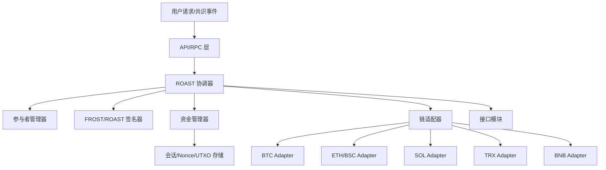

# Frost 模块设计文档

## 1. 概述
Frost 模块负责去中心化资产管理和跨链交互，使用门限签名方案 (TSS) 和多方计算 (MPC)，特别是利用 ROAST (Robust Asynchronous Schnorr Threshold) 的鲁棒性，托管 BTC、ETH、SOL、TRX、BNB 等链上的资产。

## 2. 架构原则
1. **独立性**：Frost 模块独立于主共识引擎运行，观察共识状态（已确认的交易）并异步执行请求（提现、权力交接）。
2. **解耦**：通过接口抽象不同链的逻辑（UTXO 与账户模型）和签名方案。

## 2.1 架构示意

## 3. 核心组件

### 3.1 参与者管理器 (Participant Manager)
- 角色：管理来自共识层的活跃参与者（矿工）集合。
- 功能：
  - 跟踪前 10,000 个共识矿工；
  - 选择活跃签名委员会（如随机 1,000 个子集）以减少通信开销；
  - 当矿工集合发生显著变化（如 >20% 变动）时，触发“权力交接”逻辑。

### 3.2 资产链适配器 (Chain Adapters)
抽象特定链的逻辑。
- **比特币 (BTC)**：管理 UTXO、构建交易、用聚合公钥生成地址。
- **智能合约链 (ETH, SOL, TRX, BNB)**：使用托管合约；合约存储当前委员会的聚合公钥；只有验证了有效门限签名后才释放资产。

### 3.3 签名聚合器 (ROAST 协调器)
- 角色：封装 FROST 协调器逻辑，作为 ROAST Orchestrator。
- 算法：ROAST (Robust Asynchronous Schnorr Threshold)。
- 工作流程：
  1. **会议初始化**：协调器发起消息签名会话；
  2. **子集选择**：从活跃池中选择阈值 $t$ 的参与者子集；
  3. **FROST 轮次**：尝试与选定子集进行承诺与签名；
  4. **故障处理（鲁棒性）**：若子集有超时/无效成员，自动切换到新的子集，直至生成有效签名；
  5. **风险缓解**：若协调者自身超时或失效，由共识层切换新的协调者。

### 3.4 资金管理器 (Fund Manager)
- 角色：管理各链资产余额、入账/出账流水和风控限额，为提现与 gas 供应提供资金保障。
- 功能：
  - **余额与预留**：维护多链余额、可用/已预留额度，提现排队时先占用预留，避免超额签名；
  - **入账记录**：witness模块是负责入账的，一旦他记录上账成功，这边frost需要负责记录他的资金在原生链的信息；
  - **提现调度**：按先到先出原则，即先上账的资金先被提现，生成待签名交易；
  - **手续费与补给**：根据配置文件，按之前年平均300%配置手续费；
- 存储：需要在数据库中（pb中定义好结构）单独一个模块出来存储链上资金信息。

## 4. 关键流程

### 4.1 提现流程
1. **请求**：用户发起提现；共识验证并确认请求。
2. **排队**：Frost 模块从共识状态获取已确认的提现请求。
3. **签名**：协调器与活跃委员会运行 ROAST，生成提现交易签名。
4. **广播**：签名后的交易广播到目标链。
5. **确认**：监控链上确认状态。

### 4.2 权力交接（密钥轮换）
- 触发：当验证者集合显著变动（如前 10,000 矿工中 >20% 变化）。
- 流程：
  1. **DKG**：新委员会生成新的聚合公钥；
  2. **资产迁移**：
     - BTC：构建交易将 UTXO 从旧地址迁移到新地址，由旧委员会签名；
     - 合约链：调用托管合约的 `updateSigners(newPublicKey)`，由旧委员会签名。
- 约束：交接关键阶段普通提现可能暂停/排队以确保原子性。

## 5. 数据结构与存储

### 5.1 防重放与防双花（Nonce & UTXO）
- **账户模型链 (ETH/SOL/TRX/BNB)**：
  - 机制：使用 Nonce；
  - 实现：维护每个链上托管账户的当前 Nonce；每次生成提现交易时递增；
  - 防双花：目标链拒绝重复或乱序 Nonce。
- **UTXO 模型链 (BTC)**：
  - 机制：跟踪已确认的 UTXO 集合；
  - 防双花：
    1. 构建交易时引用未花费 UTXO；
    2. 一旦交易广播并打包，该 UTXO 标记为已花费；
    3. 再次使用同一 UTXO 的交易会被网络拒绝；
  - 并发控制：构建交易时锁定选用的 UTXO，防止并发请求使用相同输入。

### 5.2 配置
- **Gas/手续费管理**：
  - `config.json` 存储 gas 价格策略；
  - 策略示例：使用较高倍数（如 300% 年均值）保障快速上链，并通过治理或定期软件升级更新。

## 6. 接口 (RPC/API)

### 6.1 内部接口（模块间）

- ChainAdapter：封装各链基础能力：
  - BuildWithdrawalTx(request)：根据提现请求构造原始交易（含手续费估算）；
  - BroadcastTx(tx)：广播交易并返回 txId；
  - QueryTxStatus(txId)：查询链上确认状态；
  - GetBalance()：查询托管地址/合约余额；
  - EstimateFee(params)：估算手续费/priority fee。
- SessionStore：存储签名会话、Nonce、UTXO/Nonce 锁：
  - CreateSession(msg, committee)、UpdateSessionStatus(id, status)；
  - LockInputs(inputs) / UnlockInputs(inputs)（针对 BTC UTXO）；
  - SavePartialSignature(id, signer, sig) 等。
- FundStore / LedgerStore：资金管理持久层：
  - `RecordDeposit(depositId, chain, addr, amount, txId)`：记录入账流水并更新对应链/地址余额；
  - `RecordWithdrawalRequested(withdrawId, chain, addr, amount)`：记录提现请求流水并预校验可用余额；
  - `CreateReservation(chain, amount, withdrawId)` / `ReleaseReservation(reservationId)`：为提现创建或释放预留额度；
  - `UpdateWithdrawalStatus(withdrawId, status, txId)`：在广播或确认后更新提现状态及链上 txId；
  - `GetBalance(chain)` / `GetReservedBalance(chain)`：查询某条链当前托管余额及已预留余额；
  - `ListLedgerEntries(chain, fromTime, toTime, cursor, limit)`：按链和时间区间分页列出流水用于对账与审计。
- CommitteeStore：委员会/公钥信息：
  - 记录当前/历史委员会、聚合公钥、阈值参数；
  - 支持读写接口供 DKG、权力交接使用。
- ConsensusObserver：从共识层订阅事件：
  - OnConfirmedWithdrawal(req)、OnCommitteeChanged(event) 等。

### 6.2 外部接口（RPC/API）

- 查询类：
  - GetCurrentCommittee()：返回当前活跃签名者列表、聚合公钥和阈值参数；
  - GetWithdrawalStatus(txId)：返回提现状态（排队 / 签名中 / 已广播 / 已确认 / 失败及原因）；
  - GetAggregatorInfo()：返回当前协调器身份、健康状态和最近会话统计；
  - GetFundSummary(chain)：返回指定链的托管余额、可用/预留额度及最近入账/出账摘要。
- 管理类（通常需治理/管理员权限）：
  - TriggerKeyRotation()：手动触发一次密钥轮换流程（在满足安全前提下）；
  - PauseWithdrawals() / ResumeWithdrawals()：紧急暂停/恢复提现；
  - UpdateFeePolicy(chain, policy)：更新手续费策略（如 gas 上限、优先级）。
- 调试与监控：
  - ListSessions(filter)：查看最近签名会话的状态和参与者；
  - GetHealth()：返回内部组件健康检查结果（DB、链适配器、共识订阅）。
## 7. 安全考虑
- **异步安全性**：协议需在异步网络下保持安全，ROAST 保证只要有阈值 $t$ 诚实节点即活性。
- **双花防护**：严格的 Nonce 管理与 UTXO 跟踪（针对 BTC）。
- **活性**：协调器失败时协议需快速切换到备份协调器。

## 8. 未来路线图
- **可扩展性优化**：进一步优化 ROAST 以适配更大委员会，或实现分层签名。
- **更多链支持**：通过实现 Chain Adapter 接口添加新链。

