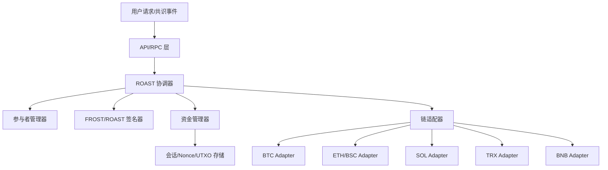

# Frost 模块设计文档

## 1. 概述
Frost 模块负责去中心化资产管理和跨链交互，使用门限签名方案 (TSS) 和多方计算 (MPC)，特别是利用 ROAST (Robust Asynchronous Schnorr Threshold) 的鲁棒性，托管 BTC、ETH、SOL、TRX、BNB 等链上的资产。

## 2. 架构原则
1. **独立性**：Frost 模块独立于主共识引擎运行，观察共识状态（已确认的交易）并异步执行请求（提现、权力交接）。
2. **解耦**：通过接口抽象不同链的逻辑（UTXO 与账户模型）和签名方案。
3. **可扩展性**：设计用于处理大规模验证者集合（最多 10,000 矿工），通过子集（如随机 1,000 个矿工）作为活跃签名委员会来优化性能，缓解 ROAST 的 $O(n^2)$ 通信开销。

## 2.1 架构示意

## 3. 核心组件

### 3.1 参与者管理器 (Participant Manager)
- 角色：管理来自共识层的活跃参与者（矿工）集合。
- 功能：
  - 跟踪前 10,000 个共识矿工；
  - 选择活跃签名委员会（如随机 1,000 个子集）以减少通信开销；
  - 当矿工集合发生显著变化（如 >20% 变动）时，触发“权力交接”逻辑。

### 3.2 资产链适配器 (Chain Adapters)
抽象特定链的逻辑。
- **比特币 (BTC)**：管理 UTXO、构建交易、用聚合公钥生成地址。
- **智能合约链 (ETH, SOL, TRX, BNB)**：使用托管合约；合约存储当前委员会的聚合公钥；只有验证了有效门限签名后才释放资产。

### 3.3 签名聚合器 (ROAST 协调器)
- 角色：封装 FROST 协调器逻辑，作为 ROAST Orchestrator。
- 算法：ROAST (Robust Asynchronous Schnorr Threshold)。
- 工作流程：
  1. **会议初始化**：协调器发起消息签名会话；
  2. **子集选择**：从活跃池中选择阈值 $t$ 的参与者子集；
  3. **FROST 轮次**：尝试与选定子集进行承诺与签名；
  4. **故障处理（鲁棒性）**：若子集有超时/无效成员，自动切换到新的子集，直至生成有效签名；
  5. **风险缓解**：若协调器自身超时或失效，由共识层切换新的协调器。

### 3.4 资金管理器 (Fund Manager)
- 角色：管理各链资产余额、入账/出账流水和风控限额，为提现与 gas 供应提供资金保障。
- 功能：
  - **余额与预留**：维护多链余额、可用/已预留额度，提现排队时先占用预留，避免超额签名；
  - **入账记录**：监听确认的充值/收益并入账到内部账簿，支持与链上/合约对账；
  - **提现调度**：按优先级/批次合并提现，检查风控限额（单笔/日限额、黑名单），生成待签名交易；
  - **手续费与补给**：跟踪各链 gas/手续费池，自动从主资产拨出小额补给账户或用 RBF/fee bump 追加费用；
  - **重试与回滚**：监控 pending/stuck 交易，必要时取消/重签或重建 UTXO 选择（BTC）；
  - **审计与告警**：输出按链、按账户的余额和流水报表，异常（余额突降、手续费过高）触发告警。
- 存储：账簿/预留状态与交易流水持久化到 `SessionStore` 或独立资金库，支持幂等写入与对账.

## 4. 关键流程

### 4.1 提现流程
1. **请求**：用户发起提现；共识验证并确认请求。
2. **排队**：Frost 模块从共识状态获取已确认的提现请求。
3. **签名**：协调器与活跃委员会运行 ROAST，生成提现交易签名。
4. **广播**：签名后的交易广播到目标链。
5. **确认**：监控链上确认状态。

### 4.2 权力交接（密钥轮换）
- 触发：当验证者集合显著变动（如前 10,000 矿工中 >20% 变化）。
- 流程：
  1. **DKG**：新委员会生成新的聚合公钥；
  2. **资产迁移**：
     - BTC：构建交易将 UTXO 从旧地址迁移到新地址，由旧委员会签名；
     - 合约链：调用托管合约的 `updateSigners(newPublicKey)`，由旧委员会签名。
- 约束：交接关键阶段普通提现可能暂停/排队以确保原子性。

## 5. 数据结构与存储

### 5.1 防重放与防双花（Nonce & UTXO）
- **账户模型链 (ETH/SOL/TRX/BNB)**：
  - 机制：使用 Nonce；
  - 实现：维护每个链上托管账户的当前 Nonce；每次生成提现交易时递增；
  - 防双花：目标链拒绝重复或乱序 Nonce。
- **UTXO 模型链 (BTC)**：
  - 机制：跟踪已确认的 UTXO 集合；
  - 防双花：
    1. 构建交易时引用未花费 UTXO；
    2. 一旦交易广播并打包，该 UTXO 标记为已花费；
    3. 再次使用同一 UTXO 的交易会被网络拒绝；
  - 并发控制：构建交易时锁定选用的 UTXO，防止并发请求使用相同输入。

### 5.2 配置
- **Gas/手续费管理**：
  - `config.json` 存储 gas 价格策略；
  - 策略示例：使用较高倍数（如 300% 年均值）保障快速上链，并通过治理或定期软件升级更新。

## 6. 接口 (RPC/API)
- `GetCurrentCommittee()`：返回当前活跃签名者列表和聚合公钥。
- `GetWithdrawalStatus(txId)`：返回特定提现的状态。
- `GetAggregatorInfo()`：返回当前协调器身份和状态。

## 7. 安全考虑
- **异步安全性**：协议需在异步网络下保持安全，ROAST 保证只要有阈值 $t$ 诚实节点即活性。
- **双花防护**：严格的 Nonce 管理与 UTXO 跟踪（针对 BTC）。
- **活性**：协调器失败时协议需快速切换到备份协调器。

## 8. 未来路线图
- **可扩展性优化**：进一步优化 ROAST 以适配更大委员会，或实现分层签名。
- **更多链支持**：通过实现 Chain Adapter 接口添加新链。

