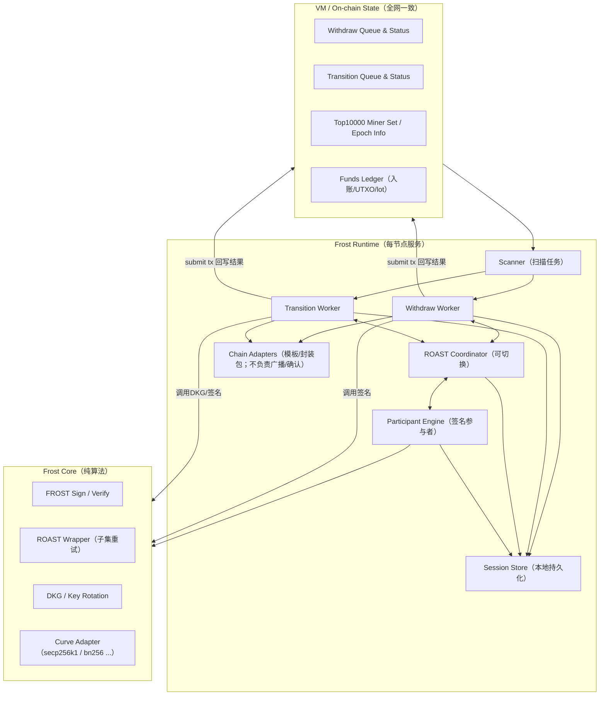
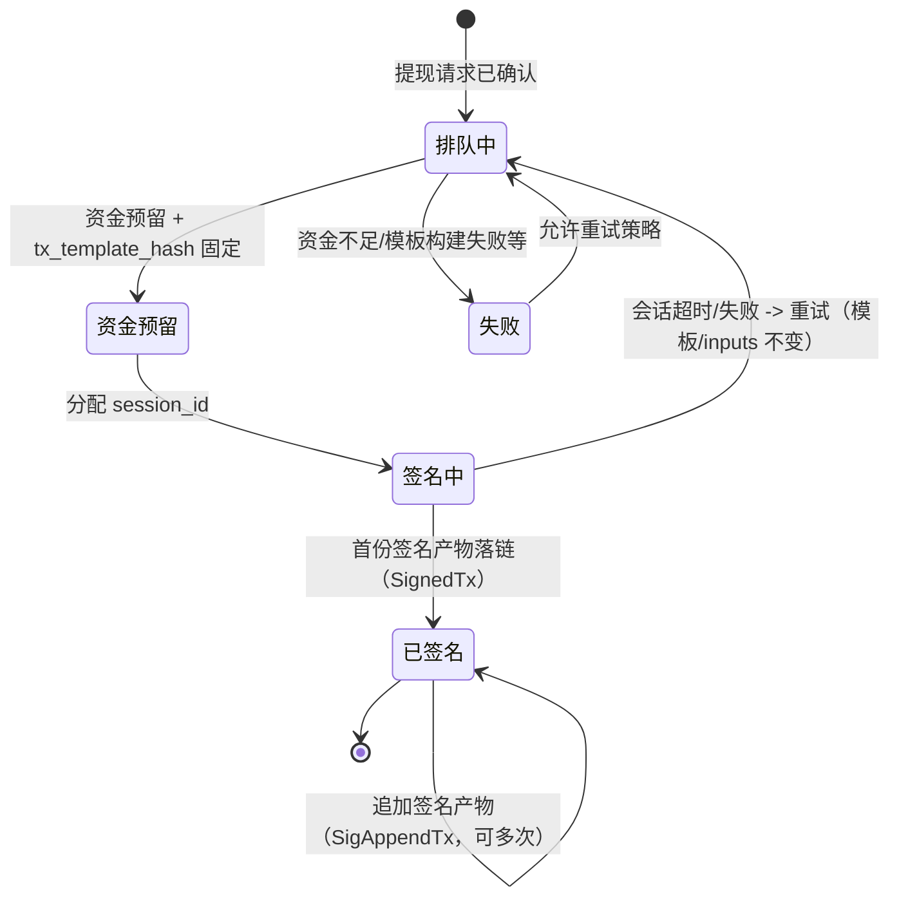
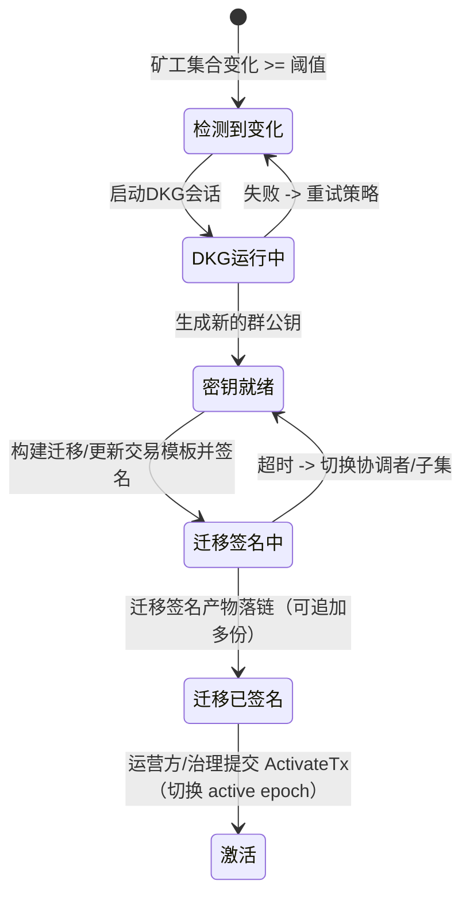
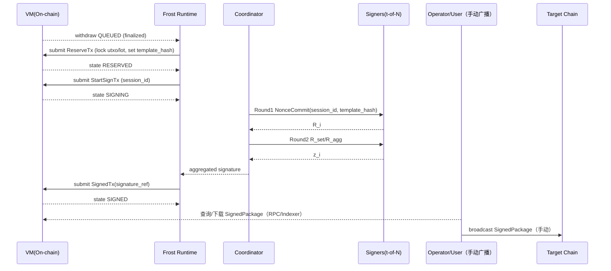

# FROST 模块设计文档（v1）

> 目标：把 FROST 做成**独立于共识**的"跨链资产执行引擎"，严格按**已达成共识的队列**执行两类流程：  
> 1) 提现（Withdraw Queue）  
> 2) 权力交接/密钥轮换（Power Transition / Key Rotation Queue）  
>
> 关键约束来自 `frost/requirements.md`：  
> - 前 10000 个共识 miner 参与签名流程（可从状态机/数据库获取其公钥/地址）  
> - Withdraw 支持 FROST/ROAST；ROAST 要支持**超时切换聚合者**  
> - Nonce/UTXO 设计要确保异步冗余下仍不多签发  
> - v1 支持：BTC / ETH / SOL / TRX / BNB  
> - Gas/手续费配置文件（按年均 300% 写死，后续版本治理/升级更新）  
> - 提现调度 FIFO（先入账的资金先被提现）  
> - 共识暂停时，FROST 仍持续执行**已确认**的提现/交接（状态回写可延后）
> - 提现/迁移相关的三方链交易：**FROST/整个工程不负责广播与确认**；Runtime 只负责构建模板、完成门限签名，并把"签名产物/交易包"落链（可查询/可审计）；广播由用户/运营方手动完成。
> - 允许 ROAST 对同一 `tx_template_hash` 产生**多份合法签名产物**；系统接受并追加记录这些产物，但**不把签名 bytes 写入 StateDB 的 Merkle Root**（只做 receipt/history 记录或 tx payload 记录），同时保证不会导致双花（同一 withdraw_id 绑定同一模板/同一输入集合）。

---

## 0. 术语

- **On-chain State**：由 VM 执行、随区块最终化提交的状态（全网一致、可验证）。
- **Runtime**：每个节点本地运行的 frost 服务（非共识、可重启、可容错）。
- **Signer Set (Top10000)**：当前高度下可参与签名的前 10000 名 miner（来自状态机/数据库可查询）。
- **Threshold (t)**：门限签名阈值（默认 `t = ceil(N * 0.8)`，可配置）。
- **Coordinator / Aggregator（聚合者）**：会话中负责收集承诺值/部分签名并输出聚合签名的角色；需要可切换。
- **Session**：一次签名或一次 DKG/轮换的会话，包含 session_id、参与者集合、消息摘要等。
- **Chain Adapter**：链适配器（BTC UTXO vs 合约链/账户模型链）。

---

## 1. 设计目标与非目标

### 1.1 目标

1) **确定性输入，异步执行**  
FROST 的输入来自 On-chain State（已最终化的 tx/队列），Runtime 只“读状态 + 执行动作 + 以 tx 回写结果”。

2) **模块解耦**  
尽量复用现有工程抽象：EventBus / Transport / VM HandlerRegistry / DBManager。  
不引入独立的“ConsensusObserver / FrostVMHandler / FrostNetworkAdapter”平行体系。

3) **安全的 Anti-Double-Spend / Anti-Double-Sign**  
- BTC：UTXO 选择与锁定、模板固定  
- 合约链：合约层使用 withdraw_id 去重；账户链 nonce/序列由“链上/合约”保证唯一

4) **ROAST 鲁棒性**  
- 节点掉线/恶意不配合：自动换子集/换聚合者  
- 聚合者作恶：超时切换聚合者（所有节点可独立计算切换序列）

5) **两条主流程独立**  
- Withdraw pipeline：持续执行，不因轮换长期阻塞（可设计为“只在关键切换窗口短暂停顿/降速”）  
- Power transition pipeline：在达到触发阈值时进入，保证最终一致


---

## 2. 总体架构

FROST 分三层：**共识状态层（VM） / 运行时层（Runtime） / 密码学内核（Core）**。



---

## 3. 模块边界与目录建议

> 你当前 `frost/` 里已有 DKG/曲线适配/签名实验代码（package 名叫 dkg）。需要迁移到 core 子目录，保持“纯算法不依赖网络/DB”。

建议目录：

```
frost/
  core/                     # 纯密码学，不依赖 VM/DB/Transport
    curve/                  # secp256k1、bn256 等适配
    frost/                  # 2-round FROST
    roast/                  # ROAST wrapper（重试/子集选择策略）
    dkg/                    # DKG/Key rotation
  runtime/                  # 每节点运行服务（可重启、可恢复）
    deps.go                 # 依赖注入接口（ChainStateReader/TxSubmitter/P2P 等，见 8.1）
    manager.go              # Runtime 主入口与生命周期管理
    scanner.go              # 扫描链上队列任务
    withdraw_worker.go      # 提现流程执行器
    transition_worker.go    # 权力交接流程执行器
    coordinator.go          # ROAST Coordinator（聚合者角色）
    participant.go          # Participant Engine（签名参与者角色）
    session/
      store.go              # 本地会话持久化（nonce、commit、share…，见 8.4）
      types.go              # Session 相关类型定义
      recovery.go           # 会话恢复逻辑（重启后恢复进行中的会话）
    net/
      msg.go                # MsgFrost envelope 定义（见 8.2）
      handlers.go           # P2P 消息处理器（NonceCommit/SigShare/Abort 等）
  vmhandler/                # VM TxHandlers：写入/推进链上状态机（见 8.3）
    register.go             # Handler 注册入口
    withdraw_request.go     # FrostWithdrawRequestTx：创建 QUEUED
    withdraw_reserve.go     # FrostWithdrawReserveTx：选择 UTXO/lot，进入 RESERVED
    withdraw_start_sign.go  # FrostWithdrawStartSignTx：进入 SIGNING
    withdraw_signed.go      # FrostWithdrawSignedTx：记录首份签名产物，进入 SIGNED
    transition_trigger.go   # FrostTransitionTriggerTx：触发轮换
    transition_finalize.go  # FrostTransitionFinalizeTx：完成轮换激活
    transition_signed.go    # FrostTransitionSignedTx：记录迁移签名产物
    funds_ledger.go         # 资金账本操作（lot/utxo/reserve）
  chain/                    # 链适配器（构建模板 / 封装 SignedPackage / 解析与校验）
    adapter.go              # ChainAdapter 接口定义 + ChainAdapterFactory
    btc/
      adapter.go            # BTC 适配器实现
      utxo.go               # UTXO 选择与管理
      template.go           # 交易模板构建
    evm/                    # ETH/BNB 共享
      adapter.go            # EVM 适配器实现
      contract.go           # 托管合约交互
    tron/
      adapter.go            # TRON 适配器实现
    solana/
      adapter.go            # Solana 适配器实现
  api/                      # 对外 RPC/HTTP（只读查询 + 运维，见 9）
    http.go                 # HTTP 服务入口
    routes.go               # 路由注册
    query_handlers.go       # 查询类接口实现（GetWithdrawStatus 等）
    admin_handlers.go       # 运维类接口实现（GetHealth/ForceRescan 等）
    types.go                # API 请求/响应类型定义
  config/
    default.json            # 默认配置文件（见 10）
    config.go               # 配置加载与解析
```

---

## 4. On-chain 状态机与数据模型（VM 层）

### 4.1 为什么要“链上状态机”

为了满足：

* “每个 miner 都能根据状态机和数据库得到签名者集合”
* “异步冗余也不多签发”
* “共识暂停时 Runtime 仍执行（但最终以链上队列作为唯一输入源）”

关键做法：
**所有“可能影响资产安全/唯一性”的决策都必须落在链上状态中**（例如：withdraw_id、交易模板 hash、UTXO 锁、合约 withdraw_id 去重标记等）。

### 4.2 Key 前缀

> 具体由keys\keys.go管理。这里用 `v1_frost_` 举例。

| 数据                  | Key 示例                              | 说明                                         |
| ------------------- | ----------------------------------- | ------------------------------------------ |
| 配置快照                | `v1_frost_cfg`                      | committeeN、thresholdRatio、timeouts、链配置hash等 |
| Top10000 集合         | `v1_frost_top10000_<heightOrEpoch>` | 公钥/NodeID 列表                       |
| Funds Ledger        | `v1_frost_funds_<chain>_<asset>`    | 余额、lot 队列、UTXO set（BTC）等                   |
| Withdraw Queue      | `v1_frost_withdraw_<withdraw_id>`   | 提现请求与状态                                    |
| Withdraw FIFO Index | `v1_frost_withdraw_q_<seq>`         | seq->withdraw_id，用于 FIFO 扫描                |
| Transition State    | `v1_frost_transition_<epoch>`       | 轮换/交接会话与状态                                 |

### 4.3 核心结构（ Proto ）

#### 4.3.1 WithdrawRequest（链上）

* withdraw_id：提现tx的id
* chain/asset：目标链与资产类型
* to / amount：提现目标地址与数量
* fee_policy：固定或上限（v1 固定取 config）
* tx_context：提现交易签名内容，由VM填写
* status：状态机字段（见下）
* session_id：当前正在使用的签名会话 id（可空）
* signed_tx_ref：签名产物（hash 或 raw 的存储引用）

#### 4.3.2 FundsLedger（链上）

* Account/Contract chains（ETH/BNB/TRX/SOL）：

  * `available_balance`（可用）
  * `reserved_balance`（已预留，防止重复分配）
  * `deposit_lots[]`（FIFO：每次入账形成一个 lot，提现从 lot 头部扣减）
  * `next_withdraw_seq`（用于生成 withdraw_id 或 FIFO index）

* BTC：

  * `utxos[]`（每个含：txid:vout:value:pkScript:height:confirmed_time）
  * `locked_utxos`（映射 utxo->withdraw_id，防并发）
  * `change_utxo_policy`（用于后续 CPFP/归集）

> 说明：你要求“先上账的资金先被提现”，BTC 天然可用“UTXO age 升序选取”；账户链用 `deposit_lots` 实现真正 FIFO。

##### 资金语义：SIGNED 即视为“已支出”（本链口径）

为满足你想要的 A) **SIGNED = 已支出**（用户不广播由用户承担）的语义：

- `FrostWithdrawReserveTx`（进入 RESERVED）：
  - **账户/合约链**：从 `available_balance` 挪到 `reserved_balance`；同时在 `deposit_lots` 上做 FIFO 扣减与“预留占用”标记（防并发/防重复分配）。
  - **BTC**：从 `utxos[]` 里按 FIFO/age 选择 inputs，并写入 `locked_utxos[utxo]=withdraw_id`（防并发），同时把模板 hash 固定到 WithdrawRequest。

- `FrostWithdrawSignedTx`（进入 SIGNED）：
  - **本链立即记账为“已支出”**：预留资金不再回退，也不再被后续提现使用。
  - **账户/合约链**：将对应 `reserved_balance` 记为 `spent`（可以通过累积字段或在 receipt/history 中记录，不强制进入 StateDB root）。
  - **BTC**：对应的 `locked_utxos` 永不释放（或迁移到 `spent_utxos`/`consumed_utxos` 结构，视实现便利），确保这些 UTXO 永不再用于新提现。

> 注：外链资金实际何时转出取决于用户/运营方何时广播 SignedPackage；该结果**不影响**本链“已支出”口径。


#### 4.3.3 TransitionState（链上）

* epoch_id / trigger_height 这次轮换的唯一编号（一般单调递增）；触发轮换的链上高度
* dkg_status：NotStarted / Running / KeyReady / Failed
* old_group_pubkey / new_group_pubkey
* migration_status：Preparing / Signing / Signed / Active / Failed
* migration_sig_count：已落链的签名产物数量（不含 bytes）
* affected_chains：需要更新的链列表（BTC/合约链）
* pause_withdraw_policy：是否暂停/降速（仅在"切换生效窗口"短暂停）

> 迁移产物（raw tx / call data / signatures）用 `FrostTransitionSignedTx`（首份）+ `FrostTransitionSigAppendTx`（追加）落 receipt/history（SyncStateDB=false）。

---

## 5. Withdraw Pipeline（提现流程）

### 5.1 状态机（链上）



> 说明：
> 1、共识产出withdrawTx。
> 2、frost针对withdrawTx生成唯一模板。
> 3、frost计算出协调者，由协调者发起Roast流程。
> 4、协调者提交withdraw_signedTx 。
> 5、若Roast发送切换重试产生了多笔合法withdraw_signedTx，共识只做弱校验接受并追加签名到数据库。
> * `RESERVED` 仍必须把"唯一模板（tx_template_hash）+ 唯一资金输入集合"固定下来，避免签出不同交易。
> * `ROAST` 允许对 **同一模板** 产出多份签名产物；这些产物只追加到 history/receipt，不影响状态机根。

### 5.2 Runtime 执行步骤

1. Scanner 以 FIFO 扫描 `v1_frost_withdraw_q_<seq>`
2. 对每个 withdraw_id：

   * 读取 WithdrawRequest 状态
   * 若 `QUEUED`：尝试创建 `RESERVED`（通过提交 tx，让 VM 执行 reserve）
   * 若 `RESERVED`：尝试进入 `SIGNING`（提交 tx 记录 session_id）
   * 若 `SIGNING`：参与 ROAST 会话（coordinator 或 participant）
   * 若 `SIGNED`：
     * 通过 ChainAdapter 把聚合签名"封装成可广播的交易包/参数包"（SignedPackage）
     * 提交 `FrostWithdrawSignedTx`（首份产物）或 `FrostWithdrawSigAppendTx`（追加产物）
     * **停止推进（不负责广播/确认）**：由用户/运营方自行广播到目标链

> "共识暂停时"处理：
>
> * Runtime 仍可继续签名与生成 SignedPackage（本地记录进度到 SessionStore）。
> * 回写链上状态（SIGNED / SigAppend）需要共识恢复后再提交 tx；恢复后 Scanner 会自动对齐并补齐回写。

### 5.3 ROAST 会话（签名）

#### 5.3.1 FROST 两轮（基础）

* Round 1：参与者提交 nonce commitment：`R_i`
* Round 2：聚合者广播 `R_agg` / `R_set`，参与者返回 `z_i`（sig share），聚合者聚合为 `sig`

#### 5.3.2 ROAST 包装（鲁棒性）

* 聚合者从  singers中选择子集 `S`（大小 >= t）
* 对子集发起 FROST，收集承诺/部分签名
* 若子集失败或超时：换子集继续，直到收齐 t 份有效 share
* 若聚合者超时或作恶：切换聚合者（见 5.3.3）

#### 5.3.3 聚合者切换规则（必须全网可独立计算）

为避免“谁来当聚合者”引入新的共识点，v1 用**确定性序列 + 超时切换**：

* `seed = H(session_id || epoch_id || "frost_agg")`
* `agg_candidates = Permute(active_committee, seed)`
* 当前聚合者 index = `floor((now - session_start)/agg_timeout)`
* 参与者只接受“当前 index 的聚合者”的请求；超时后自然接受下一个聚合者

> 好处：
>
> * 不需要链上写入“谁是聚合者”
> * 聚合者作恶丢包/拖延，会被下一位自然接管
> * 两个聚合者并行时，参与者会因 index 校验拒绝旧聚合者

---

## 6. Power Transition Pipeline（权力交接 / 密钥轮换）

### 6.1 触发条件（链上）

* Top10000 集合变化达到阈值：

* 按治理参数：`change_ratio >= transitionTriggerRatio`

> 注：requirements 中“2000 个已改变（80%）”表述不一致。v1 以“2000/10000=20% 触发”作为工程可落地解释；若你最终要“80% 才触发”，只需把 ratio 配成 0.8。

### 6.2 状态机（链上）



### 6.3 执行策略

* **合约链（ETH/BNB/TRX/SOL）**：统一用"托管合约/程序"管理资产与 signer pubkey：

  * 合约保存当前 `group_pubkey`
  * 提现时合约验证门限签名
  * 轮换时调用 `updatePubkey(new_pubkey)`，由旧 key 产生门限签名授权执行
  * 离线构造 + 门限签名产物落链，**由运营方广播** `updatePubkey(new_pubkey)`

* **BTC**：方案：

  **迁移 UTXO**：将旧聚合地址的 UTXO 转到新地址（需要构建并签名交易；**广播由用户/运营方手动完成**）


### 6.4 与提现并行的策略

权力交接可能很长。为保证提现“丝滑”：

* 默认不全局暂停提现，只在 `ACTIVE` 切换的短窗口做一致性保护：

  * `KEY_READY` -> `MIGRATION_CONFIRMED` 阶段：允许继续处理提现，但新提现应绑定“当前 active key epoch”
  * 若提现使用旧 key，必须保证旧 key 仍有效；若涉及合约更新，则提现合约验证会在切换后拒绝旧 key，因此需在切换窗口协调：

    * 策略 A：切换前停止新提现进入 SIGNING（只让已 SIGNING 的完成）


---

## 7. Nonce / UTXO 安全设计（避免多签发）

### 7.1 总原则：签名必须绑定“唯一模板”

所有参与者在产生 `R_i` 或 `z_i` 前必须验证：

* 该 session_id 对应的 `message_hash` 与链上 WithdrawRequest 的 `tx_template_hash` 一致
* 该 withdraw_id 当前状态允许签名（SIGNING）
* 该 active key epoch 与链上一致

### 7.2 合约链（ETH/BNB/TRX/SOL）

**用“合约/程序层去重”**：

* 被签名的消息包含：
  `withdraw_id || chain_id || asset || to || amount || fee_cap || deadline || epoch_id`
* 合约维护 `used_withdraw_id`（或 nonce map），同一 withdraw_id 只能成功一次
* 即便多个聚合者产出相同签名，链上只会执行一次；多笔 tx 会被 revert

> 这样可以把“nonce 不一致导致多签发”的风险压到最低。

### 7.3 BTC（UTXO）

* 链上 FundsLedger 维护 UTXO 集与锁：`lock(utxo)->withdraw_id`
* reserve 阶段固定：

  * 选取 UTXO（按 age 升序满足 FIFO）
  * 固定 outputs（to + change）与 fee（按 config 固定）
  * 得到 raw tx template，并写入 `tx_template_hash`
* 签名阶段只允许对该模板签名
* 若手续费过低导致卡住：

  * v1：等待/重试广播，不生成“不同模板的替代交易”
  * v1+（可选）：用 CPFP（用 change 输出再花费生成子交易，提高整体打包概率）

---

## 8. 内部接口（模块间）——重新设计（重点）

> 目标：不造“ConsensusObserver / FrostVMHandler / FrostNetworkAdapter”。
> Frost Runtime 只依赖你工程里已经稳定存在的抽象：
>
> * EventBus（订阅 block.finalized 作为唤醒信号）
> * Transport（p2p 消息）
> * VM HandlerRegistry（注册 frost tx handlers）
> * DBManager / StateDB（读链上状态；本地存会话）

### 8.1 Runtime 依赖注入接口（Go）

```go
// frost/runtime/deps.go

// 读链上最终化状态（来自 StateDB/DB overlay 的只读视图）
type ChainStateReader interface {
    Get(key string) ([]byte, bool, error)
    Scan(prefix string, fn func(k string, v []byte) bool) error
}

// 提交“回写交易”（进入 txpool/广播/共识）
type TxSubmitter interface {
    Submit(tx any) (txID string, err error)
}

// 订阅最终化事件（仅作为唤醒，不是唯一触发源）
type FinalityNotifier interface {
    SubscribeBlockFinalized(fn func(height uint64))
}

// P2P 网络（复用现有 Transport）
type P2P interface {
    Send(to NodeID, msg *FrostEnvelope) error
    Broadcast(peers []NodeID, msg *FrostEnvelope) error
    SamplePeers(n int, role string) []NodeID  
}

// 当前高度下 signer set（Top10000）提供者
type SignerSetProvider interface {
    Top10000(height uint64) ([]SignerInfo, error)
    CurrentEpoch(height uint64) uint64
}

// 链适配器（纯构造/校验/封装；不做 RPC/广播/确认查询）
type ChainAdapter interface {
    // BuildWithdrawTemplate 构建提现交易模板（必须纯函数：同输入同输出）
    BuildWithdrawTemplate(req *pb.FrostWithdrawRequest, ledger *pb.FundsLedger) (*pb.TxTemplate, error)

    // TemplateHash 计算模板哈希（用于链上绑定/参与者校验）
    TemplateHash(tpl *pb.TxTemplate) ([]byte, error)

    // TxIDFromTemplate 可选：从 raw 模板计算“预期 txid”（用于查询/审计展示）
    TxIDFromTemplate(tpl *pb.TxTemplate) (string, error)

    // WrapSigned 将聚合签名与模板封装成可广播的 SignedPackage（raw tx / calldata / params）
    WrapSigned(tpl *pb.TxTemplate, aggSig []byte) (*pb.SignedPackage, error)

    // ValidateSignedPackage 可选：对 SignedPackage 做最小一致性校验（hash/长度/域分隔等）
    ValidateSignedPackage(pkg *pb.SignedPackage, expectTplHash []byte) error

    // DeriveAddress 由群公钥派生托管地址（BTC P2TR / 合约地址 / program address 等）
    DeriveAddress(groupPubKey []byte) (string, error)

    ValidateAddress(addr string) error
}

// 链适配器工厂
type ChainAdapterFactory interface {
    Adapter(chain string) (ChainAdapter, error)
}
```

> 说明：
>
> * `FinalityNotifier` 可直接由你现有 EventBus 包一层实现（订阅 `block.finalized`）。
> * `P2P` 可直接使用你现有 `Transport`，新增 `MsgFrost` 消息类型即可。
> * `SignerSetProvider` 的实现可以：
>
>   * 从共识层已落盘的 validator set 读（但接口仍保持“只读”）

### 8.2 P2P 消息：统一 Envelope（避免散乱）

```go
// frost/runtime/net/msg.go

type FrostEnvelope struct {
    SessionID   string
    Kind        string   // "NonceCommit" | "SigShare" | "Abort" | "CoordinatorAnnounce" | ...
    From        NodeID
    Epoch       uint64
    Round       uint32
    Payload     []byte   // protobuf / json
    Sig         []byte   // 消息签名（防伪造/重放）
}
```

新增：`MsgType = MsgFrost`，payload 为 `FrostEnvelope`。

### 8.3 VM 集成：只用 TxHandlers（不在 VM 内跑签名）

* `frost/vmhandler/register.go`：把以下 tx kind 注册到 VM 的 HandlerRegistry

  * `FrostWithdrawRequestTx`：创建 QUEUED + FIFO index
  * `FrostWithdrawReserveTx`：选择 UTXO/lot，写入 tx_template_hash，进入 RESERVED
  * `FrostWithdrawStartSignTx`：写入 session_id，进入 SIGNING
  * `FrostWithdrawSignedTx`：记录"首份"签名产物引用/摘要，进入 SIGNED
  * `FrostWithdrawSigAppendTx`：追加一份签名产物到 history/receipt（不改 StateDB root）
  * `FrostTransitionTriggerTx / FinalizeTx`：推进 transition 状态机
  * `FrostTransitionSignedTx`：记录迁移签名产物（首份）
  * `FrostTransitionSigAppendTx`：追加迁移签名产物到 history/receipt

> VM TxHandlers 的职责：**验证 + 写入状态机**。
> 签名协作与会话恢复在 Runtime 做（可重试、可恢复、不会破坏 VM 确定性）。
> **广播/确认不在本工程范围内**：Runtime 只负责产出签名并将 `SignedPackage` 落链；是否广播/是否确认由用户/运营方承担。
> （补充：Runtime 可以直接写本地 `SessionStore`；但任何链上状态变更都只能通过 VM TxHandlers 并经共识最终化。）

### 8.4 数据库存储：链上状态 vs 本地会话

* **链上状态（StateDB）**：Withdraw/Transition/FundsLedger/Top10000/committee 等
* **本地会话（SessionStore）**：nonce、commit、已见消息、超时计时、重启恢复信息

  * 重要：nonce 必须持久化后才发送 commitment，避免重启后不小心复用

---

## 9. 外部 RPC/API（对外暴露）

> v1 只做“读 + 运维”；写操作通过链上 tx（与系统一致）。

### 9.1 查询类

* `GetFrostConfig()`：当前 frost 配置快照
* `GetGroupPubKey(epoch)`：当前/历史聚合公钥
* `GetWithdrawStatus(withdraw_id)`：状态机、session_id、`tx_template_hash`、`raw_txid`（可离线从模板计算）、`signed_package_ref`、失败原因
* `ListWithdraws(from_seq, limit)`：FIFO 扫描队列
* `GetTransitionStatus(epoch)`：轮换进度、链更新结果
* `GetTxSignInfo(withdraw_id)`：聚合签名结果
* `GetAllWithdrawSignInfo(height1, height2)`：按高度范围汇总

### 9.2 运维/调试类

* `GetHealth()`：DB/StateReader/ChainAdapters/P2P/Scanner 状态
* `GetSession(session_id)`：本地会话详情（当前聚合者 index、收到多少份、谁超时）
* `ForceRescan()`：触发 scanner 立即跑一轮（仅本地）
* `Metrics()`：签名耗时分布、聚合者切换次数、子集重试次数、失败原因统计（不做外链确认统计）

---

## 10. 配置文件（v1）

`frost/config/default.json`：

```json
{
  "committee": {
    "topN": 10000,
    "thresholdRatio": 0.8,
    "epochBlocks": 200000 //每隔epochBlocks检查一次是否变化量达到阈值，需要更换委员会
  },
  "timeouts": {
    "nonceCommitMs": 2000,
    "sigShareMs": 3000,
    "aggregatorRotateMs": 5000,
    "sessionMaxMs": 60000
  },
  "withdraw": {
    "maxInFlightPerChain": 50,
    "retryPolicy": { "maxRetry": 5, "backoffMs": 5000 }
  },
  "transition": {
    "triggerChangeRatio": 0.2,
    "pauseWithdrawDuringSwitch": true
  },
  "chains": {
    "btc": { "feeSatsPerVByte": 25 },
    "eth": { "gasPriceGwei": 30, "gasLimit": 180000 },
    "bnb": { "gasPriceGwei": 3, "gasLimit": 180000 },
    "trx": { "feeLimitSun": 30000000 },
    "sol": { "priorityFeeMicroLamports": 2000 }
  }
}
```

---

---

## 12. 安全考虑

1. **参与者验签与防重放**

* FrostEnvelope 可选带消息签名（使用 miner 节点身份签名）
* 必须校验 session_id / epoch / round，不接受过期消息

2. **Nonce 安全**

* Nonce 生成后必须本地落盘再发送 commitment
* 会话失败后 nonce 不复用

3. **模板绑定**

* 所有签名 share 必须绑定链上 `tx_template_hash`，防止聚合者诱导签名不同交易

4. **聚合者作恶**

* 超时切换聚合者（确定性序列）

---

## 14. 附：关键流程时序图（Withdraw）



> 注：FROST 只保证"模板绑定 + 签名产物可审计可取用"，不追踪外链确认。

---

