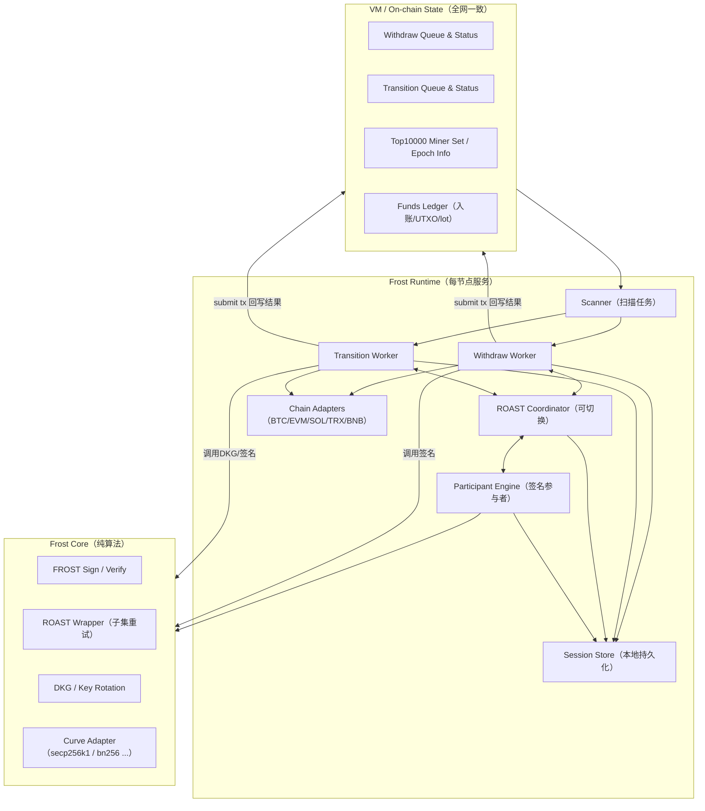
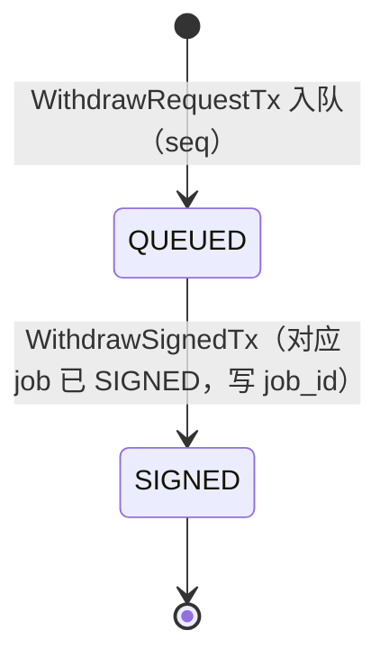
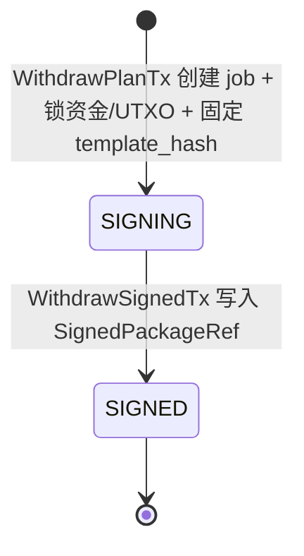
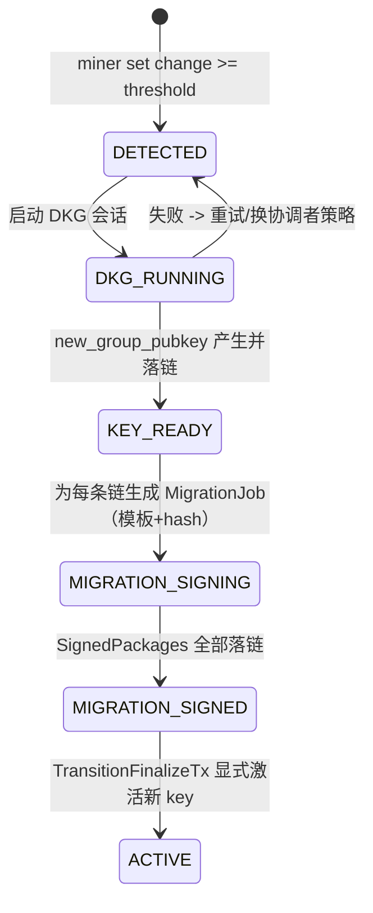


# FROST 模块设计文档（v1）

> 目标：把 FROST 做成**独立于共识**的"跨链资产执行引擎"，严格按**已达成共识的队列**执行两类流程：  
> 1) 提现（Withdraw Queue）  
> 2) 权力交接/密钥轮换（Power Transition / Key Rotation Queue）  
>
> 关键约束来自 `frost/requirements.md`：  
> - 前 10000 个共识 miner 参与签名流程（可从状态机/数据库获取其公钥/地址）  
> - Withdraw 支持 FROST/ROAST；ROAST 要支持**超时切换聚合者**  
> - Nonce/UTXO 设计要确保异步冗余下仍不多签发  
> - v1 支持：BTC / ETH / SOL / TRX / BNB  
> - Gas/手续费配置文件（按年均 300% 写死，后续版本治理/升级更新）  
> - 提现调度 FIFO（先入账的资金先被提现）  
> - 共识暂停时，FROST 仍持续执行**已确认**的提现/交接（状态回写可延后）
> - 提现/迁移相关的三方链交易：**FROST/整个工程不负责广播与确认**；Runtime 只负责构建模板、完成门限签名，并把"签名产物/交易包"落链（可查询/可审计）；广播由用户/运营方手动完成。
> - 允许 ROAST 对同一 `tx_template_hash` 产生**多份合法签名产物**；系统接受并追加记录这些产物，但**不把签名 bytes 写入 StateDB 的 Merkle Root**（只做 receipt/history 记录或 tx payload 记录），同时保证不会导致双花（同一 withdraw_id 绑定同一模板/同一输入集合）。

---

## 0. 术语

- **On-chain State**：由 VM 执行、随区块最终化提交的状态（全网一致、可验证）。
- **Runtime**：每个节点本地运行的 frost 服务（非共识、可重启、可容错）。
- **Signer Set (Top10000)**：当前高度下可参与签名的前 10000 名 miner（来自状态机/数据库可查询）。
- **Threshold (t)**：门限签名阈值（默认 `t = ceil(N * 0.8)`，可配置）。
- **Coordinator / Aggregator（聚合者）**：会话中负责收集承诺值/部分签名并输出聚合签名的角色；需要可切换。
- **Session**：一次签名或一次 DKG/轮换的会话，包含 session_id、参与者集合、消息摘要等。
- **Chain Adapter**：链适配器（BTC UTXO vs 合约链/账户模型链）。

---

## 1. 设计目标与非目标

### 1.1 目标

1) **确定性输入，异步执行**  
FROST 的输入来自 On-chain State（已最终化的 tx/队列），Runtime 只“读状态 + 执行动作 + 以 tx 回写结果”。

2) **模块解耦**  
尽量复用现有工程抽象：EventBus / Transport / VM HandlerRegistry / DBManager。  
不引入独立的“ConsensusObserver / FrostVMHandler / FrostNetworkAdapter”平行体系。

3) **安全的 Anti-Double-Spend / Anti-Double-Sign**  
- BTC：UTXO 选择与锁定、模板固定  
- 合约链：合约层使用 withdraw_id 去重；账户链 nonce/序列由“链上/合约”保证唯一

4) **ROAST 鲁棒性**  
- 节点掉线/恶意不配合：自动换子集/换聚合者  
- 聚合者作恶：超时切换聚合者（所有节点可独立计算切换序列）

5) **两条主流程独立**  
- Withdraw pipeline：持续执行，不因轮换长期阻塞（可设计为“只在关键切换窗口短暂停顿/降速”）  
- Power transition pipeline：在达到触发阈值时进入，保证最终一致


---

## 2. 总体架构

FROST 分三层：**共识状态层（VM） / 运行时层（Runtime） / 密码学内核（Core）**。



---

## 3. 模块边界与目录建议

> 你当前 `frost/` 里已有 DKG/曲线适配/签名实验代码（package 名叫 dkg）。需要迁移到 core 子目录，保持“纯算法不依赖网络/DB”。

建议目录：

```
frost/
  core/                     # 纯密码学，不依赖 VM/DB/Transport
    curve/                  # secp256k1、bn256 等适配
    frost/                  # 2-round FROST
    roast/                  # ROAST wrapper（重试/子集选择策略）
    dkg/                    # DKG/Key rotation
  runtime/                  # 每节点运行服务（可重启、可恢复）
    deps.go                 # 依赖注入接口（ChainStateReader/TxSubmitter/P2P 等，见 8.1）
    manager.go              # Runtime 主入口与生命周期管理
    scanner.go              # 扫描链上队列任务
    withdraw_worker.go      # 提现流程执行器
    transition_worker.go    # 权力交接流程执行器
    coordinator.go          # ROAST Coordinator（聚合者角色）
    participant.go          # Participant Engine（签名参与者角色）
    session/
      store.go              # 本地会话持久化（nonce、commit、share…，见 8.4）
      types.go              # Session 相关类型定义
      recovery.go           # 会话恢复逻辑（重启后恢复进行中的会话）
    net/
      msg.go                # MsgFrost envelope 定义（见 8.2）
      handlers.go           # P2P 消息处理器（NonceCommit/SigShare/Abort 等）
  vmhandler/                # VM TxHandlers：写入/推进链上状态机（Job 化，见 5/6/8.3）
    register.go             # Handler 注册入口
    withdraw_request.go     # FrostWithdrawRequestTx：创建 QUEUED + FIFO index
    withdraw_plan.go        # FrostWithdrawPlanTx：生成 SigningJob（模板+template_hash+资金/UTXO 锁定）
    withdraw_signed.go      # FrostWithdrawSignedTx：写入 SignedPackageRef，并把 job+withdraw 置为 SIGNED（终态，资金视为已支出）

    transition_trigger.go   # FrostTransitionTriggerTx：触发轮换
    transition_plan.go      # FrostTransitionPlanTx：为受影响链生成 MigrationJob（模板+template_hash）
    transition_signed.go    # FrostTransitionSignedTx：写入迁移 SignedPackageRef
    transition_finalize.go  # FrostTransitionFinalizeTx：显式激活新 key（不依赖外链确认）

    funds_ledger.go         # 资金账本 helper（lot/utxo/lock），供 plan handler 调用
  chain/                    # 链适配器（构建模板 / 封装 SignedPackage / 解析与校验）
    adapter.go              # ChainAdapter 接口定义 + ChainAdapterFactory
    btc/
      adapter.go            # BTC 适配器实现
      utxo.go               # UTXO 选择与管理
      template.go           # 交易模板构建
    evm/                    # ETH/BNB 共享
      adapter.go            # EVM 适配器实现
      contract.go           # 托管合约交互
    tron/
      adapter.go            # TRON 适配器实现
    solana/
      adapter.go            # Solana 适配器实现
  api/                      # 对外 RPC/HTTP（只读查询 + 运维，见 9）
    http.go                 # HTTP 服务入口
    routes.go               # 路由注册
    query_handlers.go       # 查询类接口实现（GetWithdrawStatus 等）
    admin_handlers.go       # 运维类接口实现（GetHealth/ForceRescan 等）
    types.go                # API 请求/响应类型定义
  config/
    default.json            # 默认配置文件（见 10）
    config.go               # 配置加载与解析
```

---

## 4. On-chain 状态机与数据模型（VM 层）

### 4.1 为什么要“链上状态机”

为了满足：

* “每个 miner 都能根据状态机和数据库得到签名者集合”
* “异步冗余也不多签发”
* “共识暂停时 Runtime 仍执行（但最终以链上队列作为唯一输入源）”

关键做法：
**所有“可能影响资产安全/唯一性”的决策都必须落在链上状态中**（例如：withdraw_id、交易模板 hash、UTXO 锁、合约 withdraw_id 去重标记等）。

### 4.2 Key 前缀

> 具体由keys\keys.go管理。这里用 `v1_frost_` 举例。

| 数据                  | Key 示例                              | 说明                                         |
| ------------------- | ----------------------------------- | ------------------------------------------ |
| 配置快照                | `v1_frost_cfg`                      | committeeN、thresholdRatio、timeouts、链配置hash等 |
| Top10000 集合         | `v1_frost_top10000_<heightOrEpoch>` | 公钥/NodeID 列表                       |
| Funds Ledger        | `v1_frost_funds_<chain>_<asset>`    | 余额、lot 队列、UTXO set（BTC）等                   |
| Withdraw Queue      | `v1_frost_withdraw_<withdraw_id>`   | 提现请求与状态                                    |
| Withdraw FIFO Index | `v1_frost_withdraw_q_<seq>`         | seq->withdraw_id，用于 FIFO 扫描                |
| Transition State    | `v1_frost_transition_<epoch>`       | 轮换/交接会话与状态                                 |

### 4.3 核心结构（ Proto ）

#### 4.3.1 WithdrawRequest（链上）

* withdraw_id：提现tx的id
* chain/asset：目标链与资产类型
* to / amount：提现目标地址与数量
* fee_policy：固定或上限（v1 固定取 config）
* tx_context：提现交易签名内容，由VM填写
* status：状态机字段（见下）
* session_id：当前正在使用的签名会话 id（可空）
* signed_tx_ref：签名产物（hash 或 raw 的存储引用）

#### 4.3.2 FundsLedger（链上）

* Account/Contract chains（ETH/BNB/TRX/SOL）：

  * `available_balance`（可用）
  * `reserved_balance`（已预留，防止重复分配）
  * `deposit_lots[]`（FIFO：每次入账形成一个 lot，提现从 lot 头部扣减）
  * `next_withdraw_seq`（用于生成 withdraw_id 或 FIFO index）

* BTC：

  * `utxos[]`（每个含：txid:vout:value:pkScript:height:confirmed_time）
  * `locked_utxos`（映射 utxo->withdraw_id，防并发）
  * `change_utxo_policy`（用于后续 CPFP/归集）

> 说明：你要求“先上账的资金先被提现”，BTC 天然可用“UTXO age 升序选取”；账户链用 `deposit_lots` 实现真正 FIFO。

#### 4.3.3 TransitionState（链上）

* epoch_id / trigger_height 这次轮换的唯一编号（一般单调递增）；触发轮换的链上高度
* dkg_status：NotStarted / Running / KeyReady / Failed
* old_group_pubkey / new_group_pubkey
* migration_status：Preparing / Signing / Signed / Active / Failed
* migration_sig_count：已落链的签名产物数量（不含 bytes）
* affected_chains：需要更新的链列表（BTC/合约链）
* pause_withdraw_policy：是否暂停/降速（仅在"切换生效窗口"短暂停）

> 迁移产物（raw tx / call data / signatures）可通过重复提交 `FrostTransitionSignedTx`（同 epoch 多份 SignedPackage）落 receipt/history（SyncStateDB=false）。

---

## 5. Withdraw Pipeline（提现流程，Job 模式）

本版本把“签名的基本单位”从 **withdraw_id** 提升为 **SigningJob**：

- **WithdrawRequest（提现请求）**：用户想要“转给谁/转多少”的业务请求，必须严格 FIFO 入队。
- **SigningJob（签名任务/模板任务）**：把 FIFO 队首的一段 withdraw **打包成尽可能少的模板**，对该模板完成一次 ROAST（BTC 可能是 *一次会话产出多份 input 签名*），最终产出一个 `SignedPackage`。
- Frost 的交付点是：`SignedPackage` 已落链（receipt/history 或 state 引用），用户可下载后自行广播；**本链不负责广播/确认**。

### 5.1 链上对象与关键字段

#### 5.1.1 WithdrawRequest（链上）

- `withdraw_id`：全网唯一
- `seq`：FIFO 序号（严格递增）
- `chain / asset / to / amount`
- `status`：`QUEUED | SIGNED`
- `job_id`：归属的 SigningJob（当 status=SIGNED 时存在）


#### 5.1.2 SigningJob（链上）

一个 job 必须能被任何节点**纯验证**（不依赖外链 RPC）。

通用字段：

- `job_id`：全网唯一（ `H(chain || first_seq || template_hash || epoch)`）
- `chain`：btc/eth/trx/sol/bnb...
- `key_epoch`：使用哪个 epoch 的 `group_pubkey` 进行签名（避免轮换期间歧义）
- `withdraw_ids[]`：被该 job 覆盖的 withdraw 列表（必须是 FIFO 队首连续前缀）
- `template_hash`：模板摘要（签名绑定的唯一输入）
- `plan_ref`：资金占用/UTXO 锁定引用（见 5.3）
- `status`：`SIGNING | SIGNED`

BTC 专用字段（放入 `plan_ref` ）：

- `inputs[]`：UTXO 列表（可能多笔）
- `outputs[]`：withdraw 输出列表（可多地址、多输出；支持“一个 input 覆盖多笔小额提现”）
- `change_output`：可选（返回 treasury 地址；不计入本链可用余额，直到被外部入账模块再次确认入账）

> **重要**：BTC “一个大 UTXO 支付多笔提现” 就是一个 job：`1 input -> N withdraw outputs (+ change)`。  
> 这会显著减少签名压力（少 inputs ⇒ 少签名任务），正是“尽可能少签名满足尽可能多提现”的核心抓手。

---

### 5.2 状态机（链上）：Withdraw 与 Job 分离

#### 5.2.1 WithdrawRequest 状态机



#### 5.2.2 SigningJob 状态机



> 本链**不需要**链上记录 “SIGNING 中/会话进度”；会话信息放在 Runtime 的 `SessionStore`（可重启恢复）。

---

### 5.3 模板规划（Template Planning）：如何把 FIFO 队列打成最少的 Job

模板规划是最复杂部分，目标函数建议明确为：

1) **严格 FIFO**：job 只能覆盖“队首连续的一段 withdraw”（不能跳过队首去装后面的）。  
2) **尽可能少的签名工作量**：优先减少 `job 数`；在 BTC 中进一步减少 `inputs 数`（因为 inputs 数≈签名任务数）。  
3) **跨链可扩展**：把“能否 batch、batch 上限”下沉到链策略/配置。

#### 5.3.1 链上 PlanTx 的验证规则（必须简单、可复验）

`WithdrawPlanTx` 提交者（任意 miner/运营方）给出一个候选 job，VM 只做**不变量校验**：

- `withdraw_ids[]` 必须是当前 FIFO 队列的 **连续前缀**（从 `head_seq` 开始连续）
- 每个 withdraw 当前必须是 `QUEUED`
- `job.template_hash` 必须等于 `ChainAdapter.BuildTemplate(...)->TemplateHash(...)`
- `plan_ref` 里的资金占用必须合法：
  - BTC：选中的 UTXO 当前未锁定，且总额覆盖 `sum(outputs)+fee+min_change`（或允许 “no-change eat fee”）
  - 账户/合约链：从 `available_balance/lot` 预留，不能超额
- 通过后：资金/UTXO 进入锁定

> 这里不强求 “唯一确定的最优规划”，但强制 “不能破坏 FIFO 与资金安全”。  

#### 5.3.2 BTC 规划算法（支持 多 inputs 与 多 outputs）

BTC job 的模板本质是一笔交易：

- 多笔小额提现：**允许 1 个 input 支付 N 个 withdraw outputs**（这是减少签名的关键）
- 大额提现：允许 N 个 inputs 共同覆盖（需要 N 份 input 签名）

一个可落地的“FIFO 贪心装箱”：

1) 从 `head_seq` 开始，按序追加 withdraw 到 `outputs[]`，直到触达任一上限：
   - `max_outputs`（配置）
   - 估算 vbytes 超过 `max_vbytes`
2) 计算目标额：`need = sum(outputs) + fee_estimate + min_change`
3) 选择 inputs（UTXO）：
   - 默认按 `confirm_height/age` 升序选择（与“资金先到先出”直觉一致）
   - 逐个累加直到 `sum(inputs) >= need`
   - 若 inputs 超过 `max_inputs`，停止装箱（该 job 覆盖的 withdraw 可能更少，但 FIFO 仍成立）
4) change 处理：
   - 若 `change < dust`：不建 change（把 change 吃进 fee），模板仍合法
   - 否则创建 change 输出到 treasury 地址（注意：本链不把 change 计回可用余额，直到外部入账模块确认该 UTXO 确实出现并入账）
5) 输出 `SigningJob`：固定 `inputs/outputs/locktime/sequence/sighash`，得到 `template_hash`

> 这样自然覆盖你关心的两种场景：  
> - “金额太大”：多个 inputs（多签名任务）  
> - “金额太小”：一个 input 输出给多个地址（少签名任务）

#### 5.3.3 合约链/账户链规划（ETH/BNB/TRX/SOL）

核心建议：链上合约/程序提供 **batchWithdraw**（或允许多 instruction），使一个 job 覆盖多笔 withdraw，只需一次门限签名。

- `outputs[]` 等价于 `batch params[]`
- `template_hash` 等价于 `H(chain_id || contract || method || params || withdraw_ids[] || key_epoch)`

---

### 5.4 ROAST（Job 模式）：一次会话产出 1..K 份签名

对一个 `SigningJob`，Runtime 创建一个 `RoastSession(job_id)`：
- 每个job_id一次Roast循环分配一个全网唯一的协调者负责Roast过程。Roast协调者切换算法全网统一，每隔900个区块如果协调者没有提交有效的SignedPackageTx，自动切换到下一个协调者。
- session 输入：`job_id + template_hash + key_epoch + committee`
- session 输出：`SignedPackageTx`（BTC 是 “模板 + 每个 input 的 schnorr sig”）

#### 5.4.1 Task 向量化：BTC 的 “K 个 input = K 个签名任务”

对 BTC 来说，一个 job 里有 `K = len(inputs)` 个需要签名的 message：

- `task[j].task_id = input_index`
- `task[j].msg = sighash(input_index, tx_template)`

因此 ROAST 会话必须支持批量：

- Round1：参与者发送 `R_i[0..K-1]`（每个 task 一个 nonce commitment）
- Round2：参与者发送 `z_i[0..K-1]`（每个 task 一个 sig share）

协调者最终得到 `sig[0..K-1]`，按 input_index 填入 witness。

> 这不是“一个签名变成 K 份”，而是“同一套 ROAST 协调流程并行完成 K 次 FROST”。  
> 安全要求：**每个 task 必须使用独立 nonce**，不得复用。

#### 5.4.2 子集重试与部分完成

允许 “某些 task 已完成签名、少数 task 因掉线未完成” 的情况：

- session 内对每个 task 维护 `need_shares / collected / done`
- 协调者可对未完成 task 继续向新子集收集 share
- 已完成 task 的签名保持不变（不需要推倒重来）

#### 5.4.3 聚合者切换（确定性 + 超时）

输入 `job_session_id`：

- `seed = H(job_id || key_epoch || "frost_agg")`
- `agg_candidates = Permute(active_committee, seed)`
- `agg_index = floor((now - session_start)/agg_timeout)`
- 参与者仅接受当前 `agg_index` 的协调者请求，超时自然切换

---

### 5.5 SignedPackage（交付物）与上链方式

Frost 的“完成”定义：

- Runtime 得到 `SignedPackage`（可广播）
- 通过 `WithdrawSignedTx` 把 `SignedPackageRef/Bytes` 写入链上（receipt/history 或引用）
- VM 将该 job 覆盖的所有 withdraw 标记为 `SIGNED`，并把占用资金标记为 **consumed/spent（永久不再用于后续提现）**

BTC 的 `SignedPackage` 至少包含：

- `tx_template`（可为 PSBT-like：inputs/outputs/locktime/sequence）
- `input_sigs[]`（按 input_index 对齐的 schnorr signatures）
- （可选）`raw_wtx`（直接可广播的完整交易）

---

### 5.6 失败、回滚与重试（不依赖外链）

- ROAST 超时/失败：Runtime 可重试（换子集/换聚合者）

- 任何情况下都**不需要**链上记录外链广播/确认；用户拿 `SignedPackage` 自行广播

---

## 6. Power Transition Pipeline（权力交接 / 密钥轮换，Job 模式）

轮换同样采用 “Job 交付签名包、外链执行交给运营方” 的模式：

- 本链负责：检测触发条件 → DKG 得到新 group pubkey → 为每条受影响链生成 `MigrationJob` → 产出并上链 `SignedPackage`
- 运营方负责：拿签名包去执行外链 `updatePubkey(...)` / BTC 迁移交易广播
- 本链 **Active** 的切换由 `TransitionFinalizeTx` 明确触发（不需要 Frost 轮询外链）

### 6.1 触发条件（链上）

- `change_ratio >= transitionTriggerRatio`（例如 0.2 = 2000/10000）
- 或治理参数指定的其它触发规则

### 6.2 链上对象：TransitionState 与 MigrationJob

#### 6.2.1 TransitionState（链上）

- `epoch_id / trigger_height`
- `old_committee_ref / new_committee_ref`
- `dkg_status：NotStarted / Running / KeyReady / Failed`
- `new_group_pubkey`
- `migration_jobs[]`：该 epoch 下的 `MigrationJob` 列表（按链/分片）
- `activation_status：Preparing / SignedPackagesReady / Active`

#### 6.2.2 MigrationJob（链上）

- `job_id / epoch_id / chain`
- `key_epoch = epoch_id`（使用新 key 或旧 key 取决于迁移动作；一般迁移授权用旧 key，更新后提现用新 key）
- `template_hash`
- `status：SIGNING | SIGNED`
- `signed_package_ref`（Signed 后写入）

> 迁移 job 的本质与提现 job 相同：都是“模板 + ROAST + SignedPackage”，只是业务含义不同。
> 同样是按一个job一个时刻900区块只有一个协调者。超时切换协调者。

### 6.3 状态机（链上）



> 说明：这里的 “MIGRATION_SIGNED” 表示“迁移签名包齐全”，**不表示外链已执行成功**。

### 6.4 迁移 Job 规划与签名

#### 6.4.1 合约链（ETH/BNB/TRX/SOL）

为每条链生成一个或多个 `MigrationJob`：

- `template`：`updatePubkey(new_pubkey, epoch_id, ...)`（建议合约支持 batch/nonce 防重放）
- `template_hash`：对 calldata/params 做 hash（包含 epoch_id、chain_id、合约地址等域分隔）
- 通过 ROAST（通常 1 个 task）产出聚合签名，封装成可广播 `SignedPackage`

#### 6.4.2 BTC

若你的 BTC 侧采用 “旧地址资金迁移到新地址”的方案：

- MigrationJob 模板是一笔或多笔 BTC 交易
- 同样支持：
  - 多 inputs（迁移多个 UTXO）
  - 多 outputs（分批迁移/多找零）
- ROAST 仍按 “每个 input 一个 task” 批量完成签名（复用 5.4 的机制）

### 6.5 与提现并行的策略（围绕 key_epoch）

- 所有 Withdraw SigningJob 必须携带 `key_epoch`
- 在 `ACTIVE` 切换之前：
  - 新创建的 withdraw job 使用旧 `key_epoch`
- `TransitionFinalizeTx` 生效后：
  - 新创建的 withdraw job 使用新 `key_epoch`
- 由于本链不追踪外链执行，建议运营流程上：**先确保迁移 SignedPackage 已产出并可执行**（MIGRATION_SIGNED），再由运营方执行外链更新，并在适当时间提交 `TransitionFinalizeTx`。

---
## 7. Nonce / UTXO 安全设计（Job 模式，避免多签发）

### 7.1 总原则：签名必须绑定“唯一模板 + 唯一 Job”

所有参与者在产生 `R_i` 或 `z_i` 前必须验证：

- `job_id` 存在且链上状态为 `SIGNING`（未 SIGNED）
- `template_hash` 与链上 `SigningJob.template_hash` 一致（签名只对该模板生效）
- `key_epoch` 与链上一致（避免轮换期间签错 key）
- 对 BTC：每个 input/task 的 `msg = sighash(input_index, tx_template)` 必须由模板唯一决定（不得被协调者篡改）

> 简单记法：**签什么（msg）必须能从链上 job 纯计算出来**，参与者绝不对“链下临时拼的模板”签名。

### 7.2 合约链（ETH/BNB/TRX/SOL）

v1 建议把“唯一性/去重”交给合约/程序层（强约束），从而允许一个 job 覆盖多笔提现：

- 被签名的消息建议包含（域分隔）：
  `job_id || chain_id || contract/program || method || withdraw_ids[] || to[] || amount[] || fee_cap || deadline || key_epoch`
- 合约/程序维护 `used_withdraw_id` 或 `used_job_id`（二选一即可），确保同一提现不会被重复执行
- 即便出现重复广播/重放，链上执行也会失败（revert），不会重复转出

### 7.3 BTC（UTXO）

BTC 的安全关键点在于：**inputs/outputs/fee/locktime/sequence/sighash 必须在链上 Plan 阶段固定**，并且 UTXO 必须被锁定，避免并发重复分配。

- 链上 FundsLedger 维护 UTXO 集与锁：`lock(utxo)->job_id`
- `WithdrawPlanTx` 固定：
  - 选取 `inputs[]`（可能多笔 UTXO）
  - 固定 `outputs[]`（可多地址、多输出，支持“一个 input 覆盖多笔小额提现”）
  - 固定 fee/feerate、locktime/sequence、sighash_type
  - 生成 `tx_template` 并写入 `template_hash`
- 签名阶段（ROAST）：
  - 只允许对该模板的 `K=len(inputs)` 个 task 产生签名（每个 input 一个 sighash/message）
  - Nonce 必须按 task 独立生成并本地持久化，绝不跨 task 复用

> 费用策略：由于 Frost 不负责外链广播/确认，v1 推荐使用保守的 fee 参数（配置中可按年均 * 300%）。如需更复杂的加速（RBF/CPFP），建议作为后续版本在“额外 Job/额外 SignedPackage”层面实现，而不是在同一 withdraw 上生成不同模板的替代交易。

---
## 8. 内部接口（模块间）——重新设计（重点）

> 目标：不造“ConsensusObserver / FrostVMHandler / FrostNetworkAdapter”。
> Frost Runtime 只依赖你工程里已经稳定存在的抽象：
>
> * EventBus（订阅 block.finalized 作为唤醒信号）
> * Transport（p2p 消息）
> * VM HandlerRegistry（注册 frost tx handlers）
> * DBManager / StateDB（读链上状态；本地存会话）

### 8.1 Runtime 依赖注入接口（Go）

```go
// frost/runtime/deps.go

// 读链上最终化状态（来自 StateDB/DB overlay 的只读视图）
type ChainStateReader interface {
    Get(key string) ([]byte, bool, error)
    Scan(prefix string, fn func(k string, v []byte) bool) error
}

// 提交“回写交易”（进入 txpool/广播/共识）
type TxSubmitter interface {
    Submit(tx any) (txID string, err error)
}

// 订阅最终化事件（仅作为唤醒，不是唯一触发源）
type FinalityNotifier interface {
    SubscribeBlockFinalized(fn func(height uint64))
}

// P2P 网络（复用现有 Transport）
type P2P interface {
    Send(to NodeID, msg *FrostEnvelope) error
    Broadcast(peers []NodeID, msg *FrostEnvelope) error
    SamplePeers(n int, role string) []NodeID  
}

// 当前高度下 signer set（Top10000）提供者
type SignerSetProvider interface {
    Top10000(height uint64) ([]SignerInfo, error)
    CurrentEpoch(height uint64) uint64
}

// 链适配器工厂
type ChainAdapterFactory interface {
    Adapter(chain string) (ChainAdapter, error)
}
```

> 说明：
>
> * `FinalityNotifier` 可直接由你现有 EventBus 包一层实现（订阅 `block.finalized`）。
> * `P2P` 可直接使用你现有 `Transport`，新增 `MsgFrost` 消息类型即可。
> * `SignerSetProvider` 的实现可以：
>
>   * 从共识层已落盘的 validator set 读（但接口仍保持“只读”）

### 8.2 P2P 消息：统一 Envelope（避免散乱）

```go
// frost/runtime/net/msg.go

type FrostEnvelope struct {
    SessionID   string
    Kind        string   // "NonceCommit" | "SigShare" | "Abort" | "CoordinatorAnnounce" | ...
    From        NodeID
    Epoch       uint64
    Round       uint32
    Payload     []byte   // protobuf / json
    Sig         []byte   // 消息签名（防伪造/重放）
}
```

新增：`MsgType = MsgFrost`，payload 为 `FrostEnvelope`。

### 8.3 VM 集成：只用 TxHandlers（Job 化，不在 VM 内跑签名）

* `frost/vmhandler/register.go`：把以下 tx kind 注册到 VM 的 HandlerRegistry

  * `FrostWithdrawRequestTx`：创建 `WithdrawRequest{status=QUEUED}` + FIFO index
  * `FrostWithdrawPlanTx`：生成 `SigningJob{status=SIGNING}`（模板+`template_hash`+资金/UTXO 锁定）
  * `FrostWithdrawSignedTx`：写入 `SignedPackageRef/Bytes`，把 job 与其覆盖的 withdraw 全部置为 `SIGNED`（终态，资金视为已支出）


  * `FrostTransitionTriggerTx`：触发轮换（进入 DKG_RUNNING/KEY_READY 等）
  * `FrostTransitionPlanTx`：为受影响链生成 `MigrationJob{status=SIGNING}`（模板+`template_hash`）
  * `FrostTransitionSignedTx`：记录迁移 `SignedPackageRef/Bytes`，并将对应 MigrationJob 置为 SIGNED
  * `FrostTransitionFinalizeTx`：显式激活新 key（不依赖外链确认）

> VM TxHandlers 的职责：**验证 + 写入状态机（共识态）**。  
> Runtime 的职责：**离链 ROAST/FROST 签名协作 + 会话恢复**，只对链上 job 的 `template_hash` 签名；并通过 `SignedTx` 把签名产物公布到链上。  
> Frost 不负责外链广播/确认；用户/运营方拿链上 `SignedPackage` 自行广播。

### 8.4 数据库存储：链上状态 vs 本地会话

* **链上状态（StateDB）**：Withdraw/Transition/FundsLedger/Top10000/committee 等
* **本地会话（SessionStore）**：nonce、commit、已见消息、超时计时、重启恢复信息

  * 重要：nonce 必须持久化后才发送 commitment，避免重启后不小心复用

### 8.5 签名产物的落链方式（不进 StateDB Root）

为满足"签名结果上链但不纳入状态机 hash root"的需求：
- 状态机（WithdrawRequest/TransitionState）只写入：status、tx_template_hash、session_id、primary_sig_ref/sig_count 等**小字段**（SyncStateDB=true）
- 具体签名 bytes / raw tx / 调用参数包：写入 **receipt/history 类数据**（WriteOp.SyncStateDB=false），仅供审计与 RPC 查询，不参与 StateDB Merkle Root 计算

---

## 9. 外部 RPC/API（对外暴露）

> v1 只做“读 + 运维”；写操作通过链上 tx（与系统一致）。

### 9.1 查询类

* `GetFrostConfig()`：当前 frost 配置快照
* `GetGroupPubKey(epoch)`：当前/历史聚合公钥
* `GetWithdrawStatus(withdraw_id)`：状态机、job_id、template_hash、raw_txid（可离线从模板计算）、signed_package_ref、失败原因
* `ListWithdraws(from_seq, limit)`：FIFO 扫描队列
* `GetTransitionStatus(epoch)`：轮换进度、链更新结果
* `GetTxSignInfo(withdraw_id)`：聚合签名结果
* `GetAllWithdrawSignInfo(height1, height2)`：按高度范围汇总

### 9.2 运维/调试类

* `GetHealth()`：DB/StateReader/ChainAdapters/P2P/Scanner 状态
* `GetSession(job_id)`：本地会话详情（当前聚合者 index、每个 task 收到多少份、谁超时）
* `ForceRescan()`：触发 scanner 立即跑一轮（仅本地）
* `Metrics()`：签名耗时分布、聚合者切换次数、子集重试次数、失败原因统计等（不做外链确认统计）

---

## 10. 配置文件（v1）

`frost/config/default.json`：

```json
{
  "committee": {
    "topN": 10000,
    "thresholdRatio": 0.8,
    "epochBlocks": 200000 //每隔epochBlocks检查一次是否变化量达到阈值，需要更换委员会
  },
  "timeouts": {
    "nonceCommitMs": 2000,
    "sigShareMs": 3000,
    "aggregatorRotateMs": 5000,
    "sessionMaxMs": 60000
  },
  "withdraw": {
    "maxInFlightPerChain": 50,
    "retryPolicy": { "maxRetry": 5, "backoffMs": 5000 }
  },
  "transition": {
    "triggerChangeRatio": 0.2,
    "pauseWithdrawDuringSwitch": true
  },
  "chains": {
    "btc": { "feeSatsPerVByte": 25 },
    "eth": { "gasPriceGwei": 30, "gasLimit": 180000 },
    "bnb": { "gasPriceGwei": 3, "gasLimit": 180000 },
    "trx": { "feeLimitSun": 30000000 },
    "sol": { "priorityFeeMicroLamports": 2000 }
  }
}
```

---

---

## 12. 安全考虑

1. **参与者验签与防重放**

* FrostEnvelope 可选带消息签名（使用 miner 节点身份签名）
* 必须校验 session_id / epoch / round，不接受过期消息

2. **Nonce 安全**

* Nonce 生成后必须本地落盘再发送 commitment
* 会话失败后 nonce 不复用

3. **模板绑定**

* 所有签名 share 必须绑定链上 `tx_template_hash`，防止聚合者诱导签名不同交易

4. **聚合者作恶**

* 超时切换聚合者（确定性序列）

---

## 14. 附：关键流程时序图（Withdraw，Job 模式）

```mermaid
sequenceDiagram
  participant VM as VM(On-chain)
  participant RT as Frost Runtime
  participant PL as Planner(Template Planning)
  participant CO as Coordinator(ROAST)
  participant S as Signers(t-of-N)
  participant OP as Operator/User（手动广播）
  participant CH as Target Chain

  Note over VM,RT: 多笔 WithdrawRequest 已按 FIFO 入队（QUEUED）

  RT->>PL: 读取队首连续 withdraw + FundsLedger
  PL-->>RT: 生成候选 SigningJob（inputs/outputs/template_hash）

  RT->>VM: submit WithdrawPlanTx(job, locks, template_hash)
  VM-->>RT: job SIGNING(job_id, template_hash)

  RT->>CO: Start RoastSession(job_id, tasks=K inputs)
  CO->>S: Round1 NonceCommit(job_id, task_ids[])
  S-->>CO: R_i[task_id]  (batch)
  CO->>S: Round2 Challenge/R_agg(job_id, task_ids[])
  S-->>CO: z_i[task_id]  (batch)
  CO-->>RT: sig[task_id] -> SignedPackage

  RT->>VM: submit WithdrawSignedTx(job_id, signed_package_ref)
  VM-->>RT: job SIGNED; withdraws -> SIGNED（终态）

  OP-->>VM: 查询/下载 SignedPackage（RPC/Indexer）
  OP->>CH: broadcast SignedPackage（手动）
```

> 注：Frost 只保证"模板绑定 + 签名产物可审计可取用"，不追踪外链确认。

---

