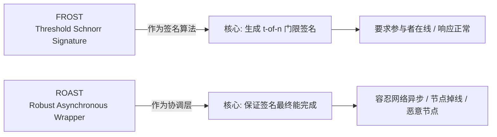
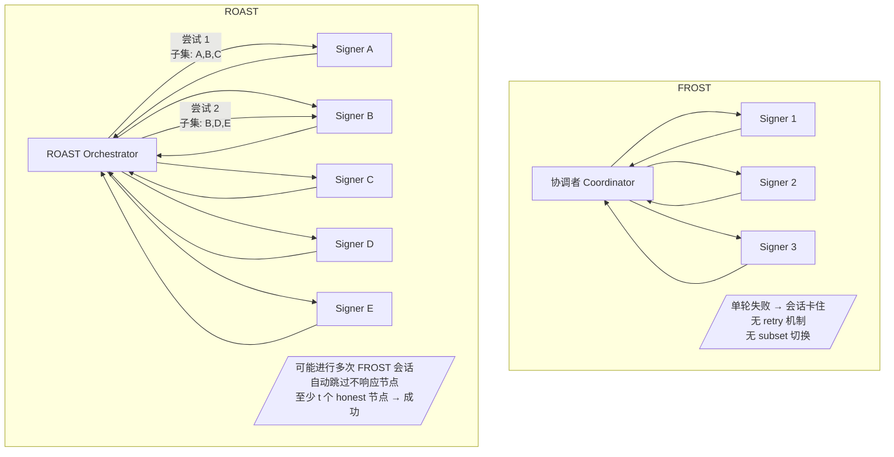
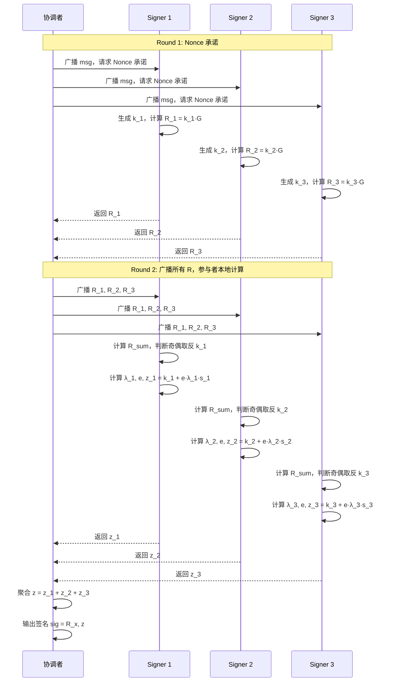
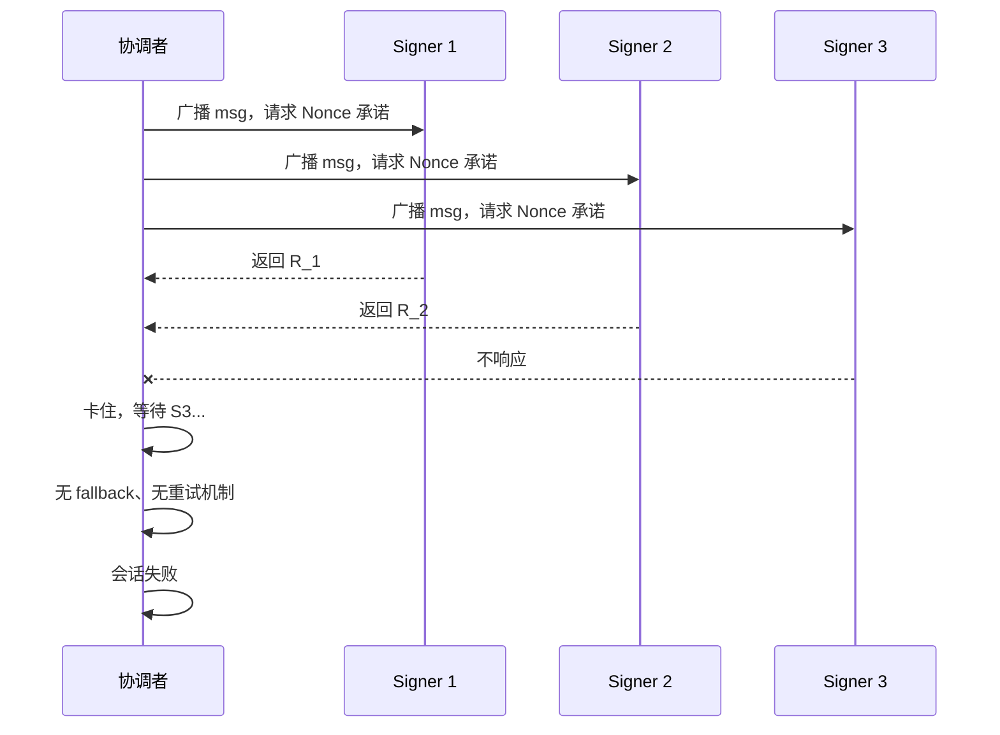
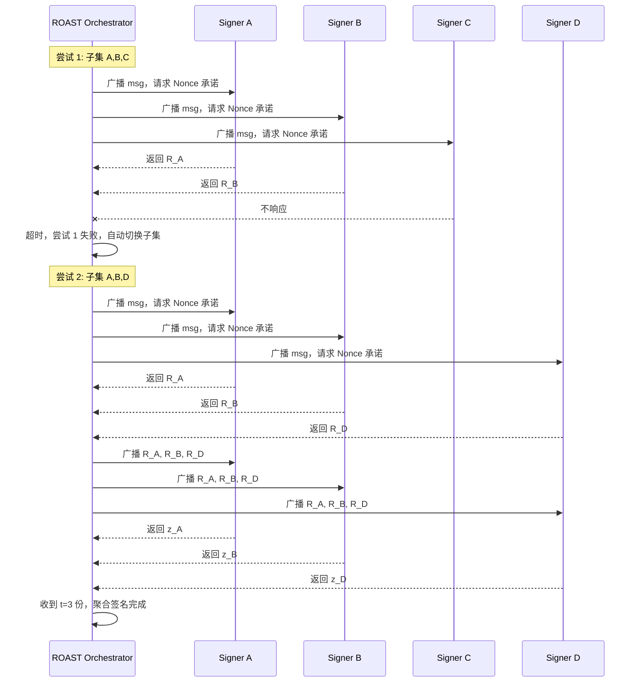
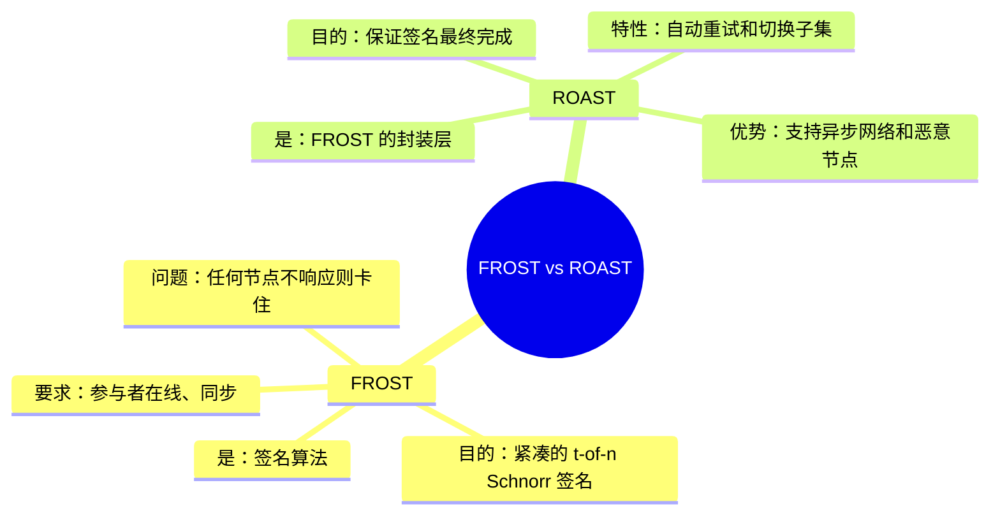
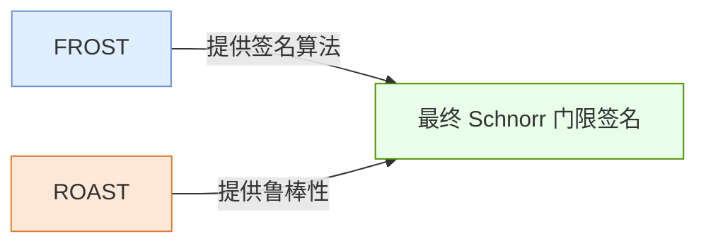

原文https://www.btcstudy.org/2022/11/04/robust-asynchronous-schnorr-threshold-signature-tabconf-2022/
---

# Frost vs Roast — 本质区别说明

## 📌 1. 设计定位对比

---

## 📌 2. 基础结构对比（系统架构视角）

---

## 📌 3. 签名流程对比（时序图）

### 🔹 FROST 正常流程（两轮通信）

---

### 🔹 FROST 失败场景（无 Robustness）

---

### 🔹 ROAST（具备 Robustness + Asynchronous）

---

## 📌 4. 本质区别（概念图）

---

## 📌 5. 总结（一句话）

---
