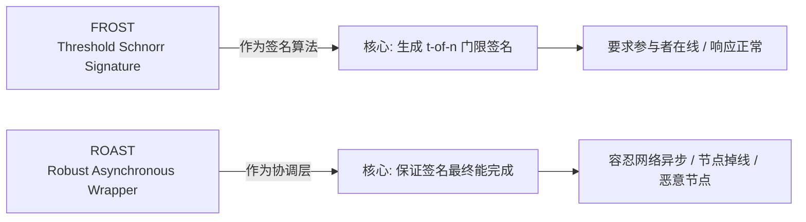
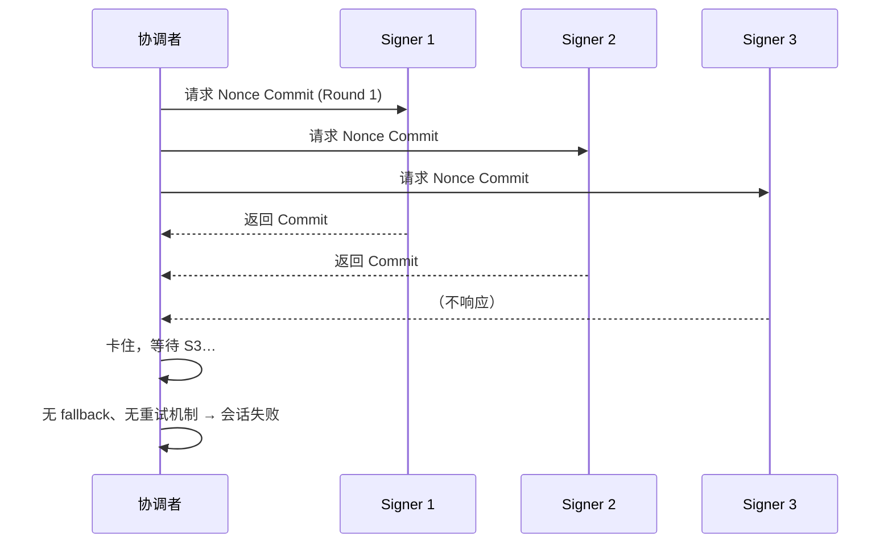
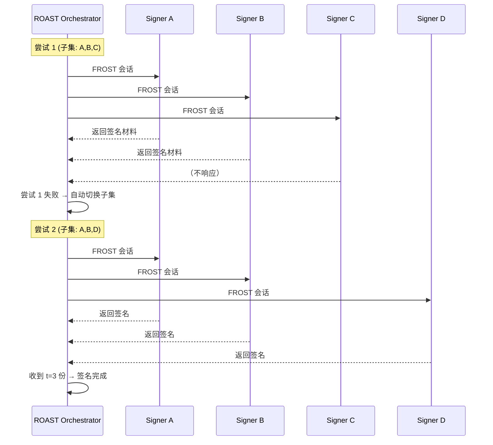
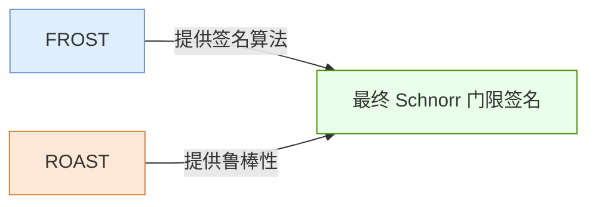

原文https://www.btcstudy.org/2022/11/04/robust-asynchronous-schnorr-threshold-signature-tabconf-2022/
---

# Frost vs Roast — 本质区别说明（Mermaid 可视化）

## 📌 1. 设计定位对比



---

## 📌 2. 基础结构对比（系统架构视角）

```mermaid
flowchart TD
    subgraph FROST
        F1[协调者 Coordinator]
        F2[Signer 1]
        F3[Signer 2]
        F4[Signer 3]
        F1 --> F2
        F1 --> F3
        F1 --> F4
        F2 --> F1
        F3 --> F1
        F4 --> F1
        note right of F1
            单轮失败 → 会话卡住  
            无 retry 机制  
            无 subset 切换  
        end note
    end

    subgraph ROAST
        R0[ROAST Orchestrator]
        R1[Signer A]
        R2[Signer B]
        R3[Signer C]
        R4[Signer D]
        R5[Signer E]

        R0 -->|尝试 1<br>(子集: A,B,C)| R1
        R0 --> R2
        R0 --> R3

        R0 -->|尝试 2<br>(子集: B,D,E)| R2
        R0 --> R4
        R0 --> R5

        R1 --> R0
        R2 --> R0
        R3 --> R0
        R4 --> R0
        R5 --> R0

        note right of R0
            可能进行多次 FROST 会话  
            自动跳过不响应节点  
            至少 t 个 honest 节点 → 成功  
        end note
    end
```

---

## 📌 3. 签名流程对比（时序图）

### 🔹 FROST（不具备 Robustness）



---

### 🔹 ROAST（具备 Robustness + Asynchronous）



---

## 📌 4. 本质区别（概念图）

```mermaid
mindmap
  root((FROST vs ROAST))
    FROST
      "是：签名算法"
      "目的：紧凑的 t-of-n Schnorr 签名"
      "要求：参与者在线、同步"
      "问题：任何节点不响应 → 卡住"
    ROAST
      "是：FROST 的封装层"
      "目的：保证签名最终完成 (liveness)"
      "特性：自动重试/切换子集"
      "优势：支持异步网络、恶意节点"
```

---

## 📌 5. 总结（一句话）



---
