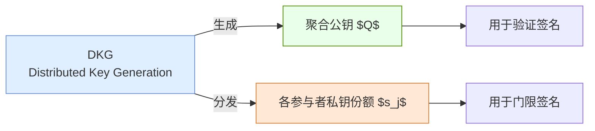
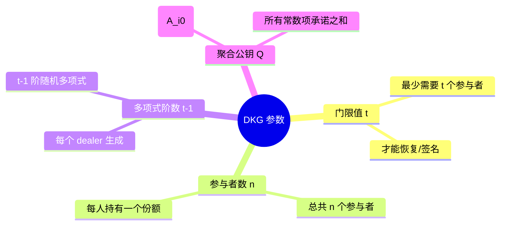
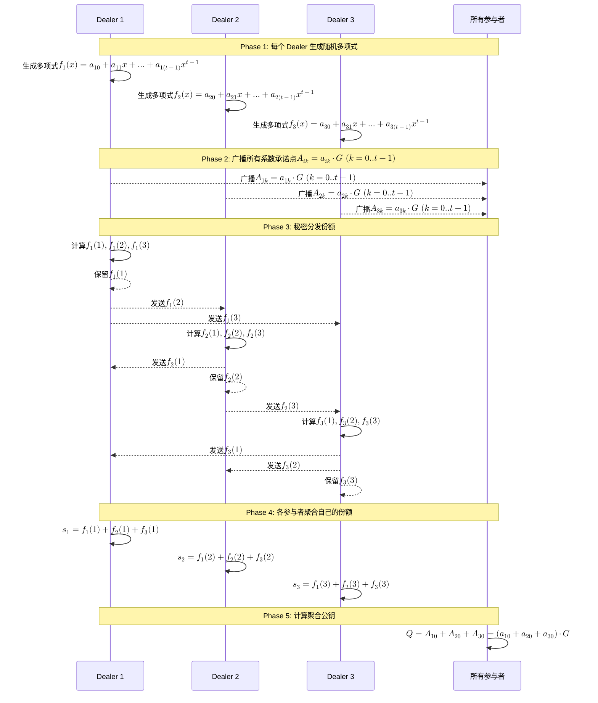
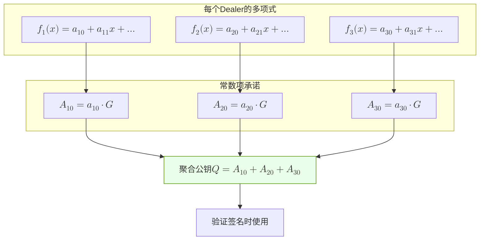
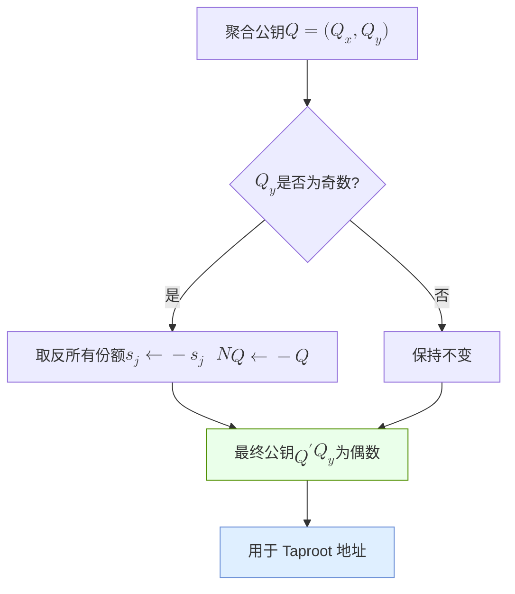
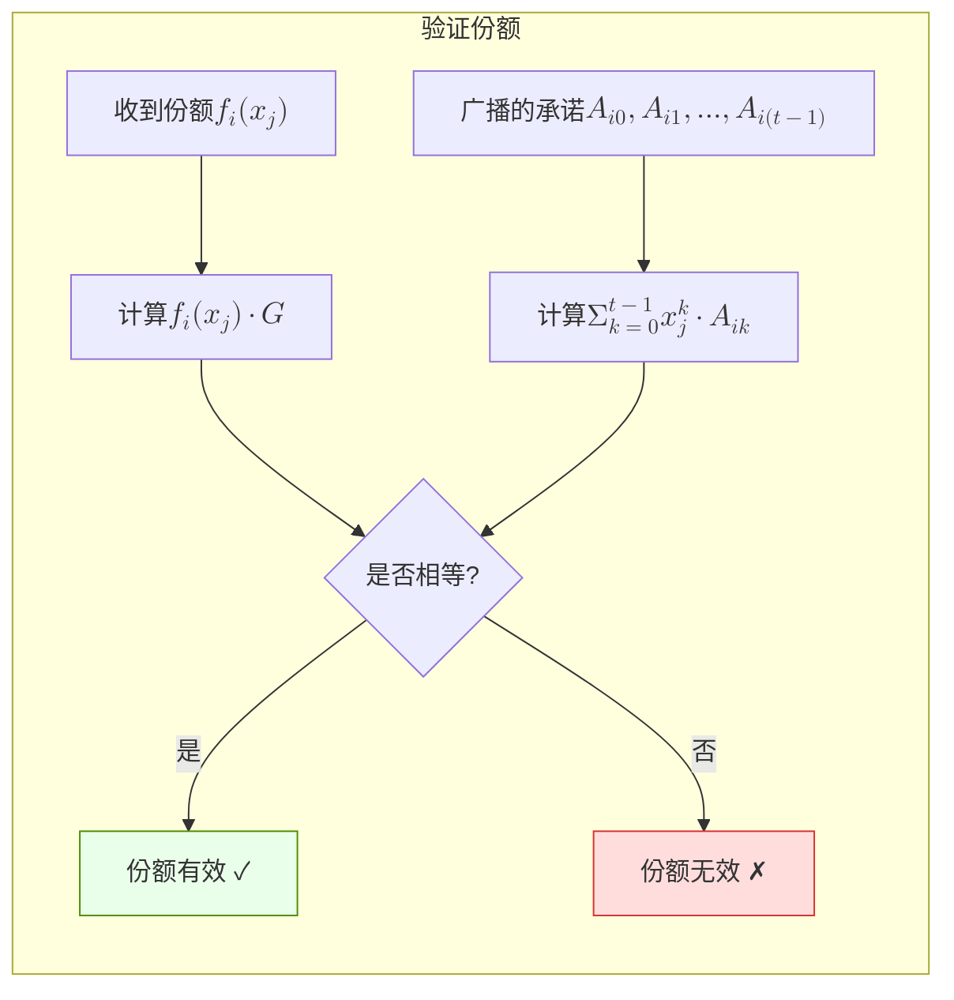
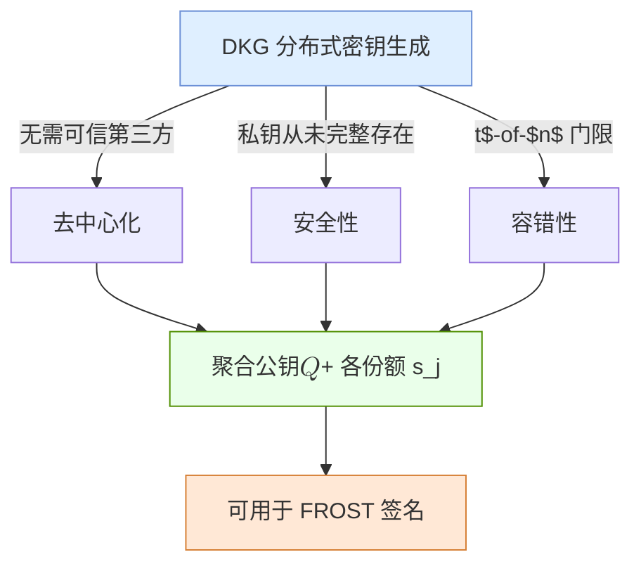

# DKG（分布式密钥生成）生成聚合公钥流程

## 📌 1. DKG 概述

---

## 📌 2. DKG 核心参数

---

## 📌 3. DKG 流程（时序图）

---

## 📌 4. 聚合公钥生成原理

---

## 📌 5. BIP340 x-only 公钥调整

---

## 📌 6. 份额验证

其中 $$x_j$$ 是参与者 j 的评估点（Shamir 的 x 坐标），常见做法是直接取参与者编号 $$x_j = j$$，或用其身份/公钥哈希映射到标量域；只要各参与者的 $$x_j$$ 两两不同且不为 0 即可。

---

## 📌 7. 总结

