# DKG（分布式密钥生成）生成聚合公钥流程

## 📌 1. DKG 概述

```mermaid
flowchart LR
    A[DKG<br>Distributed Key Generation] -->|生成| B[聚合公钥 Q]
    A -->|分发| C[各参与者私钥份额 s_j]
    
    B --> D[用于验证签名]
    C --> E[用于门限签名]
    
    style A fill:#dfefff,stroke:#6b8fd6
    style B fill:#eaffea,stroke:#4f8f00
    style C fill:#ffe8d6,stroke:#d67f35
```



---

## 📌 2. DKG 核心参数

```mermaid
mindmap
  root((DKG 参数))
    门限值 t
      最少需要 t 个参与者
      才能恢复/签名
    参与者数 n
      总共 n 个参与者
      每人持有一个份额
    多项式阶数 t-1
      每个 dealer 生成
      t-1 阶随机多项式
    聚合公钥 Q
      Q = Σ A_i0
      所有常数项承诺之和
```



---

## 📌 3. DKG 流程（时序图）

```mermaid
sequenceDiagram
    participant D1 as Dealer 1
    participant D2 as Dealer 2
    participant D3 as Dealer 3
    participant ALL as 所有参与者

    Note over D1,ALL: Phase 1: 每个 Dealer 生成随机多项式

    D1->>D1: 生成多项式 f_1(x) = a_10 + a_11·x + ... + a_1(t-1)·x^(t-1)
    D2->>D2: 生成多项式 f_2(x) = a_20 + a_21·x + ... + a_2(t-1)·x^(t-1)
    D3->>D3: 生成多项式 f_3(x) = a_30 + a_31·x + ... + a_3(t-1)·x^(t-1)

    Note over D1,ALL: Phase 2: 广播常数项承诺点 A_i0 = a_i0 · G

    D1-->>ALL: 广播 A_10 = a_10 · G
    D2-->>ALL: 广播 A_20 = a_20 · G
    D3-->>ALL: 广播 A_30 = a_30 · G

    Note over D1,ALL: Phase 3: 秘密分发份额

    D1->>D1: 计算 f_1(1), f_1(2), f_1(3)
    D1-->>D1: 保留 f_1(1)
    D1-->>D2: 发送 f_1(2)
    D1-->>D3: 发送 f_1(3)

    D2->>D2: 计算 f_2(1), f_2(2), f_2(3)
    D2-->>D1: 发送 f_2(1)
    D2-->>D2: 保留 f_2(2)
    D2-->>D3: 发送 f_2(3)

    D3->>D3: 计算 f_3(1), f_3(2), f_3(3)
    D3-->>D1: 发送 f_3(1)
    D3-->>D2: 发送 f_3(2)
    D3-->>D3: 保留 f_3(3)

    Note over D1,ALL: Phase 4: 各参与者聚合自己的份额

    D1->>D1: s_1 = f_1(1) + f_2(1) + f_3(1)
    D2->>D2: s_2 = f_1(2) + f_2(2) + f_3(2)
    D3->>D3: s_3 = f_1(3) + f_2(3) + f_3(3)

    Note over D1,ALL: Phase 5: 计算聚合公钥

    ALL->>ALL: Q = A_10 + A_20 + A_30 = (a_10 + a_20 + a_30) · G
```



---

## 📌 4. 聚合公钥生成原理

```mermaid
flowchart TD
    subgraph 每个Dealer的多项式
        P1["f_1(x) = a_10 + a_11·x + ..."]
        P2["f_2(x) = a_20 + a_21·x + ..."]
        P3["f_3(x) = a_30 + a_31·x + ..."]
    end

    subgraph 常数项承诺
        A1["A_10 = a_10 · G"]
        A2["A_20 = a_20 · G"]
        A3["A_30 = a_30 · G"]
    end

    P1 --> A1
    P2 --> A2
    P3 --> A3

    A1 --> Q["聚合公钥 Q = A_10 + A_20 + A_30"]
    A2 --> Q
    A3 --> Q

    Q --> V["验证签名时使用"]

    style Q fill:#eaffea,stroke:#4f8f00
```

---

## 📌 5. BIP340 x-only 公钥调整

```mermaid
flowchart TD
    Q["聚合公钥 Q = (Qx, Qy)"]
    
    Q --> CHECK{"Qy 是否为奇数?"}
    
    CHECK -->|是| NEGATE["取反所有份额<br>s_j ← -s_j mod N<br>Q ← -Q"]
    CHECK -->|否| KEEP["保持不变"]
    
    NEGATE --> RESULT["最终公钥 Q'<br>Qy 为偶数"]
    KEEP --> RESULT
    
    RESULT --> TAPROOT["用于 Taproot 地址"]
    
    style RESULT fill:#eaffea,stroke:#4f8f00
    style TAPROOT fill:#dfefff,stroke:#6b8fd6
```



---

## 📌 6. 份额验证

```mermaid
flowchart LR
    subgraph 验证份额
        S["收到份额 f_i(j)"]
        C["广播的承诺 A_i0, A_i1, ..., A_i(t-1)"]
        
        S --> CALC["计算 f_i(j) · G"]
        C --> SUM["计算 Σ j^k · A_ik"]
        
        CALC --> CMP{"是否相等?"}
        SUM --> CMP
        
        CMP -->|是| OK["份额有效 ✓"]
        CMP -->|否| FAIL["份额无效 ✗"]
    end
    
    style OK fill:#eaffea,stroke:#4f8f00
    style FAIL fill:#ffdddd,stroke:#d63333
```

---

## 📌 7. 总结

```mermaid
flowchart TB
    DKG["DKG 分布式密钥生成"]
    
    DKG --> |"无需可信第三方"| TRUSTLESS["去中心化"]
    DKG --> |"私钥从未完整存在"| SECURE["安全性"]
    DKG --> |"t-of-n 门限"| THRESHOLD["容错性"]
    
    TRUSTLESS --> RESULT["聚合公钥 Q + 各份额 s_j"]
    SECURE --> RESULT
    THRESHOLD --> RESULT
    
    RESULT --> FROST["可用于 FROST 签名"]
    
    style DKG fill:#dfefff,stroke:#6b8fd6
    style RESULT fill:#eaffea,stroke:#4f8f00
    style FROST fill:#ffe8d6,stroke:#d67f35
```



