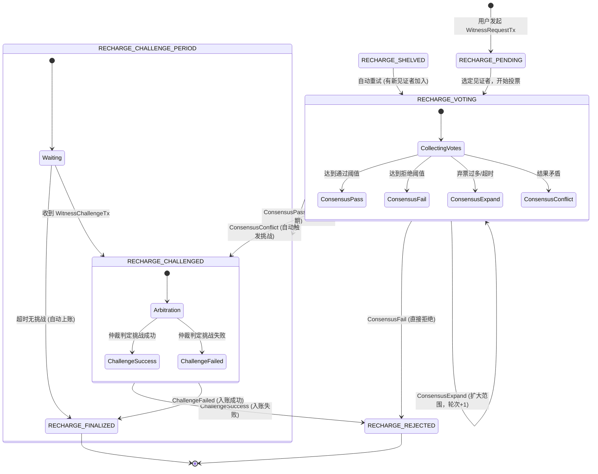
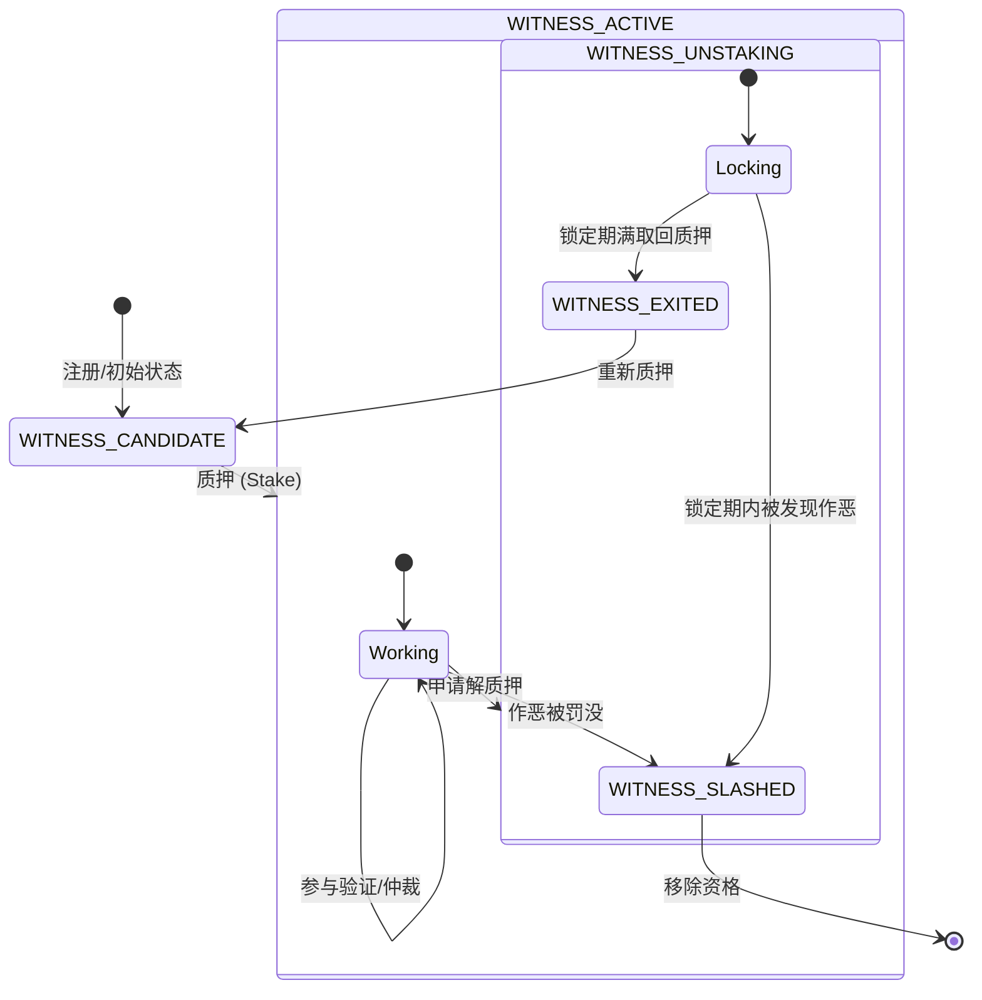

# Witness Module Code Documentation

本文档详细说明了 `witness` 模块的代码结构、核心组件以及关键流程的状态流转。

## 1. 模块概览

`witness` 模块负责处理跨链充值的验证、见证者管理、投票共识以及挑战仲裁。它通过去中心化的见证者网络确保跨链资产的安全入账。

### 核心组件

*   **Service (`service.go`)**: 模块入口，协调各个子组件，处理外部请求和事件循环。
*   **StakeManager (`stake_manager.go`)**: 管理见证者的质押、解质押、状态变更及奖励/罚没。
*   **VoteManager (`vote_manager.go`)**: 管理投票过程，收集投票并计算共识结果。
*   **ChallengeManager (`challenge_manager.go`)**: 处理挑战和仲裁逻辑。
*   **Selector (`selector.go`)**: 负责基于 VRF 和概率算法选择见证者和仲裁者。
*   **Types (`types.go`)**: 定义核心数据结构、枚举和配置参数。

## 2. 核心流程与状态流转

### 2.1 入账请求生命周期 (Recharge Request Lifecycle)

入账请求从创建到最终完成（或拒绝）经历多个状态。



### 2.2 见证者状态流转 (Witness Status Lifecycle)

见证者从候选人到活跃状态，再到退出或被罚没。



## 3. 关键代码逻辑说明

### 3.1 奖励分配 (Fee Distribution)

当入账请求进入终态（`RECHARGE_FINALIZED` 或 `RECHARGE_REJECTED`）时，系统会将 `recharge_fee` 分配给**诚实**的见证者。

*   **触发点**:
    1.  `Service.checkChallengePeriod`: 公示期结束自动上账。
    2.  `Service.handleChallengeResolved`: 仲裁结束。
*   **诚实者定义**:
    *   **Finalized (成功)**: 投 `PASS` 的见证者。
    *   **Rejected (失败)**: 投 `FAIL` 的见证者。
*   **实现**: `StakeManager.DistributeReward` 平均分配费用。

### 3.2 扩大范围 (Scope Expansion)

当第一轮见证者无法达成共识（如弃票过多或超时）时，系统会扩大验证范围。

*   **逻辑**: `Service.expandScope`
*   **过程**:
    1.  轮次 (`Round`) + 1。
    2.  排除已参与的见证者。
    3.  使用 `Selector` 选择更多的新见证者。
    4.  重置投票计数，开始新一轮投票。
*   **无限扩展与挂起**:
    *   系统不再设置最大轮次 (`MaxRounds`)。
    *   只要还有未参与的活跃见证者，系统就会持续扩大范围。
    *   **挂起 (Shelved)**: 仅当**所有活跃见证者都已参与**且仍无共识时，请求进入 `RECHARGE_SHELVED` 状态。

### 3.3 自动挑战 (Auto Challenge)

当投票结果出现严重分歧（如既有大量 PASS 也有大量 FAIL，导致无法达成一致且非弃票原因）时，系统判定为 `ConsensusConflict`。

*   **逻辑**: `Service.handleConflict`
*   **过程**:
    1.  状态转为 `RECHARGE_CHALLENGED`。
    2.  系统自动生成一个 `ChallengeID`。
    3.  选择仲裁者介入。
    4.  进入仲裁流程，由仲裁者决定最终结果。

### 3.4 自动重试 (Auto Retry)

对于处于 `RECHARGE_SHELVED` 状态的请求（或仲裁），系统会定期尝试重试。

*   **逻辑**: `Service.retryShelvedRequests` / `Service.retryShelvedChallenges`
*   **触发**: `Service.SetCurrentHeight` 每隔一定区块（`RetryIntervalBlocks`）触发一次。
*   **机制**:
    1.  检查是否有新的见证者加入（或之前未被选中的见证者）。
    2.  如果能选出新的见证者，则将状态恢复为 `RECHARGE_VOTING`（或继续仲裁），开启新一轮投票。
    3.  这确保了系统不会因为暂时的见证者不足而永久卡死，随着网络发展，挂起的请求终将被处理。

## 4. 数据结构 (Protobuf)

主要数据结构定义在 `pb/data.proto` 中。

*   **WitnessRequestTx**: 用户发起的入账请求交易，包含 `recharge_fee`。
*   **RechargeRequest**: 系统内部维护的请求状态对象，包含当前状态、投票记录、选定的见证者等。
*   **WitnessVote**: 见证者的投票数据。
*   **ChallengeRecord**: 挑战和仲裁的记录。
*   **WitnessInfo**: 见证者的个人信息（地址、质押、状态、奖励等）。

## 5. VM 交互与数据持久化

`witness` 模块作为一个独立的逻辑单元，通过接口与主 VM (Virtual Machine) 进行交互。

### 5.1 交互方式

*   **区块高度同步**: VM 通过调用 `Service.SetCurrentHeight(height)` 驱动见证者模块的时间推进（如检查公示期、解质押锁定等）。
*   **交易处理**: VM 解析区块中的交易，识别出 `WitnessRequestTx`, `WitnessVoteTx` 等，调用 `Service` 的相应方法（如 `CreateRechargeRequest`, `ProcessVote`）。
*   **事件通知**: `Service` 通过 `Events()` 通道向 VM 发送状态变更事件（如 `EventRechargeFinalized`），VM 接收后可触发后续逻辑（如铸造 Token）。

### 5.2 数据持久化 (DB Interface)

为了解耦存储实现，`witness` 模块定义了 `DBInterface` 接口 (`service.go`)，由 VM 层传入具体实现。

```go
type DBInterface interface {
    GetWitnessInfo(address string) (*pb.WitnessInfo, error)
    SaveWitnessInfo(info *pb.WitnessInfo) error
    GetRechargeRequest(requestID string) (*pb.RechargeRequest, error)
    SaveRechargeRequest(request *pb.RechargeRequest) error
    GetChallengeRecord(challengeID string) (*pb.ChallengeRecord, error)
    SaveChallengeRecord(record *pb.ChallengeRecord) error
    GetActiveWitnesses() ([]*pb.WitnessInfo, error)
}
```

*   **数据落库**:
    *   **见证者信息**: 在质押、解质押、状态变更时保存。
    *   **请求状态**: 在创建请求、投票更新、状态流转（如进入公示期、完成）时保存。
    *   **挑战记录**: 在创建挑战、仲裁投票、挑战结束时保存。

这种设计使得 `witness` 模块不依赖具体的数据库（如 LevelDB, BadgerDB），便于测试和集成。
