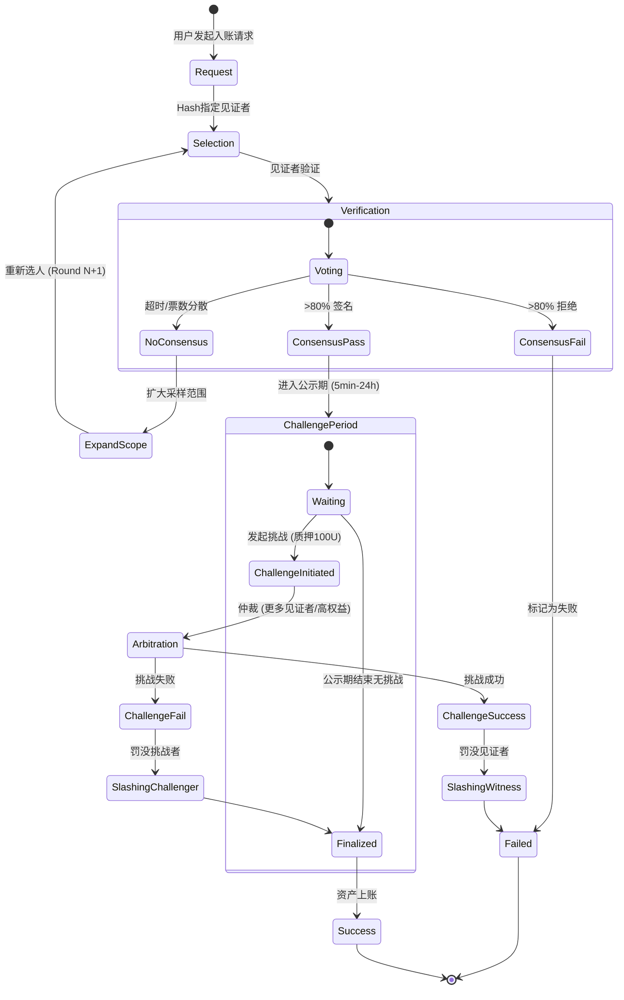

# Witness 入账流程设计

基于 `witness.go` 的设计文档。

## 核心流程

1.  **请求发起**: 用户发起入账 TX 请求，通过 Hash 指定见证者。
2.  **验证**: 见证者在各自的区块链浏览器/节点验证交易。
3.  **共识**:
    *   **通过**: 收集到 >80% 签名。
    *   **失败**: 收集到 >80% 拒绝消息。
    *   **未达成共识**: 截止时间内未满足上述任一条件 -> **扩大范围**。
4.  **扩大范围**: 重新选择新一批见证者（如 10人 -> 20人 -> 40人），重新计票。
5.  **公示期**: 共识通过后进入公示期（5min - 24h）。
    *   **挑战**: 任何人可质押 ~100U 发起挑战。
    *   **裁决**: 由更多见证者或高权益节点裁决。
        *   挑战成功: 罚没见证者收益。
        *   挑战失败: 罚没挑战者资金。
6.  **上账**: 公示期结束无异议，资产入账。

## 状态流转图

## 关键参数
*   **共识阈值**: 80%
*   **公示期**: 5min, 30min, 24h (取决于金额/风险)
*   **挑战质押**: ~100U
*   **激励**: 跨链手续费 + Token 奖励 (按质押金额 * 次数)
