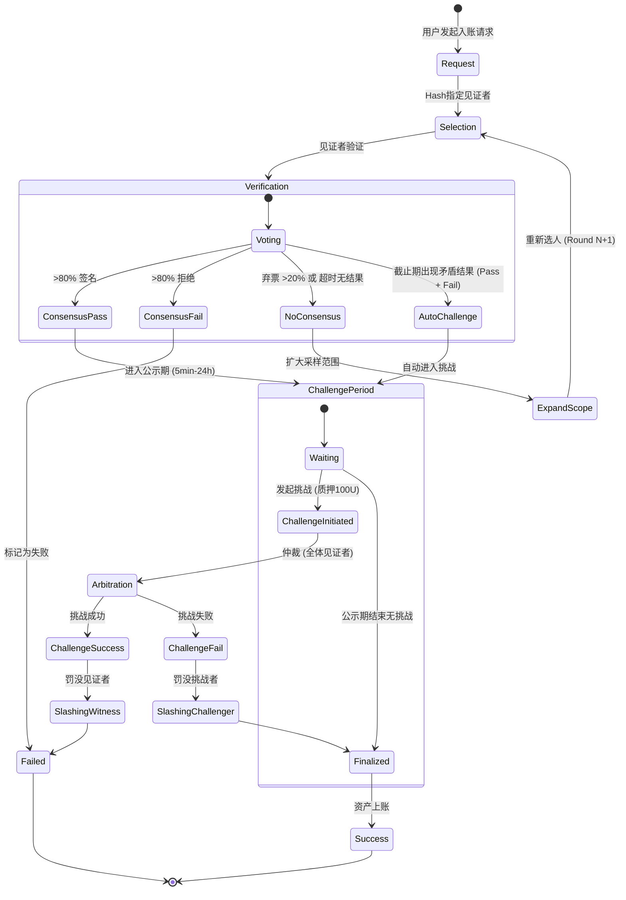

# Witness 入账流程设计

基于 `witness.go` 的设计文档。

## 核心流程

1.  **请求发起**: 用户发起入账 TX 请求，通过 Hash 指定见证者。
2.  **验证**: 见证者在各自的区块链浏览器/节点验证交易。
3.  **共识**:
    *   **通过**: 收集到 >80% 签名。
    *   **失败**: 收集到 >80% 拒绝消息。
    *   **扩大范围**: 
        *   截止时间内未满足上述任一条件。
        *   **弃票率 > 20%** (无法达成 >80% 共识)。
    *   **自动挑战**: 
        *   截止时间到，若出现**矛盾结果**（既有通过票，也有未通过票），无论比例如何，自动进入挑战阶段。
4.  **扩大范围**: 重新选择新一批见证者（如 10人 -> 20人 -> 40人），重新计票。
5.  **公示期**: 共识通过后进入公示期（5min - 24h）。
    *   **挑战**: 任何人可质押 ~100U 发起挑战。
    *   **裁决**: 由更多见证者或高权益节点裁决。
        *   挑战成功: 罚没见证者收益。
        *   挑战失败: 罚没挑战者资金。
6.  **上账**: 公示期结束无异议，资产入账。

## 状态流转图

## 投票类型与责任 (Vote Types & Liability)

1.  **通过 (Pass)**: 确认交易有效。
    *   责任: 若后续被证明交易无效（恶意Tx），签名者将被罚没。
2.  **拒绝 (Fail)**: 确认交易无效（如资金不符、Hash不匹配）。
    *   责任: 若后续被证明交易有效，拒绝者可能被罚没。
    *   说明: 如资金不符也应该被拒绝，用户可以在整个流程走完之后重新提交上账申请。
        提交的原生链hash和本链hash一一绑定。
3.  **弃票 (Abstain)**: 无法判断当前状态或不愿参与。
    *   **免责**: 弃票者不会被追责，不承担罚没风险。
    *   后果: 若弃票导致无法达成共识 (>20%)，将触发扩大范围。

## 质押与解质押机制

### 1. 质押 (Staking)
*   **目的**: 确保见证者诚实履行验证职责，防止恶意行为。
*   **质押物**:
    *   **初始阶段**: 系统代币或稳定币（如 1000 U）。
    *   **长期运行**: "未来收益质押"模式，使用未提取收益作为质押金。
*   **状态流转**: `[Candidate] --(质押)--> [Active]`
 
 ### 2. 解质押 (Unstaking)
 *   **申请**: 随时可发起。
 *   **锁定期 (Lock-up Period)**:
     *   申请后进入 `Unstaking` 状态。
     *   资金锁定一段时间（如 7 天）。
     *   期间不参与新交易验证，但需对历史行为负责。
 *   **提现**: 锁定期满且无罚没，资金退回。
 *   **状态流转**: `[Active] --(申请解质押)--> [Unstaking] --(锁定期满)--> [Exited]`
 
 ### 3. 挑战与罚没 (Slashing)
 *   **触发条件**: 恶意签名、长期不在线。
 *   **挑战期**: 共识后进入公示期，任何人可质押资金发起挑战。
 *   **裁决**: 更多见证者/高权益节点仲裁。
 *   **结果**:
     *   挑战成功: 罚没见证者（部分销毁，部分奖给挑战者）。
     *   挑战失败: 罚没挑战者。
 
 ## 关键参数
*   **共识阈值**: 80%
*   **公示期**: 5min, 30min, 24h (取决于金额/风险)
*   **挑战质押**: ~100U
*   **激励**: 跨链手续费 + Token 奖励 (按质押金额 * 次数)
